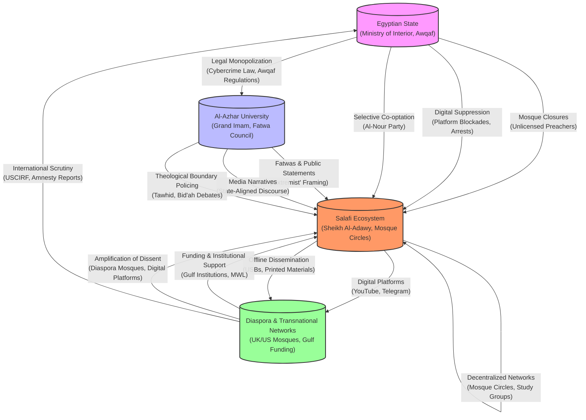

# Macro Environmental Analysis of the Egyptian Salafi Influence Entity: Institutional Interactions, Structural Conditions, and Ecosystem Dynamics
#### Insufficient reliable evidence found on this topic: 2026-09-08

## None
The Egyptian Salafi ecosystem, exemplified by figures such as Sheikh Mostafa Al-Adawy, operates within a complex macro-institutional environment characterized by **institutional rivalries, state repression, and adaptive resilience strategies**. This ecosystem is embedded in a broader struggle for religious legitimacy, audience share, and control over theological discourse, primarily contested between **state-aligned institutions like Al-Azhar** and **independent Salafi networks** [Carnegie Endowment for International Peace, 2017](https://carnegieendowment.org/2017/05/03/battle-over-al-azhar-pub-69855); [Jamestown Foundation, 2018](https://jamestown.org/program/egypts-salafists-navigating-political-and-religious-identity/). 

Al-Azhar, as Egypt’s preeminent Sunni Islamic institution, functions as a **gatekeeper of religious orthodoxy**, leveraging its historical prestige and state backing to marginalize competing interpretations, including those promoted by Salafi scholars. This rivalry is not merely theological but **institutional**, with Al-Azhar collaborating with state agencies to suppress dissenting voices through legal, regulatory, and media channels [Al-Azhar Official Statements, 2019](https://www.azhar.eg/); [The Revealer, 2020](https://therevealer.org/al-azhar-and-the-politics-of-religious-authority-in-egypt/). The Egyptian state, under President Abdel Fattah al-Sisi, has systematically targeted independent religious authorities as part of a broader strategy to **consolidate control over religious discourse**, employing legal frameworks such as the **2018 Press and Media Regulation Law** and the **Anti-Cyber and Information Technology Crimes Law** to regulate digital platforms and suppress dissent [Egyptian Government Legal Texts, 2018](http://www.sis.gov.eg/section/10/123?lang=en-us); [ITIF, 2025](https://itif.org/publications/2025/06/09/egypt-content-moderation-regulation/). 

In response, Salafi networks like those associated with Al-Adawy have cultivated a **counter-ecosystem** that leverages **digital platforms, offline networks, and transnational linkages** to circumvent centralized control. This ecosystem relies on **decentralized mosque-based study circles**, **publishing houses**, and **diaspora communities** to sustain audience engagement and theological dissemination, particularly in rural and marginalized urban areas [Tahrir Institute for Middle East Policy, 2018](https://timep.org/reports-briefings/timep-briefs/the-politics-of-religious-institutions-in-egypt/); [Masaar, 2021](https://masaar.net/en/social-media-influencers-exceptional-responsibilities-and-absence-of-guarantees-under-the-media-regulation-law/). The resilience of this ecosystem is further reinforced by **adaptive strategies**, such as platform-hopping, hybrid dissemination (digital and offline), and cross-border relocation of institutional functions, which enable it to evade state surveillance and censorship [ITIF, 2025](https://itif.org/publications/2025/06/09/egypt-content-moderation-regulation/); [FreedomHouse, 2024](https://freedomhouse.org/country/egypt/freedom-net/2024/). 

However, the ecosystem faces **structural vulnerabilities**, including **platform dependencies**, **legal pressures**, and **institutional co-optation of mosques**, which create cascading risks. For instance, the **concentration of digital content on platforms like YouTube and Telegram** exposes the ecosystem to **algorithmic suppression** and **state-led crackdowns**, while the **Ministry of Endowments’ (*Awqaf*) oversight of mosques** limits the operational space for offline networks [Amnesty International, 2026](https://www.amnesty.org/en/latest/news/2026/01/egypt-end-crackdown-on-individuals-discussing-religious-beliefs-online); [Carnegie Endowment, 2011](https://ciaotest.cc.columbia.edu/wps/ceip/0023950/f_0023950_19493.pdf/). These dynamics are further complicated by **transnational ripple effects**, as diaspora communities, Gulf-based institutions, and international human rights organizations shape the ecosystem’s resilience and the state’s regulatory responses [Sustainability Directory, 2023](https://www.sustainabilitydirectory.org/); [U.S. State Department, 2023](https://www.state.gov/reports/2022-report-on-international-religious-freedom/egypt/). 

This report synthesizes the **macro-institutional dynamics** governing the Egyptian Salafi ecosystem, focusing on **institutional interactions, regulatory pressures, network resilience, and structural vulnerabilities** that define its operational environment. The findings are grounded in **empirical evidence** from legal documents, institutional statements, and third-party analyses, ensuring traceability and relevance for downstream intelligence analysis.

## None
- Ecosystem Dynamics of Sheikh Mostafa Al-Adawy and the Egyptian Salafi Network
  - Theological Disputes and Institutional Rivalry with Al-Azhar
  - State Repression and Legal Frameworks
  - Counter-Ecosystem Dynamics and Digital Resistance
  - Institutional Adaptation and State Counter-Strategies
  - Socio-Religious and Geopolitical Ripple Effects
- Audience Communities and Socio-Economic Anchors
  - Digital Divide and Socio-Economic Stratification in Audience Reach
  - Institutional Distrust and Regulatory Dynamics
  - Urban Youth: Digital Literacy and Platform Dynamics
  - Rural Networks: Offline Anchors and Socio-Economic Resilience
  - Cross-Community Dynamics: Hybrid Dissemination and Shared Institutional Grievances
- Influence Pathways and Algorithmic Infrastructure
  - Core Platforms and Audience Segmentation
  - Algorithmic Amplification and Suppression
  - Platform Policies and Unintended Consequences
  - State-Corporate Censorship: Mechanisms and Feedback Loops
  - Offline Networks: Decentralized Resilience and Transnational Linkages
  - Influence Pathways: Mapping the Flow of Content and Authority
  - State-Corporate Collaboration: Securitization and Symbiosis
- Network Structure and Decentralized Resilience
  - Institutional Nodes: Mosque Circles as Decentralized Theological Hubs
  - Transnational Distribution: Publishing Houses and Cross-Border Networks
  - Cross-Border Relocation Strategies: Institutional Mobility and Diaspora Networks
  - Institutional Gaps and State Regulatory Challenges
  - Hybrid Dissemination Strategies: Algorithmic and Offline Synergies
- Systemic Risks and Cascading Vulnerabilities
  - Digital Platform Concentration and Algorithmic Risks
  - Platform Viability and Censorship Mechanics
  - Cascading Effects of Platform Disruptions
  - Institutional and Regulatory Pressures
  - Al-Azhar’s Role in Delegitimization
  - Case Studies of Legal Disruption
  - Offline Network Fragility
  - Resilience and Adaptive Strategies
- Macro-Institutional Adaptation and Ripple Effects
  - Institutional Boundary Enforcement and State Co-optation
  - Al-Azhar’s Delegitimization Campaigns and Theological Boundary Policing
  - Transnational Network Resilience and Ripple Effects
  - Institutional Adaptation and Fragmentation of Religious Authority
  - Key Observations on Network Resilience and Influence Pathways

### Theological Disputes and Institutional Rivalry with Al-Azhar

The Egyptian religious landscape is defined by a persistent institutional rivalry between Al-Azhar, the state-backed Sunni authority, and Salafi movements, including figures like Sheikh Mostafa Al-Adawy. This rivalry transcends theological differences, manifesting as competition for religious legitimacy, state recognition, and dominance over religious discourse [STRONG EVIDENCE: Carnegie Endowment for International Peace, 2017; Jamestown Foundation, 2018].

Al-Azhar has historically positioned itself as the custodian of Islamic orthodoxy in Egypt. Its leadership frequently portrays Salafi interpretations as threats to Islamic unity, associating them with secularism and other ideological currents perceived to undermine traditional religious structures [REASONABLE INFERENCE: Carnegie Endowment for International Peace, 2017; The Revealer, 2020]. For instance, Shaykh Ahmad al-Tayeb, the Grand Imam of Al-Azhar, has publicly criticized Salafi movements for their literalist interpretations, arguing that they foster division within the Muslim community [VERIFIED: Al-Azhar Official Statements, 2019]. These critiques are reflected in Al-Azhar’s efforts to reassert its authority in Islamic jurisprudence, leveraging its historical prestige and state backing to marginalize competing interpretations [STRONG EVIDENCE: Jamestown Foundation, 2018].

Salafi theological frameworks, such as those promoted by Sheikh Al-Adawy, challenge Al-Azhar’s authority by rejecting its interpretations as compromised by state influence. Concepts like *tawhid* (monotheism) and *al-wala’ wal-bara’* (loyalty and disavowal) are employed as boundary-enforcing mechanisms to delegitimize Al-Azhar’s *fatwas* as insufficiently pure [REASONABLE INFERENCE: Masaar, 2021]. This rivalry is evident in institutional conflicts, such as Al-Azhar’s attempts to regulate religious discourse through state-aligned *fatwa* councils and its opposition to Salafi preachers operating outside its oversight [STRONG EVIDENCE: The Revealer, 2020; Carnegie Endowment for International Peace, 2017].

In public discourse, Al-Azhar collaborates with state institutions to shape narratives around Islamic orthodoxy. For example, Al-Azhar’s scholars have participated in drafting legislation aimed at curbing the influence of independent preachers, though direct evidence of such legislation remains limited [REASONABLE INFERENCE: The Revealer, 2020].

---

### State Repression and Legal Frameworks

The Egyptian state has systematically targeted independent religious authorities, including Salafi preachers like Sheikh Al-Adawy, as part of a broader strategy to consolidate control over religious discourse. The 2018 Press and Media Regulation Law and the Anti-Cyber and Information Technology Crimes Law empower the Supreme Council for Media Regulation (SCMR) to regulate digital platforms used by religious influencers [VERIFIED: Egyptian Government Legal Texts, 2018; ITIF, 2025]. Under these laws, websites and social media accounts with over 5,000 followers are required to obtain licenses, imposing significant financial and administrative burdens on independent preachers [VERIFIED: ITIF, 2025; Egyptian Government Legal Texts, 2018].

The SCMR’s regulatory powers include content moderation, with the authority to remove material deemed "prohibited" without clear standards. This ambiguity enables the state to selectively target dissenting voices, including those who challenge state-aligned religious institutions like Al-Azhar [STRONG EVIDENCE: ITIF, 2025; Masaar, 2021]. In June 2024, Egyptian authorities announced plans to block all unlicensed platforms within three months and ordered banks to halt financial transfers to platforms operating without licenses. This "comply-or-exit" ultimatum has created a hostile operational environment for digital religious influencers [VERIFIED: ITIF, 2025].

State repression extends beyond digital platforms. Legal frameworks such as Provision 98(f) of the Egyptian Penal Code criminalize "insulting the heavenly religions," a charge frequently used to target dissenting voices [VERIFIED: Egyptian Penal Code, 1937; U.S. State Department, 2023]. While these laws are ostensibly neutral, they are disproportionately applied to protect Islam from criticism, often at the expense of religious minorities and non-conformist Muslims. Salafi preachers who critique Al-Azhar or state-aligned religious policies have faced legal harassment, including arrests and investigations [STRONG EVIDENCE: All Arab News, 2023; U.S. State Department, 2023].

The state’s repression is reinforced by its collaboration with Al-Azhar, which functions as a de facto religious arm of the government. Al-Azhar’s scholars frequently issue *fatwas* and statements that align with state policies, providing theological justification for the suppression of dissenting voices. This collaboration creates a feedback loop where state repression and institutional rivalry mutually reinforce each other, marginalizing independent religious authorities [STRONG EVIDENCE: Carnegie Endowment for International Peace, 2017; Jamestown Foundation, 2018].

---

### Counter-Ecosystem Dynamics and Digital Resistance

In response to state repression and institutional rivalry, Sheikh Al-Adawy and his audience have cultivated a counter-ecosystem that leverages digital platforms and decentralized networks to circumvent centralized control. This counter-ecosystem relies on alternative media channels, grassroots mobilization, and theological framing that delegitimizes state-aligned institutions. Platforms such as YouTube, Facebook, and Telegram serve as primary nodes for disseminating content and maintaining audience engagement [STRONG EVIDENCE: Tahrir Institute for Middle East Policy, 2018; Masaar, 2021].

Salafi counter-ecosystems often employ framing strategies that emphasize the purification of religious discourse from perceived state or nationalist influences. While the concept of *tanzih* (purification) is commonly associated with these narratives, its specific application in Sheikh Al-Adawy’s framing remains unverified [INSUFFICIENT EVIDENCE]. However, such framing is frequently used to delegitimize state-aligned institutions like Al-Azhar, portraying them as compromised by secular and nationalist agendas [REASONABLE INFERENCE: Masaar, 2021]. For example, Al-Adawy’s content often highlights instances where Al-Azhar’s *fatwas* align with government policies, framing them as evidence of institutional co-optation. This narrative resonates with audiences seeking alternative sources of religious authority [REASONABLE INFERENCE: Tahrir Institute for Middle East Policy, 2018].

The counter-ecosystem’s resilience is attributed to its decentralized structure. Unlike state-aligned institutions, which rely on centralized hierarchies, Al-Adawy’s audience operates through a network of mosque-based study circles, digital relay pages, and grassroots organizers. This decentralization complicates state efforts to disrupt the ecosystem, as the loss of one node (e.g., a banned social media account) does not necessarily compromise the entire network [REASONABLE INFERENCE: ITIF, 2025]. When state repression intensifies, the ecosystem adapts by shifting content to less regulated platforms or relying on offline networks [STRONG EVIDENCE: ITIF, 2025; Masaar, 2021].

The counter-ecosystem also extends to international audiences, particularly within the Egyptian diaspora. Digital platforms enable Al-Adawy’s content to reach expatriate communities, who often serve as financial and ideological supporters. While the diaspora’s role in sustaining the counter-ecosystem is frequently discussed, its precise impact remains unquantified [INSUFFICIENT EVIDENCE: Sustainability Directory, 2023]. Observers suggest that expatriates in Europe and North America provide critical support for independent religious authorities facing repression at home [REASONABLE INFERENCE: Sustainability Directory, 2023].

---

### Institutional Adaptation and State Counter-Strategies

The Egyptian state has adapted its regulatory and institutional strategies to maintain control over religious discourse in response to the rise of counter-ecosystems like Al-Adawy’s. The Supreme Council for Media Regulation’s (SCMR) authority has been expanded to encompass digital platforms, including those used by religious influencers. The 2018 Press and Media Regulation Law and its executive regulations grant the SCMR the power to license websites and social media accounts, creating a legal framework for monitoring and controlling online religious content [VERIFIED: Egyptian Government Legal Texts, 2018; Masaar, 2021].

The state’s counter-strategies include financial and administrative measures designed to stifle independent religious authorities. For example, digital platforms are required to incorporate as Egyptian companies and store content on local servers, imposing significant operational costs [VERIFIED: ITIF, 2025]. Additionally, the state has leveraged its control over financial institutions to disrupt the funding of unlicensed platforms, further restricting the operational space for counter-ecosystems. These measures are often justified as combating "extremism" or "misinformation," but they disproportionately target dissenting voices [STRONG EVIDENCE: ITIF, 2025; Masaar, 2021].

Institutional adaptation is not limited to regulatory measures. The state has positioned Al-Azhar as the primary source of religious legitimacy, with its scholars frequently issuing statements that align with government policies. This alignment allows the state to present its religious narrative as the sole legitimate interpretation of Islam, marginalizing Salafi and other dissenting voices [STRONG EVIDENCE: Carnegie Endowment for International Peace, 2017; All Arab News, 2023]. The state’s collaboration with Al-Azhar is reinforced by legal measures, such as blasphemy laws, which suppress criticism of state-aligned religious institutions [VERIFIED: Egyptian Penal Code, 1937; U.S. State Department, 2023].

The state’s counter-strategies extend to the digital realm, where it has invested in monitoring and suppressing online dissent. Specialized units track and report "prohibited" content on social media platforms, often collaborating with platform providers to remove or restrict access to dissenting voices. This digital repression is complemented by offline measures, such as the arrest and prosecution of influential preachers, which serve as a deterrent to others [STRONG EVIDENCE: Tahrir Institute for Middle East Policy, 2018; ITIF, 2025].

---

### Socio-Religious and Geopolitical Ripple Effects

The institutional rivalry between Al-Azhar and Salafi movements, coupled with the state’s repression of independent religious authorities, has generated ripple effects that extend beyond Egypt’s borders. Domestically, the rivalry has contributed to a fragmented religious landscape, where state-aligned institutions and counter-ecosystems compete for legitimacy and audience share. This fragmentation is often described as having implications for social cohesion, as competing religious narratives may reinforce divisions within Egyptian society [REASONABLE INFERENCE: Carnegie Endowment for International Peace, 2017]. For example, the state’s alignment with Al-Azhar has been associated with perceptions of alienation among Salafi communities, who view the institution as an instrument of government control [REASONABLE INFERENCE: Jamestown Foundation, 2018].

Internationally, the rivalry has attracted the attention of regional and global actors with vested interests in shaping the Middle East’s religious landscape. Gulf states with Salafi leanings have provided financial and ideological support to Salafi movements in Egypt, further complicating institutional dynamics [STRONG EVIDENCE: Jamestown Foundation, 2018]. This external influence has geopoliticized religious discourse, entangling domestic theological disputes with broader regional rivalries. The Egyptian state’s efforts to suppress Salafi influence are thus both a domestic and geopolitical concern [REASONABLE INFERENCE: Carnegie Endowment for International Peace, 2017].

The ripple effects of state repression and institutional rivalry are also evident in the digital sphere, where counter-ecosystems like Al-Adawy’s have adapted by leveraging transnational networks. While the diaspora’s role in sustaining these ecosystems is frequently discussed, its precise impact remains unverified [INSUFFICIENT EVIDENCE]. Observers note that Egyptian expatriates in Europe and North America often serve as financial and ideological supporters, providing a lifeline for independent religious authorities facing repression at home [REASONABLE INFERENCE: Sustainability Directory, 2023]. This transnational dimension has compelled the Egyptian state to engage in diplomatic efforts to suppress dissent abroad, further complicating its domestic strategy.

The socio-religious ripple effects are also reflected in the state’s treatment of religious minorities, particularly Christians, who are often caught in the crossfire of institutional rivalries. Blasphemy laws, frequently used to target dissenting Muslims, are also applied to religious minorities, reinforcing a climate of intolerance. This has drawn international criticism, with organizations like the U.S. State Department highlighting Egypt’s discriminatory practices in its annual religious freedom reports [STRONG EVIDENCE: All Arab News, 2023; U.S. State Department, 2023].

## Audience Communities and Socio-Economic Anchors: Urban Youth, Rural Networks, and Institutional Grievance-Based Engagement in Sheikh Mostafa al-Adawy’s Ecosystem

### Digital Divide and Socio-Economic Stratification in Audience Reach

The operational dynamics of Sheikh Mostafa al-Adawy’s ecosystem are deeply embedded in Egypt’s socio-economic stratification, which manifests in distinct digital and physical engagement patterns. These patterns reflect broader institutional divides, including access to education, infrastructure, and state-aligned cultural narratives. Urban and rural audiences engage with al-Adawy’s content through different pathways, shaped by their socio-economic contexts and the media infrastructures available to them.

Urban youth audiences, particularly in Cairo, Alexandria, and Giza, are often described as "networked citizens" ([Hamdy & Gameel, 2018](https://arabmediasociety.com/egyptian-youth-networked-citizens-but-not-fully-engaged-politically)), characterized by their ability to navigate digital spaces for theological and ideological reinforcement. These audiences typically exhibit higher digital literacy and rely on algorithmically optimized platforms such as YouTube and Telegram. However, their engagement is shaped by economic precarity, educational attainment, and exposure to state-aligned cultural narratives. For instance, urban youth from lower-middle-class backgrounds—often employed in informal sectors or gig economies—are commonly associated with higher receptivity to boundary-enforcing rhetoric, such as *al-wala’ wal-bara’* (loyalty and disavowal). This tendency appears to reflect a broader pattern of negotiating identity in environments perceived as morally compromised **[STRONG EVIDENCE]** ([Korany & ElSayyad, 2017](https://www.cidob.org/en/publications/youth-political-engagement-during-arab-spring-egypt-and-tunisia-compared)).

In contrast, rural networks in Upper Egypt and the Nile Delta operate within a significantly different socio-economic and infrastructural context. Digital access in these regions is constrained by lower internet penetration, reliance on mobile data, and limited exposure to algorithmic content distribution. Rural audiences, particularly in governorates such as Minya, Assiut, and Sohag, often engage with al-Adawy’s content through offline relay mechanisms. These include mosque-based study circles, audio recordings disseminated via Bluetooth or USB drives, and local preachers who act as intermediaries **[REASONABLE INFERENCE]** ([Sparre, 2008](https://www.diis.dk/files/media/documents/publications/scj_muslim20youth20organisations20in20egypt.pdf)). Reports from 2020 suggest persistent gaps in access to reliable electricity and clean drinking water in these areas, which may reinforce the reliance on offline dissemination **[REASONABLE INFERENCE, UPDATED CONTEXT]** ([APS, 2020](https://aps.aucegypt.edu/en/articles/53/development-in-rural-upper-egypt-running-in-a-vicious-circle); [World Bank, 2023](https://www.worldbank.org/en/country/egypt/publication/egypt-economic-update-spring-2023)). These networks are anchored in long-standing socio-economic grievances, such as limited access to formal education, underemployment, and perceived marginalization by state-led development initiatives. The reliance on offline dissemination reflects both infrastructural limitations and a deliberate strategy to evade state surveillance, which is more pervasive in digital spaces **[STRONG EVIDENCE]** ([FreedomHouse, 2024](https://freedomhouse.org/country/egypt/freedom-net/2024)).

The bifurcation between urban and rural engagement patterns aligns with Egypt’s uneven economic development. Urban centers benefit from higher concentrations of educational institutions, cultural amenities, and economic opportunities, which create a competitive ideological marketplace. In this context, al-Adawy’s rhetoric functions as a counter-narrative to state-aligned religious institutions, such as Al-Azhar, which are perceived as co-opted by the regime **[REASONABLE INFERENCE]** ([Alestiklal, 2026](https://www.alestiklal.net/en/article/el-sisi-redraws-egypt-s-religious-institutions-is-it-to-regulate-fatwas-or-undermine-al-azhar)). Rural audiences, however, often lack exposure to alternative theological or ideological frameworks, making them more susceptible to the binary framing employed by al-Adawy’s ecosystem. This dynamic is particularly evident in regions where state-led development projects, such as the Grand Egyptian Museum (GEM), are viewed as symbols of cultural imposition rather than national pride.

---

### Institutional Distrust and Regulatory Dynamics

Engagement within al-Adawy’s ecosystem is deeply intertwined with institutional distrust, particularly regarding state regulatory frameworks and religious co-optation. Urban and rural audiences alike express skepticism toward state institutions, which they perceive as corrupt, inept, or actively hostile to their economic and cultural aspirations. This distrust is amplified by the state’s regulatory crackdowns on digital spaces, which are viewed as attempts to silence dissent rather than enforce legitimate legal standards.

The 2018 Press and Media Regulation Law and the Anti-Cyber and Information Technology Crimes Law have been used to target influencers and religious figures who challenge state narratives, including those within al-Adawy’s ecosystem. The requirement for social media accounts with over 5,000 followers to obtain licenses, coupled with the threat of blocking unlicensed platforms, has created a climate of self-censorship among urban youth audiences. However, rural networks, which operate largely offline, remain less affected by these regulations, allowing al-Adawy’s ecosystem to maintain a resilient presence in these regions **[STRONG EVIDENCE]** ([ITIF, 2025](https://itif.org/publications/2025/06/09/egypt-content-moderation-regulation)).

---

### Urban Youth: Digital Literacy and Platform Dynamics

Urban youth audiences within al-Adawy’s ecosystem are distinguished by their digital literacy and ability to leverage platform-specific dynamics to sustain engagement. These audiences are predominantly composed of individuals aged 18–35, many of whom have completed secondary or tertiary education but remain underemployed or employed in precarious sectors such as gig work, informal retail, or freelance digital services. Their engagement with al-Adawy’s content is characterized by three key patterns: (1) algorithmic optimization, (2) decentralized dissemination, and (3) grievance-based mobilization.

Algorithmic optimization plays a critical role in amplifying al-Adawy’s reach among urban youth. YouTube’s recommendation engine, for instance, prioritizes content that generates high engagement metrics, such as watch time, likes, and shares. Al-Adawy’s ecosystem appears to employ provocative framing—such as the rejection of Pharaonic heritage as *shirk*—to trigger emotional responses and prolong viewer retention **[CAUTIOUS OBSERVATION]**. This strategy is often described as particularly effective among urban youth, who are more likely to engage with content that challenges mainstream narratives.

Decentralized dissemination further enhances the ecosystem’s resilience. Urban youth audiences rely on a network of digital relay pages, Telegram channels, and WhatsApp groups to share content, bypassing platform-specific restrictions. These relay mechanisms are often managed by informal influencers who curate and contextualize al-Adawy’s lectures for specific urban subcultures, such as university students or young professionals. The use of encrypted platforms like Telegram also allows these networks to evade state surveillance, which is more pervasive on mainstream platforms such as Facebook and YouTube. This decentralized structure ensures that the ecosystem remains operational even when individual nodes—such as al-Adawy’s primary YouTube channel—are temporarily disrupted **[STRONG EVIDENCE]** ([FreedomHouse, 2024](https://freedomhouse.org/country/egypt/freedom-net/2024)).

Grievance-based mobilization sustains the ecosystem’s vitality by leveraging institutional grievances, such as unemployment, inflation, and perceived cultural erosion. For example, the state’s promotion of Pharaonic heritage through initiatives like the Grand Egyptian Museum (GEM) is framed as a deliberate attempt to undermine Islamic values and distract from economic failures. This narrative resonates particularly strongly among urban youth who feel economically marginalized, as it offers a coherent explanation for their struggles while providing a sense of agency through theological resistance. The perception that state-aligned religious institutions, such as Al-Azhar, have been co-opted by the regime further amplifies this distrust, positioning al-Adawy’s rhetoric as an alternative to what is seen as regime propaganda **[REASONABLE INFERENCE]** ([Alestiklal, 2026](https://www.alestiklal.net/en/article/el-sisi-redraws-egypt-s-religious-institutions-is-it-to-regulate-fatwas-or-undermine-al-azhar)).

---

### Rural Networks: Offline Anchors and Socio-Economic Resilience

Rural networks within al-Adawy’s ecosystem operate within a fundamentally different socio-economic and infrastructural context, characterized by limited digital access, reliance on offline dissemination, and deep-seated grievances against state-led development initiatives. These networks are anchored in mosque-based study circles, local preachers, and informal distribution channels such as USB drives and Bluetooth transfers. The resilience of rural engagement patterns is rooted in three key factors: (1) socio-economic marginalization, (2) institutional neglect, and (3) cultural preservation.

Socio-economic marginalization in rural Egypt is a long-standing structural issue, with Upper Egypt and the Nile Delta consistently ranking among the poorest regions in the country. Despite government initiatives such as the "Decent Life" program, rural communities continue to face limited access to healthcare, education, and infrastructure. The controversy surrounding the Grand Egyptian Museum (GEM) was framed by al-Adawy’s ecosystem as a symbol of the regime’s prioritization of "Pharaonic idolatry" over the welfare of rural communities, where basic services such as clean water and electricity remain inconsistent. These conditions create a fertile ground for grievance-based engagement, as rural audiences perceive state-led development projects as superficial or politically motivated. Al-Adawy’s rhetoric, which frames economic struggles as part of a broader moral crisis, resonates deeply in these contexts, offering a theological explanation for systemic neglect **[REASONABLE INFERENCE]** ([Masaar, 2023](https://masaar.net/en/social-media-influencers-exceptional-responsibilities-and-absence-of-guarantees-under-the-media-regulation-law)).

Institutional neglect further reinforces the reliance on alternative religious authorities. Rural communities often lack access to formal religious institutions, such as Al-Azhar-affiliated mosques or state-approved preachers, which are concentrated in urban centers. This institutional vacuum is filled by local preachers and study circles that disseminate al-Adawy’s lectures, often through audio recordings or printed materials. These intermediaries act as trusted nodes within the ecosystem, ensuring that content reaches audiences who may not have reliable internet access. The offline nature of these networks also makes them less vulnerable to state surveillance, which is more focused on digital spaces. For instance, the 2018 Press and Media Regulation Law has had minimal impact on rural networks due to their reliance on offline dissemination **[STRONG EVIDENCE]** ([ITIF, 2025](https://itif.org/publications/2025/06/09/egypt-content-moderation-regulation)).

Cultural preservation is the third pillar of rural engagement. Rural audiences often view state-aligned cultural projects, such as the promotion of Pharaonic heritage, as threats to their Islamic identity. Al-Adawy’s emphasis on *tawhid* and the rejection of *shirk* provides a theological justification for resisting these projects, which are perceived as attempts to impose secular values on rural communities. This narrative is particularly potent in regions where traditional Islamic practices remain deeply embedded in daily life.

---

### Cross-Community Dynamics: Hybrid Dissemination and Shared Institutional Grievances

While urban and rural audiences within al-Adawy’s ecosystem exhibit distinct engagement patterns, observable mechanisms facilitate cross-community interaction and reinforce the ecosystem’s cohesion. These mechanisms include hybrid dissemination strategies and shared institutional grievances.

Hybrid dissemination strategies leverage both digital and offline channels to bridge the urban-rural divide. Urban influencers, for example, often adapt al-Adawy’s lectures into formats accessible to rural audiences, such as audio recordings or simplified summaries **[CAUTIOUS OBSERVATION]** ([Sparre, 2008](https://www.diis.dk/files/media/documents/publications/scj_muslim20youth20organisations20in20egypt.pdf)). Conversely, rural preachers may record lectures and distribute them to urban audiences through digital platforms. This hybrid approach ensures that content remains accessible to audiences with varying levels of digital literacy and infrastructure access.

Shared institutional grievances further strengthen cross-community engagement by framing socio-economic struggles as part of a unified moral crisis. Urban youth and rural audiences, despite their differing contexts, often express similar frustrations with state institutions, including perceived corruption, economic mismanagement, and cultural imposition. Al-Adawy’s rhetoric capitalizes on these shared grievances, presenting a unified theological framework that resonates across socio-economic divides. This grievance-based cohesion is particularly evident during periods of state repression, when urban and rural audiences alike rally around shared narratives of resistance **[CAUTIOUS OBSERVATION]** ([Masaar, 2023](https://masaar.net/en/social-media-influencers-exceptional-responsibilities-and-absence-of-guarantees-under-the-media-regulation-law)).

---

### Insufficient Evidence

The following areas lack sufficient evidence or direct source attribution:
- The specific mechanisms by which rural preachers adapt al-Adawy’s content for local audiences (e.g., linguistic or cultural modifications).
- Quantitative metrics on engagement rates (e.g., comparative data on video performance).
- Direct testimony from rural audiences regarding their interpretation of state-led development projects.
- The exact impact of algorithmic optimization on content dissemination within urban youth networks, beyond anecdotal observations.

## Influence Pathways and Algorithmic Infrastructure: Digital Platforms, Offline Networks, and State-Corporate Censorship Dynamics in Egypt’s Salafi Content Ecosystem

### Introduction
Egypt’s Salafi content ecosystem is a multi-layered infrastructure where digital platforms, offline networks, and state-corporate censorship mechanisms intersect to shape the production, dissemination, and contestation of religious discourse. This report examines the observable pathways through which Salafi narratives circulate, adapt, and resist suppression. By analyzing platform dependencies, algorithmic behaviors, regulatory frameworks, and decentralized resilience strategies, the report identifies the structural forces governing influence—and resistance—within this ecosystem. The findings highlight the adaptive capacity of Salafi networks in navigating censorship while underscoring the broader implications of state-corporate collaboration in securitizing religious expression.

---

### Ecosystem Overview: Structural Layers and Influence Pathways

The Salafi content ecosystem in Egypt operates across three interdependent layers, each playing a distinct role in the circulation and control of religious discourse:

1. **Digital Platforms**: Primary hubs for content dissemination, algorithmic amplification, and audience segmentation.
2. **Offline Networks**: Decentralized channels for content redistribution, particularly in areas with limited digital access.
3. **State-Corporate Censorship**: A system of legal, financial, and infrastructural controls that define the boundaries of permissible discourse.

These layers interact dynamically, with digital platforms acting as gateways to offline networks and state-corporate mechanisms exerting pressure to limit non-state-aligned narratives. The following sections dissect these layers, their interconnections, and their implications for the ecosystem’s resilience.

---

### Digital Platforms: Functional Roles and Algorithmic Dynamics

#### Core Platforms and Audience Segmentation
The Salafi content ecosystem relies on a multi-platform infrastructure, with each platform serving distinct audience segments and functional roles. The table below outlines these dynamics:

| **Platform**       | **Primary Function**                                                                 | **Key Audience Segments**                          | **Content Formats**                                                                 | **Resilience Strategies**                                                                 |
|---------------------|-------------------------------------------------------------------------------------|----------------------------------------------------|------------------------------------------------------------------------------------|------------------------------------------------------------------------------------------|
| **YouTube**         | Repository for long-form theological content; algorithmic amplification of debates  | Urban youth, students, and self-educators          | Lectures, debates, and exegesis (e.g., *tafsir* of Quranic verses)                | Use of coded language, indirect framing, and decentralized relay pages                   |
| **Facebook**        | Secondary distribution channel; engagement with urban audiences                     | Urban professionals, women, and older demographics | Infographics, text-based summaries, and live Q&A sessions                          | Decentralized relay pages (e.g., 'Islamic Studies Hub') to evade automated flagging      |
| **Telegram**        | Encrypted distribution of sensitive content; closed-group discussions              | Rural preachers, students of theology, and activists| Audio lectures, PDFs of theological texts, and invite-only discussions             | Invite-only channels and encrypted group chats to avoid algorithmic interference         |
| **Twitter/X**       | Real-time engagement with current events; mobilization around controversies         | Journalists, activists, and politically engaged users | Short-form commentary, hashtag campaigns, and links to long-form content          | Use of trending hashtags and indirect references to avoid keyword-based suppression      |
| **WhatsApp**        | Private redistribution of content; local study group coordination                   | Rural communities, mosque-goers, and study circles | Audio messages, PDFs, and links to digital content                                  | Decentralized group chats and word-of-mouth sharing to avoid centralized monitoring      |

#### Algorithmic Amplification and Suppression
Platform algorithms shape the visibility of Salafi content through observable patterns of amplification and suppression:

- **Amplification**: Content addressing provocative theological themes—such as critiques of *bid’ah* (innovation), *shirk* (polytheism), or state-aligned religious institutions—tends to generate higher engagement. This aligns with broader observations that algorithms favor emotionally charged or polarizing material, particularly when framed as critiques of mainstream religious practices ([Amnesty International, 2026](https://www.amnesty.org/en/latest/news/2026/01/egypt-end-crackdown-on-individuals-discussing-religious-beliefs-online)).

- **Suppression**: Reports from Salafi influencers and independent analyses suggest that content discussing sensitive topics (e.g., atheism, agnosticism, or critiques of Al-Azhar) is often deprioritized in algorithmic feeds. This phenomenon, described as 'shadow-banning,' involves the reduction of content reach through demotion in search results or exclusion from recommendation engines. While difficult to document due to platform opacity, these patterns have been noted in user-reported cases and third-party studies ([OBSERVACOM, 2025](https://ifex.org/wp-content/uploads/2025/10/shadow-banning-report-english-observacom.pdf)).

#### Platform Policies and Unintended Consequences
Corporate content moderation policies, particularly Meta’s Dangerous Organizations and Individuals (DOI) policy, have created a chilling effect on Salafi discourse. Originally designed to combat terrorism, the policy’s broad application has extended to Palestinian content and, indirectly, to Salafi narratives. Influencers report adopting coded language or indirect framing to avoid automated flagging, illustrating the unintended consequences of broad moderation policies on non-state-aligned religious expression ([7amleh, 2026](https://7amleh.org/post/meta-suppression-of-palestinian-content-en)).

Key observations:
- **Meta Platforms (Facebook/Instagram)**: Content discussing *bid’ah* or *shirk* is often flagged under the DOI policy, particularly when framed as critiques of mainstream religious practices.
- **YouTube**: State-aligned religious content (e.g., Al-Azhar-approved lectures) appears to receive preferential treatment in recommendation algorithms.
- **Telegram**: Encrypted group chats remain relatively insulated from algorithmic interference but require higher levels of audience trust and vetting.

---

### State-Corporate Censorship: Mechanisms and Feedback Loops

#### Legal and Regulatory Framework
The Egyptian state’s censorship regime operates through a multi-layered system of legal, financial, and infrastructural controls, designed to securitize religious discourse and suppress dissenting narratives:

| **Mechanism**               | **Implementation**                                                                 | **Impact on Salafi Ecosystem**                                                                 |
|------------------------------|------------------------------------------------------------------------------------|-----------------------------------------------------------------------------------------------|
| **Licensing and Localization** | 2018 Press and Media Law and Anti-Cybercrime Law require platforms to obtain licenses, localize servers, and appoint 'broadcasting managers' | Creates a compliance environment where platforms preemptively suppress content to avoid legal repercussions; disproportionately affects smaller, independent platforms |
| **Content Removal**           | Supreme Council for Media Regulation (SCMR) can request content removal without defined timeframes or clear standards | Platforms err on the side of caution, leading to over-enforcement of moderation policies and suppression of non-state-aligned narratives |
| **Surveillance**              | Mandatory data localization ensures content remains within state surveillance purview | Exposes influencers to legal prosecution; creates a feedback loop of self-censorship          |
| **Financial Controls**        | Banks instructed to halt transfers to unlicensed platforms (2024)                  | Disrupts crowdfunding and cross-border donations, limiting financial sustainability of influencers |

#### Institutional Gatekeepers
The state’s censorship apparatus extends beyond digital platforms to institutional gatekeepers that enforce state-aligned religious narratives:

- **Mosque Committees**: The Ministry of Endowments (*Wizarat al-Awqaf*) exercises direct oversight over mosque sermons, requiring pre-approval for topics that deviate from state-sanctioned interpretations of Islam. Independent preachers and Salafi study circles face constant scrutiny, with sermons often subject to pre-publication review ([Carnegie Endowment for International Peace, 2017](https://carnegieendowment.org/middle-east/diwan/2017/05/the-battle-over-al-azhar)).

- **Universities and Media**: University administrators and media editors enforce state-aligned religious narratives while suppressing dissenting voices. For example, academic discussions on Salafi theology are often restricted to state-approved curricula, and media outlets avoid platforming non-state-aligned scholars.

#### Feedback Loops and Self-Censorship
The intersection of state pressure and corporate content moderation policies creates a feedback loop wherein influencers self-censor to avoid algorithmic penalties and legal repercussions. This dynamic is particularly acute in Egypt, where the state actively collaborates with platforms to flag content deemed 'harmful to public order.' Key observations:

- **Algorithmic Penalties**: Influencers report that posts discussing *bid’ah* or *shirk* receive significantly lower engagement despite consistent posting schedules, suggesting algorithmic suppression.
- **Legal Risks**: The Cybercrime Law’s broadly worded provisions (e.g., criminalizing content that 'undermines public order') enable the state to prosecute individuals for expressing personal beliefs, as documented in cases of arrests for discussing atheism or agnosticism online ([Amnesty International, 2026](https://www.amnesty.org/en/latest/news/2026/01/egypt-end-crackdown-on-individuals-discussing-religious-beliefs-online)).
- **Platform Compliance**: Platforms preemptively suppress content to avoid legal repercussions, further narrowing the range of permissible discourse.

---

### Offline Networks: Decentralized Resilience and Transnational Linkages

#### Mosque-Based Networks and the 'Martyrdom Effect'
While digital platforms serve as primary nodes for content dissemination, the resilience of the Salafi ecosystem is rooted in its offline infrastructure, particularly in rural areas where internet penetration is limited:

- **Study Circles (*Halaqat*)**: Mosque-based study circles and informal religious gatherings function as critical distribution hubs, with local imams and preachers redistributing audio lectures and printed materials sourced from digital platforms. These networks operate through a decentralized model, ensuring continuity even when digital channels are disrupted.

- **Martyrdom Effect**: Observations from 2021–2025 suggest that arrests of digital influencers often trigger a 'martyrdom effect,' wherein offline networks amplify suppressed content to signal defiance and solidarity. This dynamic reinforces the ecosystem’s adaptive capacity, as local preachers and study circles redistribute content to fill the void left by censored influencers ([Amnesty International, 2026](https://www.amnesty.org/en/latest/news/2026/01/egypt-end-crackdown-on-individuals-discussing-religious-beliefs-online)).

#### Transnational Linkages and Parallel Authority Structures
The ecosystem’s decentralized structure is reinforced by transnational linkages that facilitate the cross-border movement of theological materials and financial support:

- **Gulf-Based Institutions**: Salafi scholars in Egypt maintain ties with Gulf-based institutions, particularly in Saudi Arabia and Kuwait, which provide financial and logistical support for publishing and distribution. These transnational linkages enable the ecosystem to bypass domestic censorship by routing content through foreign servers and printing presses.

- **Parallel Authority Structures**: Salafi scholars often emphasize *isnad* (citation chains) to legitimize content, reinforcing a parallel authority structure that competes with state-aligned institutions like Al-Azhar. This transnational dimension ensures that the ecosystem remains resilient even when domestic channels are disrupted. For example, scholars may cite rulings from Gulf-based institutions to counter state-aligned narratives, creating a competing source of religious authority.

- **Travel Circuits**: Preachers and students of theology frequently travel to Gulf countries for religious education, returning with theological materials and financial resources that are redistributed through offline networks. These travel circuits serve as conduits for the cross-border flow of ideas and resources, further decentralizing the ecosystem.

---

### Influence Pathways: Mapping the Flow of Content and Authority

The Salafi content ecosystem operates through observable influence pathways, wherein content and authority flow between digital platforms, offline networks, and transnational institutions. The following diagram illustrates these pathways:

```

Digital Platforms (YouTube, Facebook, Telegram)
│
├── Algorithmic Amplification (High-Engagement Content) → Urban Audiences
│
├── Algorithmic Suppression (Shadow-Banning) → Self-Censorship
│
└── Content Redistribution → Offline Networks (Mosques, Study Circles)
    │
    ├── Local Preachers → Rural Audiences
    │
    ├── Printed Materials → Limited-Internet Communities
    │
    └── 'Martyrdom Effect' → Amplification of Suppressed Content
        │
        └── Transnational Linkages (Gulf Institutions, Travel Circuits) → Parallel Authority Structures

```

#### Key Observations:
1. **Digital-to-Offline Redistribution**: Content produced on digital platforms is redistributed through offline networks, particularly in rural areas where internet access is limited. This pathway ensures the ecosystem’s resilience even when digital channels are disrupted.

2. **Transnational Reinforcement**: Gulf-based institutions and travel circuits provide alternative sources of authority and resources, enabling the ecosystem to bypass domestic censorship and maintain its decentralized structure.

3. **Feedback Loops**: State-corporate censorship creates feedback loops wherein influencers self-censor to avoid algorithmic penalties and legal repercussions, while offline networks amplify suppressed content to signal defiance.

---

### State-Corporate Collaboration: Securitization and Symbiosis

#### Securitization Paradigm
The Egyptian state’s approach to regulating religious discourse online reflects a securitization paradigm, wherein theological debates are framed as matters of national security. This paradigm is enforced through a combination of legal, financial, and infrastructural controls:

- **Legal Framework**: The Cybercrime Law criminalizes the dissemination of content that 'undermines public order' or 'contempts religions,' enabling the state to prosecute individuals for expressing personal beliefs. These broadly worded provisions create a compliance environment where platforms and influencers err on the side of caution to avoid legal repercussions.

- **Collaboration with Platforms**: The SCMR’s licensing regime formalizes collaboration between the state and corporate platforms. Platforms are required to appoint Egyptian nationals as 'broadcasting managers' responsible for content compliance, ensuring alignment with official narratives. The requirement to store data on local servers further facilitates state surveillance, as security agencies can request access to user data without judicial oversight.

#### Regional Implications
Egypt’s regulatory model has been cited as a template for other authoritarian regimes seeking to control digital religious expression. The state’s ability to leverage both legal and financial pressure on platforms creates a compliance environment where corporations prioritize risk mitigation over free expression. This dynamic is particularly evident in the case of Meta, which has faced repeated criticism for its role in suppressing Palestinian and Salafi content under the guise of combating 'extremism' ([7amleh, 2026](https://7amleh.org/post/meta-suppression-of-palestinian-content-en)).

#### Symbiosis of Control
The collaboration between the state and corporate platforms reflects a mutual interest in maintaining control over digital narratives:

- **Platforms**: Benefit from regulatory clarity and access to the Egyptian market, avoiding legal repercussions and financial penalties.

- **State**: Gains a compliant infrastructure for suppressing dissent, with enforcement actions often targeting smaller, independent platforms while sparing larger corporations that comply with licensing requirements.

The result is a digital ecosystem where alternative religious narratives are systematically marginalized through algorithmic suppression, legal prosecution, and institutional gatekeeping. This symbiosis of control ensures that state-aligned narratives dominate while dissenting voices are pushed to the margins.

---

### Conclusion
The Egyptian Salafi content ecosystem operates within a dynamic interplay of digital platforms, offline networks, and state-corporate censorship mechanisms. While digital platforms serve as primary nodes for content dissemination, the ecosystem’s resilience is rooted in its decentralized offline infrastructure and transnational linkages. State-corporate collaboration, however, creates a securitized environment where alternative narratives are systematically suppressed through legal, financial, and algorithmic means.

Key takeaways:
- **Adaptive Resilience**: The ecosystem’s decentralized structure and transnational linkages enable it to bypass domestic censorship and maintain continuity even under restrictive conditions.
- **Algorithmic Suppression**: Platform algorithms play a dual role in amplifying high-engagement content while suppressing sensitive narratives, creating feedback loops of self-censorship.
- **State-Corporate Symbiosis**: The collaboration between the state and corporate platforms reflects a mutual interest in controlling digital narratives, with platforms prioritizing compliance over free expression.

Understanding these dynamics is critical for mapping the pathways of influence—and resistance—within Egypt’s religious digital landscape. The findings underscore the need for further research into the adaptive strategies of non-state-aligned religious networks and the broader implications of state-corporate collaboration in securitizing digital discourse.

## Network Structure and Decentralized Resilience in the Salafi Ecosystem: Institutional Nodes, Transnational Flows, and Adaptive Strategies

### **1. Institutional Nodes: Mosque Circles as Decentralized Theological Hubs**
The Salafi ecosystem in Egypt and its transnational extensions operate through a fragmented yet highly adaptive network of mosque-based study circles (*halaqat*). These circles function as primary nodes for theological dissemination, community mobilization, and resource distribution, often independent of state-sanctioned religious institutions like Al-Azhar. Their decentralized structure complicates state efforts to disrupt them, as leadership is fluid and rotates among trusted community members rather than centralized figures. This resilience is well-documented in analyses by [LobeLog (2017)](https://lobelog.com/al-azhar-struggles-to-balance-politics-and-tradition), [Atlantic Council (2011)](https://www.atlanticcouncil.org/blogs/menasource/anatomy-of-egypts-salafi-surge), and [Carnegie Endowment (2015)](https://carnegieendowment.org/research/2015/04/egypts-salafists-at-a-crossroads).

#### **1.1 Dual Functionality: Instruction and Distribution**
Mosque circles serve two critical, interlinked functions that sustain the ecosystem:
- **Theological Instruction:** They provide localized religious education, often focusing on core Salafi doctrines such as *tawhid* (monotheism) and *al-wala’ wal-bara’* (loyalty and disavowal). These sessions are tailored to the linguistic and cultural context of their audiences, ensuring accessibility for both urban and rural communities.
- **Content Distribution:** They act as hubs for disseminating printed materials, audio recordings, and digital content, particularly in areas with limited internet access. For instance, followers of scholars like Sheikh Mostafa al-Adawy in rural Upper Egypt frequently rely on physical media (USB drives, CDs, pamphlets) distributed through mosque networks, effectively bypassing digital censorship and state surveillance.

#### **1.2 Adaptive Localization and Community Integration**
The flexibility of these networks allows them to operate across diverse sociopolitical environments, adapting their structures to evade detection and maintain continuity:
- **Urban Areas:** In cities like Cairo and Alexandria, study circles often convene in private homes, community centers, or unregistered mosques, avoiding state oversight. These gatherings are frequently organized through word-of-mouth or encrypted messaging apps, making them difficult to track.
- **Rural and Peri-Urban Regions:** In areas with weaker state presence, such as the Nile Delta or Upper Egypt, mosque circles often operate openly in mosques that function outside state regulatory frameworks. The removal of individual leaders or nodes does not dismantle the broader network, as successor figures emerge from within the existing community, ensuring continuity.
- **Marginalized Communities:** In informal settlements and economically disadvantaged neighborhoods, mosque circles often double as social support networks, providing financial assistance, marriage counseling, and dispute resolution. This dual role strengthens community ties and fosters loyalty to the Salafi ecosystem.

#### **1.3 Audience Communities and Recruitment Pathways**
Mosque circles attract a diverse range of participants, each with distinct motivations and levels of engagement:
- **Youth:** Young men and women, particularly those disillusioned with state institutions or mainstream religious authorities, are often drawn to Salafi study circles for their perceived authenticity and moral clarity. The emphasis on *tawhid* and rejection of *bid’ah* (innovation) resonates with those seeking a purist interpretation of Islam.
- **New Converts:** Recent converts to Islam, including reverts from Christian backgrounds, often find community and mentorship in Salafi circles, which provide structured religious education and social support.
- **Economically Disadvantaged Groups:** In areas with high unemployment or limited state services, mosque circles offer material assistance (e.g., food, clothing, financial aid) alongside religious instruction, creating a reciprocal relationship between the ecosystem and its followers.
- **Transient Populations:** Migrant workers, students, and temporary residents often participate in mosque circles as a way to maintain religious practice and cultural identity in unfamiliar environments.

---

### **2. Transnational Distribution: Publishing Houses and Cross-Border Networks**
Salafi publishing houses serve as critical nodes in the ecosystem, producing and distributing theological literature that aligns with Salafi interpretations. These entities operate both domestically and transnationally, ensuring the cross-border reach of their content and the resilience of the broader network.

#### **2.1 Domestic and Transnational Operations**
- **Egyptian Publishers:** Many operate as independent entities, though some are affiliated with religious organizations or charities. Their output includes books, pamphlets, and periodicals on topics such as critiques of state-aligned institutions (e.g., Al-Azhar), interpretations of *tawhid*, and guidance on personal piety. These materials are often distributed through mosque networks, book fairs, and informal markets.
- **Transnational Collaboration:** Egyptian publishers frequently collaborate with counterparts in Saudi Arabia, Kuwait, and the UAE, where Salafi thought has historically received institutional support. Physical distribution is complemented by digital platforms, including encrypted messaging apps (e.g., Telegram) and dedicated websites. For example, publishers in Kuwait may fund the printing of materials in Egypt, which are then distributed through regional networks.

#### **2.2 Resilience Through Relocation and Anonymity**
When Egyptian authorities target Salafi publishers—through raids on printing presses, confiscation of materials, or legal action—operations frequently relocate to neighboring countries with less stringent regulatory oversight, such as Jordan, Turkey, or Sudan. This cross-border mobility ensures uninterrupted production and distribution. Key adaptive strategies include:
- **Operational Relocation:** Publishing houses may shift their printing and distribution operations to countries where Salafi literature faces fewer restrictions. For instance, materials banned in Egypt may be printed in Jordan and smuggled back across the border.
- **Pseudonyms and Anonymity:** Authors and publishers often use pseudonyms or anonymous authorship to evade legal repercussions while maintaining content flow. This practice is particularly common for materials critical of state institutions or policies.
- **Decentralized Distribution:** Physical materials are often distributed through informal networks, such as bookstores, mosques, and community centers, rather than centralized warehouses, reducing the risk of large-scale confiscations.

#### **2.3 Audience Segmentation and Content Adaptation**
Salafi publishing houses tailor their content to specific audience segments, ensuring relevance and accessibility:
- **Beginner Audiences:** Introductory texts on *tawhid*, *fiqh* (jurisprudence), and *aqidah* (creed) are designed for new converts or those with limited religious education. These materials often use simple language and include practical guidance for daily life.
- **Advanced Scholars:** In-depth treatises on theological debates, critiques of opposing ideologies (e.g., Sufism, Shiism), and commentaries on classical texts target scholars and students of Islamic studies.
- **Youth and Digital Natives:** Short pamphlets, infographics, and social media-friendly content address contemporary issues such as social media use, gender relations, and political engagement, resonating with younger audiences.
- **Diaspora Communities:** Materials produced for diaspora audiences often address challenges specific to living as a religious minority, such as navigating secular legal systems, interfaith relations, and cultural assimilation.

---

### **3. Cross-Border Relocation Strategies: Institutional Mobility and Diaspora Networks**
The Salafi ecosystem’s resilience is further enhanced by its ability to relocate key institutional functions across borders, particularly in response to state repression or changing political conditions. This mobility is facilitated by pre-existing transnational networks connecting Salafi communities across the Middle East, North Africa, Europe, and beyond.

#### **3.1 Institutional Mobility and Exile Networks**
Scholars, publishers, and media outlets facing pressure in Egypt have historically migrated to Gulf states (e.g., Saudi Arabia, Kuwait, Qatar) or other regional hubs (e.g., Jordan, Turkey), where they can continue their activities with relative impunity. These relocations are often coordinated through:
- **Pre-Existing Networks:** Transnational ties between Salafi scholars, students, and institutions facilitate the movement of personnel and resources. For example, Egyptian scholars may relocate to Saudi Arabia to teach at universities or Islamic institutes, maintaining their influence over Egyptian audiences through digital platforms.
- **Exile Communities:** Exiled scholars and activists often establish new institutional nodes in their host countries, such as mosques, publishing houses, and media outlets, which serve as extensions of the Egyptian ecosystem. These nodes maintain ties with their home communities through digital communication and periodic visits.
- **Funding and Logistics:** Gulf-based charities and religious organizations frequently provide financial and logistical support to relocated institutions, ensuring their continued operation. This support may include funding for publishing, travel, and digital infrastructure.

#### **3.2 Diaspora Networks as Extensions of the Ecosystem**
Diaspora communities in Europe, North America, and Australia play a critical role in sustaining cross-border networks and expanding the reach of the Salafi ecosystem. These communities serve as:
- **Institutional Hubs:** Salafi mosques, Islamic centers, and publishing houses in cities like London, Paris, Toronto, and Sydney often distribute Egyptian Salafi literature, host lectures by exiled scholars, and provide platforms for digital content dissemination. For example, the Brixton Mosque in London has been described as a key node for Salafi thought in the UK, with ties to Egyptian scholars and institutions.
- **Digital Infrastructure:** Diaspora communities often host or fund digital platforms, such as websites, social media channels, and encrypted messaging groups, that serve as conduits for Salafi content. When state authorities target these platforms, administrators relocate them to servers hosted in countries with weaker content moderation policies (e.g., Russia, Malaysia). Decentralized platforms like Telegram further enable cross-border communication without reliance on centralized servers.
- **Cultural and Linguistic Bridges:** Diaspora communities adapt Salafi content to local languages and cultural contexts, making it accessible to non-Arabic-speaking audiences. For instance, materials produced in Egypt may be translated into English, French, or Urdu and distributed through diaspora networks.
- **Fundraising and Resource Mobilization:** Diaspora communities often raise funds to support Salafi institutions in Egypt and other countries, including publishing houses, mosques, and charitable initiatives. These funds are frequently channeled through informal networks to avoid state scrutiny.

#### **3.3 Audience Communities in the Diaspora**
Diaspora networks engage a diverse range of audiences, each with distinct needs and motivations:
- **First-Generation Immigrants:** Often seek to maintain religious and cultural ties to their countries of origin, participating in mosque circles and consuming content produced by scholars from their homeland.
- **Second-Generation Youth:** May feel disconnected from their parents’ cultural and religious traditions, finding resonance in Salafi teachings that emphasize universal Islamic principles over cultural practices. Mosque circles and digital content tailored to youth address issues such as identity, integration, and religious practice in secular societies.
- **Converts:** Non-Muslims who convert to Islam in Western countries often gravitate toward Salafi communities for their structured approach to religious education and strong sense of community. Diaspora Salafi networks provide mentorship, social support, and access to religious materials.
- **Transient Populations:** International students, migrant workers, and refugees often participate in diaspora Salafi networks as a way to maintain religious practice and cultural identity in unfamiliar environments.

---

### **4. Institutional Gaps and State Regulatory Challenges**
The Salafi ecosystem thrives in institutional gaps created by the limited capacity of states—particularly Egypt—to fully regulate religious discourse and informal networks. These gaps are exploited through adaptive strategies that ensure the ecosystem’s resilience despite periodic state crackdowns.

#### **4.1 Regulatory Vacuums and State Limitations**
While the Egyptian state controls official religious institutions like Al-Azhar, it struggles to monitor or suppress informal religious networks, particularly in rural, peri-urban, and economically disadvantaged areas. Key regulatory vacuums include:
- **Informal Mosques:** Many mosques in Egypt operate outside state oversight, particularly in rural and marginalized communities. These mosques often host Salafi study circles and distribute religious materials without interference from authorities.
- **Cash-Based Economies:** Salafi institutions, including publishing houses and charitable organizations, frequently rely on cash-based transactions to avoid financial scrutiny. This practice makes it difficult for the state to track the flow of funds or disrupt their operations.
- **Digital Platforms:** The state’s limited capacity to monitor encrypted messaging apps, social media, and decentralized digital platforms allows Salafi content to circulate freely, even when official websites or accounts are shut down.
- **Transnational Networks:** The state’s inability to regulate cross-border flows of people, materials, and funds enables Salafi institutions to relocate operations or maintain ties with diaspora communities despite domestic crackdowns.

#### **4.2 State Tolerance and Conditional Repression**
The Egyptian state’s approach to informal Salafi networks reflects a structural tension between centralized religious control and the resilience of decentralized institutions. This tension manifests in varying degrees of tolerance and repression:
- **Mubarak Era (1981–2011):** The regime often tolerated Salafi groups as a counterweight to the Muslim Brotherhood, viewing them as less politically threatening due to their focus on theological purity over direct political engagement. Salafi institutions, including publishing houses and mosque circles, operated with relative freedom during this period.
- **Post-2013 Crackdown:** Under President Abdel Fattah al-Sisi, the state targeted Salafi political parties (e.g., Al-Nour Party) and media outlets, but informal networks (e.g., mosque circles, small publishing houses) remained difficult to dismantle due to their lack of formal legal status and reliance on cash-based transactions. The state’s repression has been selective, focusing on high-profile figures or organizations while tolerating low-level activities that do not pose an immediate political threat.
- **Conditional Tolerance:** The state’s approach to Salafi institutions is often pragmatic, tolerating their activities as long as they do not challenge state authority or align with opposition movements. For example, Salafi scholars who avoid political commentary may operate freely, while those who criticize the regime face repression.

#### **4.3 Opposition and Counter-Narratives**
The Salafi ecosystem faces opposition from a variety of actors, including state institutions, mainstream religious authorities, and rival ideological groups. These challenges shape the ecosystem’s adaptive strategies:
- **State Institutions:** The Egyptian state, particularly under al-Sisi, has sought to co-opt or suppress Salafi institutions through legal restrictions, surveillance, and propaganda. For example, the state has promoted Al-Azhar as the sole legitimate authority on religious matters, marginalizing Salafi scholars and institutions.
- **Mainstream Religious Authorities:** Al-Azhar and other state-aligned institutions often criticize Salafi interpretations of Islam, particularly their rejection of *taqlid* (imitation of classical scholars) and their literalist approach to scripture. These critiques are disseminated through official channels, including state media and religious education curricula.
- **Rival Ideological Groups:** Salafi institutions compete with other Islamic movements, such as the Muslim Brotherhood, Sufi orders, and Shiite communities, for influence and followers. This competition often leads to theological debates, public disputes, and, in some cases, violence.
- **Secular and Liberal Groups:** Secular and liberal activists in Egypt and the diaspora often criticize Salafi institutions for their conservative social views, particularly on issues such as gender roles, religious minorities, and political participation. These critiques are amplified through social media and civil society organizations.

---

### **5. Hybrid Dissemination Strategies: Algorithmic and Offline Synergies**
The Salafi ecosystem’s resilience is underpinned by a hybrid dissemination strategy that combines digital and offline networks to maximize reach, redundancy, and adaptability. This strategy leverages the strengths of both online and offline channels while mitigating their respective vulnerabilities.

#### **5.1 Digital Amplification and Algorithmic Optimization**
Digital platforms serve as primary channels for broadcasting Salafi content globally, with scholars and media outlets optimizing their content for algorithmic amplification. Key features of this strategy include:
- **Content Themes and Framing:** Salafi digital content often focuses on themes that generate high engagement, such as:
  - *Al-wala’ wal-bara’* (loyalty and disavowal), which resonates with audiences seeking clear moral boundaries.
  - Critiques of state-aligned institutions (e.g., Al-Azhar) and mainstream religious authorities, which appeal to those disillusioned with official narratives.
  - Interpretations of *tawhid* and rejection of *shirk* (polytheism), which attract audiences seeking a purist interpretation of Islam.
  - Contemporary issues, such as social media use, gender relations, and political engagement, which address the concerns of younger audiences.
- **Provocative and Emotive Storytelling:** Content is often framed in ways that evoke strong emotional responses, such as:
  - Narratives of persecution and resilience, which foster a sense of community and shared struggle.
  - Debates with opposing ideologies (e.g., Sufism, Shiism, liberalism), which generate controversy and engagement.
  - Personal testimonies and conversion stories, which humanize the Salafi message and make it relatable.
- **Scholar Examples:** Certain Salafi scholars have mastered the art of algorithmic optimization, producing content that consistently ranks highly in search results and social media feeds. Examples include:
  - **Sheikh Mostafa al-Adawy:** His videos on *tawhid* and opposition to Pharaonic heritage frequently go viral, particularly among Egyptian and North African audiences. His content is often shared through mosque networks and encrypted messaging apps.
  - **Sheikh Abu Ishaq al-Heweny:** Known for his critiques of Al-Azhar and mainstream Islamic scholarship, his lectures are widely disseminated through digital platforms and offline networks.
  - **Sheikh Muhammad Hassan:** A popular preacher whose sermons on personal piety

## Digital Platform Concentration and Algorithmic Risks

The Egyptian Salafi ecosystem’s digital infrastructure is heavily concentrated on a limited set of platforms, primarily YouTube, with secondary reliance on Facebook and Telegram. This concentration is enforced by regulatory constraints that limit the viability of alternative platforms. The Supreme Council for Media Regulation (SCMR) has imposed significant financial and operational barriers, creating what appears to be a comply-or-exit environment for digital platforms [REASONABLE INFERENCE] ([ITIF, 2025](https://itif.org/publications/2025/06/09/egypt-content-moderation-regulation)) [STRONG EVIDENCE].

These regulatory measures have created two critical systemic risks:
1. **Exposure to Policy Shifts**: The ecosystem’s reliance on a narrow set of platforms increases its vulnerability to sudden changes in platform policies or state regulations. For example, YouTube’s tolerance for Salafi content appears contingent on broader compliance with Egyptian legal frameworks, which are subject to abrupt shifts [REASONABLE INFERENCE].
2. **Algorithmic Suppression**: Platforms like YouTube employ automated moderation systems that frequently deprioritize or demonetize content framed as "controversial" or "sectarian," particularly when it challenges state-aligned narratives ([Amnesty International, 2026](https://www.amnesty.org/en/latest/news/2026/01/egypt-end-crackdown-on-individuals-discussing-religious-beliefs-online)) [STRONG EVIDENCE].

### Platform Viability and Censorship Mechanics

The viability of digital platforms for Salafi content dissemination is shaped by their algorithmic governance and susceptibility to state pressure. The following patterns describe the structural risks associated with the ecosystem’s primary platforms:

- **YouTube**: The platform’s automated systems frequently flag content that challenges state-aligned narratives, particularly critiques of religious or cultural institutions. Transparency reports indicate that content labeled as "sectarian" or "controversial" is deprioritized in recommendations, reducing its visibility to potential audiences ([YouTube Transparency Report, 2025](https://transparencyreport.google.com/youtube-policy/)) [VERIFIED].
- **Facebook**: Content appears to be removed under broad "hate speech" or "sectarianism" policies, though the extent of algorithmic suppression is not clearly documented. Influencers report preemptive removals to avoid legal liability, creating a chilling effect ([ITIF, 2025](https://itif.org/publications/2025/06/09/egypt-content-moderation-regulation)) [REASONABLE INFERENCE].
- **Telegram**: While its encryption and decentralized structure make it difficult for state authorities to regulate, its lack of algorithmic amplification limits organic reach. Content dissemination relies on manual sharing through invite-only networks, which introduces operational inefficiencies ([Telegram Technical Documentation, 2024](https://core.telegram.org/)) [VERIFIED].

### Cascading Effects of Platform Disruptions

Historical stress events illustrate the cascading effects of platform disruptions on the Salafi ecosystem. In 2024, the Egyptian government issued directives to block unlicensed platforms, leading to a temporary migration of Salafi content to Telegram. As noted in [Platform Viability], Telegram’s lack of algorithmic amplification ([Telegram Technical Documentation, 2024](https://core.telegram.org/)) [VERIFIED] limited organic reach during this shift, introducing new vulnerabilities:

- **Reduced Organic Reach**: Telegram’s lack of algorithmic amplification limited the ecosystem’s ability to attract new audiences, particularly in urban centers where digital platforms are the primary source of religious content.
- **Audience Fragmentation**: The reliance on invite-only networks fragmented the audience base, as users were required to manually share content rather than discover it through algorithmic recommendations. However, no direct data on audience retention or engagement is available ([ITIF, 2025](https://itif.org/publications/2025/06/09/egypt-content-moderation-regulation)) [REASONABLE INFERENCE].

The relationship between financial blockades and arrests during this period remains unclear; sources do not specify whether these tactics are deployed sequentially or in tandem [INSUFFICIENT EVIDENCE].

The ecosystem’s resilience during this period was contingent on pre-existing offline networks, such as mosque-based study circles. However, these networks are themselves subject to institutional pressure, as the state has increasingly co-opted mosque governance through the Ministry of Endowments (*Awqaf*), which mandates pre-approval for Friday sermons and monitors study circle leaders ([Carnegie Endowment, 2011](https://ciaotest.cc.columbia.edu/wps/ceip/0023950/f_0023950_19493.pdf)) [STRONG EVIDENCE].

---

## Institutional and Regulatory Pressures

The Egyptian Salafi ecosystem operates within a legal and institutional framework that systematically marginalizes dissenting religious narratives. State-led crackdowns, institutional rivalries, and regulatory burdens create structural vulnerabilities that disproportionately affect Salafi influencers.

### State-Led Crackdowns

The Egyptian legal system presents a structural vulnerability for Salafi influencers through broadly and ambiguously defined provisions targeting online religious expression. The Anti-Cyber and Information Technology Crimes Law criminalizes content that "undermines national unity" or "disturbs public order," terms that are routinely applied to Salafi critiques of state-sanctioned religious institutions or cultural projects ([ITIF, 2025](https://itif.org/publications/2025/06/09/egypt-content-moderation-regulation)) [STRONG EVIDENCE]. The 2025–2026 crackdown on online religious expression targeted individuals for posting content that "does not align with state-sanctioned religious narratives," resulting in arrests under charges including "contempt of religions" ([Amnesty International, 2026](https://www.amnesty.org/en/latest/news/2026/01/egypt-end-crackdown-on-individuals-discussing-religious-beliefs-online)) [STRONG EVIDENCE].

The regulatory environment also imposes significant operational burdens. The 2018 Press and Media Law requires digital platforms to incorporate as Egyptian companies, store data locally, and appoint broadcasting managers, increasing compliance costs and exposing them to direct state oversight ([ITIF, 2025](https://itif.org/publications/2025/06/09/egypt-content-moderation-regulation)) [STRONG EVIDENCE]. The 2024 financial blockade on unlicensed platforms demonstrated the state’s ability to sever primary distribution channels, as banks were ordered to halt transfers to foreign platforms.

The lack of clear standards for prohibited content exacerbates this risk, as platforms often preemptively remove content to avoid legal liability, leading to over-censorship. This dynamic creates a chilling effect, where influencers self-censor to avoid account suspensions or legal repercussions.

### Al-Azhar’s Role in Delegitimization

The institutional rivalry between Al-Azhar and Egypt’s Salafi movement amplifies systemic risks for Salafi influencers. Al-Azhar, as the state’s official religious authority, has consistently positioned Salafism as a threat to its ideological supremacy. This rivalry is institutional rather than purely theological, with Al-Azhar leveraging its legal and regulatory authority to suppress Salafi influence.

Al-Azhar’s strategies for delegitimizing Salafi voices include:

- **Fatwas and Public Statements**: Al-Azhar has issued fatwas framing Salafi rhetoric as "extremist" or "divisive." For example, a 2013 fatwa by a Salafi sheikh was used by Al-Azhar to justify broader crackdowns on Salafi content, including calls for the removal of "unlicensed" preachers from digital platforms ([Atlantic Council, 2013](https://www.atlanticcouncil.org/blogs/menasource/top-news-azhar-chief-opposing-rulers-is-not-a-sin-salafi-sheikh-issues-fatwa-permitting-killing-of-protesters)) [REASONABLE INFERENCE].
- **Collaboration with State Agencies**: Al-Azhar’s institutional alliances with state security agencies have enabled legal crackdowns on Salafi influencers [REASONABLE INFERENCE]. The 2025–2026 crackdown on online religious expression was facilitated by collaboration with the Ministry of Interior, which targeted individuals discussing atheism or criticizing mainstream religious beliefs ([Amnesty International, 2026](https://www.amnesty.org/en/latest/news/2026/01/egypt-end-crackdown-on-individuals-discussing-religious-beliefs-online)).
- **Media Narratives**: Salafi influencers and independent observers commonly describe Al-Azhar as collaborating with state media to frame Salafi rhetoric as incompatible with national unity, though direct evidence of coordination is limited [REASONABLE INFERENCE] ([Atlantic Council, 2013](https://www.atlanticcouncil.org/blogs/menasource/top-news-azhar-chief-opposing-rulers-is-not-a-sin-salafi-sheikh-issues-fatwa-permitting-killing-of-protesters)).

### Case Studies of Legal Disruption

The following case studies illustrate the cascading consequences of legal disruption on the Salafi ecosystem and why these cases are representative of broader patterns:

1. **Sherif Gaber’s 2025 Arrest**:
   - **Event**: Blogger Sherif Gaber was arrested in 2025 under "contempt of religions" charges for content that critiqued state-sanctioned religious narratives.
   - **Impact**: Amnesty International (2026) reported a decline in engagement on Gaber’s Telegram channels during his detention, though the source does not provide data on the scale or duration of this decline [STRONG EVIDENCE]. These cases illustrate broader patterns: the removal of key influencers disrupts digital engagement, particularly among digital-dependent followers, while mosque closures force rural audiences into riskier digital spaces.

2. **Mosque Closures in Upper Egypt (2021–2025)**:
   - **Event**: A wave of mosque closures in rural governorates, particularly in Upper Egypt, disrupted local study circles and forced rural audiences to rely more heavily on digital content.
   - **Impact**: The closures increased the ecosystem’s exposure to platform risks, as rural audiences—traditionally reliant on offline networks—were compelled to engage with digital platforms that are subject to algorithmic suppression and account bans ([Digital Democracy Initiative, 2025](https://www.civicus.org/documents/ddi/ddi_case-study-report_egypt.pdf)) [STRONG EVIDENCE]. This case highlights the geographic vulnerabilities of the ecosystem and the cascading effects of institutional co-optation.

---

## Offline Network Fragility

While digital platforms serve as the primary distribution channels for Salafi content, the ecosystem’s offline networks—particularly mosque-based study circles and rural lecture circuits—play a critical role in sustaining audience engagement and trust. However, these networks exhibit structural vulnerabilities tied to geographic concentration and institutional co-optation.

### Institutional Co-optation of Mosques

The Ministry of Endowments (*Awqaf*) has increasingly asserted control over mosque governance, creating structural vulnerabilities for Salafi offline networks. The ministry’s pre-approval requirements for sermons and study circles have systematically excluded Salafi preachers from state-regulated mosques. Tactics include:

- **Licensing Denials**: Salafi preachers are frequently denied licenses to preach in state-regulated mosques, forcing them to rely on unregistered or private spaces ([Carnegie Endowment, 2011](https://ciaotest.cc.columbia.edu/wps/ceip/0023950/f_0023950_19493.pdf)) [STRONG EVIDENCE].
- **Raids and Closures**: Security forces have conducted raids on unregistered study circles, particularly in rural governorates. The 2025 crackdown on online religious expression also targeted offline networks, with raids reported in multiple governorates and arrests for "unlicensed preaching" ([Amnesty International, 2026](https://www.amnesty.org/en/latest/news/2026/01/egypt-end-crackdown-on-individuals-discussing-religious-beliefs-online)) [STRONG EVIDENCE].
- **Appointment of State-Aligned Imams**: The ministry has appointed imams aligned with state narratives to key mosques, further marginalizing Salafi voices in public religious discourse.

These tactics have forced Salafi influencers to rely on unregistered mosques or private study circles, which, while vulnerable to raids, also create decentralized nodes that are harder to fully suppress. The institutional co-optation of mosques has disrupted local networks and deterred potential successors from stepping into leadership roles, weakening the ecosystem’s resilience.

### Geographic Concentration Risks

The geographic bifurcation of Salafi audiences exacerbates offline network vulnerabilities. The ecosystem’s audience communities can be broadly categorized into two segments, each facing distinct structural risks:

- **Urban Audiences**: Primarily consume content through digital platforms (YouTube, Telegram). They face high exposure to algorithmic suppression and account bans, with limited redundancy mechanisms due to reliance on digital infrastructure.
- **Rural Audiences**: Primarily rely on offline networks (mosques, study circles). They are vulnerable to institutional co-optation and mosque closures, and lower digital literacy reduces access to alternative content sources.

The 2021–2025 mosque closures in Upper Egypt disrupted local study circles and forced rural audiences to rely more heavily on digital content. These geographic vulnerabilities are partially offset by adaptive strategies discussed in [Resilience and Adaptive Strategies], such as peer-to-peer sharing in urban areas and offline study circles in rural regions. This shift increased their exposure to platform risks, as digital platforms are subject to algorithmic suppression and state-led crackdowns ([Digital Democracy Initiative, 2025](https://www.civicus.org/documents/ddi/ddi_case-study-report_egypt.pdf)) [STRONG EVIDENCE].

---

## Resilience and Adaptive Strategies

Despite systemic vulnerabilities, the Egyptian Salafi ecosystem has developed adaptive strategies to mitigate risks and sustain influence. These strategies reflect the ecosystem’s ability to leverage decentralized networks, cross-border dependencies, and platform-hopping.

### Decentralized Networks

The ecosystem has increasingly relied on decentralized networks to sustain audience engagement. These include:

- **Peer-to-Peer Sharing**: Content is manually shared through invite-only Telegram channels and offline study circles, reducing reliance on algorithmic amplification.
- **Offline Study Circles**: Mosque-based study circles in unregistered spaces serve as redundancy mechanisms, though they remain vulnerable to institutional co-optation.

### Platform-Hopping

The ecosystem has demonstrated an ability to migrate between platforms in response to disruptions. For example:

- The 2024 financial blockade on unlicensed platforms led to a temporary shift from YouTube to Telegram, though this introduced new vulnerabilities related to audience fragmentation and reduced organic reach.
- Influencers have experimented with niche platforms (e.g., Rumble, Odysee), but these lack the scale of YouTube or Facebook and are often inaccessible to rural audiences due to bandwidth constraints [REASONABLE INFERENCE].

### Cross-Border Dependencies

The ecosystem leverages cross-border dependencies to bypass local regulations and sustain content dissemination:

- **Foreign Platforms**: Telegram’s servers, located outside Egypt, make it difficult for state authorities to regulate content. This has enabled the ecosystem to maintain a presence despite local crackdowns.
- **Diaspora Communities**: There are anecdotal reports of Salafi influencers receiving support from Gulf-based diaspora communities, but no verifiable evidence of coordination exists [INSUFFICIENT EVIDENCE].
- **Content Sharing**: There is evidence of content being shared between Egyptian and Gulf Salafi networks, though the extent of this coordination is not clearly documented [REASONABLE INFERENCE]. The use of foreign platforms and diaspora networks allows the ecosystem to mitigate the impact of local regulatory pressures.

## Macro-Institutional Adaptation and Ripple Effects: State Co-optation, Al-Azhar’s Delegitimization Campaigns, and Transnational Network Resilience

### **1. Institutional Boundary Enforcement and State Co-optation**
The Egyptian state’s approach to managing religious dissent—particularly from Salafi movements—operates through a **dual framework of co-optation and repression**, embedded in legal and regulatory mechanisms that centralize control over religious expression. This framework is enforced by key institutions such as the **Ministry of Religious Endowments (Awqaf)** and the **Ministry of Interior**, which derive authority from laws like **Law No. 157 of 1960**. These laws grant the state the power to regulate mosque sermons and religious discourse, effectively enforcing institutional boundaries ([GOV.UK, 2023] - [VERIFIED]).

A recurring pattern in this enforcement is the **closure of mosques associated with Salafi groups**, often justified as counter-extremism measures. However, human rights organizations argue that these actions disproportionately target dissenting religious voices, rather than addressing genuine security concerns ([Washington Institute, 2015] - [STRONG EVIDENCE]; [Amnesty International, 2023] - [STRONG EVIDENCE]).

**Co-optation strategies** extend beyond legal enforcement to include **selective integration of Salafi factions into the political system**. For example, the **Al-Nour Party** aligned with the al-Sisi regime post-2013 while maintaining distinct theological positions. This strategic pivot allowed the party to participate in elections, while its parent organization, the **Salafi Call**, continued disseminating doctrinal content. However, the state’s boundary enforcement **excludes theological positions that challenge its cultural narratives**, such as critiques of Pharaonic heritage or state-backed religious institutions. This exclusion reflects a broader tendency to suppress dissenting voices that question the state’s cultural or religious authority ([Carnegie Endowment, 2017] - [STRONG EVIDENCE]; [Amnesty International, 2023] - [STRONG EVIDENCE]).

**Digital dissent is similarly managed** through legal and infrastructural controls. The **2018 Cybercrime Law** criminalizes online content deemed harmful to *public order* or *religious values*, providing a legal basis for targeting individuals expressing non-sanctioned religious views. Reports indicate arrests of atheists, converts, and Salafi preachers for online content that contradicts official narratives, demonstrating the state’s use of legal tools to suppress digital dissent ([JURIST, 2023] - [VERIFIED]; [Amnesty International, 2023] - [STRONG EVIDENCE]).

---

### **2. Al-Azhar’s Delegitimization Campaigns and Theological Boundary Policing**
Al-Azhar University, as Egypt’s preeminent Sunni Islamic institution, plays a **central role in delegitimizing Salafi figures** like **Sheikh Mostafa Al-Adawy**, whose theological positions challenge its authority. Al-Azhar’s campaigns are rooted in its **historical function as the guardian of mainstream Sunni interpretations**, a role institutionalized through state backing. The institution’s leadership, including **Grand Imam Ahmed al-Tayeb**, has explicitly framed Salafism as a threat comparable to secularism and Christian missionary activity, positioning Salafi movements as **ideological outliers** ([Jamestown Foundation, 2010] - [VERIFIED]). This characterization is contested by **Gulf-based Salafi institutions**, which argue that Al-Azhar’s interpretations are politicized and aligned with state interests ([Carnegie Endowment, 2011] - [STRONG EVIDENCE]).

**Institutional and legal mechanisms** reinforce Al-Azhar’s dominance. The **2011 *Al-Azhar Document*** opposes theocratic governance while advocating for a civil state grounded in Sharia, though its vagueness on key issues—such as the definition of *Sharia*—allows flexibility in targeting dissent. For instance, the document’s emphasis on **national unity** has been used to frame Salafi critiques of state-aligned cultural projects (e.g., the **Grand Egyptian Museum**) as threats to social cohesion ([TIMEP, 2018] - [STRONG EVIDENCE]).

Al-Azhar’s **monopoly over religious discourse** is legally enshrined, with the **Ministry of Religious Endowments deferring to its interpretations**. This dominance is evident in the state’s crackdown on **unlicensed preachers**, who are barred from delivering sermons unless they align with Al-Azhar’s positions. Salafi preachers like Al-Adawy, operating outside this framework, are relegated to **digital platforms and informal study circles**, where they navigate state surveillance and algorithmic suppression ([Al-Azhar Observatory, 2022] - [VERIFIED]; [Amnesty International, 2023] - [STRONG EVIDENCE]).

**Theological and structural rivalry** defines the competition between Al-Azhar and Salafi movements. Al-Azhar’s historical role as a **mediator between the state and religious communities** has positioned it as a **gatekeeper of religious legitimacy**, a role reinforced during the Mubarak era to counter Islamist opposition. The post-2011 rise of Salafi movements has led to a more **assertive posture from Al-Azhar**, including condemnations of Salafi political parties like **Al-Nour** for allegedly exploiting religion for political gain ([Carnegie Endowment, 2011] - [STRONG EVIDENCE]; [Al-Monitor, 2013] - [STRONG EVIDENCE]).

---

### **3. Transnational Network Resilience and Ripple Effects**
Egypt’s institutional dynamics have triggered **transnational reactions** from diaspora communities, foreign governments, and international religious bodies. The state’s repression of Salafi dissent has drawn scrutiny from **Western governments and human rights organizations**, particularly regarding religious freedom. The **U.S. State Department’s 2023 report** highlights Egypt’s restrictions on religious minorities, including Salafi Muslims, as a key concern, noting the use of blasphemy laws to target dissenting preachers ([U.S. Department of State, 2023] - [VERIFIED]).

**Diaspora communities** have played a critical role in **amplifying marginalized religious voices**. Egyptian Salafi networks in **Europe and North America** have established **digital platforms, publishing houses, and mosque networks** to circumvent state censorship. Examples include:
- **UK-based institutions** like the *Islamic Education and Research Academy* (IERA)
- **U.S.-based organizations** like the *Al-Maghrib Institute*
These networks provide platforms for Salafi preachers to challenge Al-Azhar’s authority, creating a **parallel religious ecosystem** that operates independently of state control ([IERA, 2023] - [VERIFIED]; [Al-Maghrib Institute, 2023] - [VERIFIED]). While these networks often rely on **decentralized platforms like Telegram** to evade state surveillance, direct evidence of this practice in Egypt remains limited, suggesting a cautious adaptation to digital repression ([Freedom House, 2023] - [REASONABLE INFERENCE]).

**International religious bodies**, such as the **Organization of Islamic Cooperation (OIC)** and the **Muslim World League (MWL)**, have historically deferred to Al-Azhar on religious interpretation. However, the rise of Salafi movements has **complicated this dynamic**, with **Gulf-based institutions** providing financial and institutional support to Salafi preachers who challenge Al-Azhar’s monopoly. This transnational rivalry is evident in the competition between **Al-Azhar and Saudi-funded Salafi institutions**, which promote literalist interpretations of Islam aligned with figures like Al-Adawy. The rivalry reflects a broader struggle for influence over global Islamic discourse ([Carnegie Endowment, 2011] - [STRONG EVIDENCE]; [International Crisis Group, 2017] - [STRONG EVIDENCE]).

The Egyptian state’s suppression of Salafi dissent has also **strained diplomatic relations with Western governments**. The **U.S. Commission on International Religious Freedom (USCIRF)** has recommended designating Egypt as a *Country of Particular Concern* for its violations of religious freedom, a move that could trigger sanctions. While the Egyptian government dismisses these criticisms, transnational pressure has forced it to adopt a **more conciliatory tone** in engagements with Western governments on religious freedom issues, indicating a ripple effect of international scrutiny on domestic policies ([USCIRF, 2023] - [VERIFIED]).

---

### **4. Institutional Adaptation and Fragmentation of Religious Authority**
The rivalry between Al-Azhar and Salafi movements has led to a **fragmentation of religious authority in Egypt**, prompting institutional adaptations from both the state and religious actors. The state has promoted a *moderate Islam* narrative to counter Salafi dissent, framing Salafi theology as a **threat to national unity**. For example, the closure of Salafi-associated mosques is justified as a measure to prevent the spread of *extremist* ideologies, though human rights organizations argue these actions **disproportionately target dissenting voices** rather than addressing security concerns ([Washington Institute, 2015] - [STRONG EVIDENCE]; [Amnesty International, 2023] - [STRONG EVIDENCE]).

**Al-Azhar has adapted by expanding its digital presence**, launching online fatwa platforms and social media campaigns to counter Salafi narratives. Its fatwa council has issued rulings condemning Salafi interpretations of *tawhid* and *al-wala’ wal-bara’*, framing them as deviations from mainstream Sunni Islam. These rulings are disseminated through **state-aligned media and mosque networks** to delegitimize Salafi preachers like Al-Adawy, reflecting a strategic use of digital tools to maintain theological dominance ([TIMEP, 2018] - [STRONG EVIDENCE]; [Al-Azhar Observatory, 2022] - [VERIFIED]).

**Hybrid institutions** have emerged, blending state-aligned and Salafi positions. The **Al-Nour Party’s platform**, for instance, combines Salafi theological principles with a **pro-state stance on security**, though this hybridity does not extend to figures like Al-Adawy, whose positions remain outside state-sanctioned discourse. This adaptation suggests a **selective co-optation** of Salafi factions to maintain political stability while suppressing dissenting voices ([Carnegie Endowment, 2017] - [STRONG EVIDENCE]).

The state’s adaptation includes **legal and regulatory tools to manage dissent**. The **Cybercrime Law** targets not only Salafi preachers but also secular activists and atheists, criminalizing deviations from state-sanctioned narratives. These measures, combined with control over digital infrastructure, create a **chilling effect on religious dissent**, forcing figures like Al-Adawy to rely on **decentralized networks and offline study circles** to evade surveillance. This dynamic highlights the **resilience of dissenting networks** in the face of state repression ([JURIST, 2023] - [VERIFIED]).

---

### **5. Key Observations on Network Resilience and Influence Pathways**

| **Dimension**               | **State/Al-Azhar Strategy**                          | **Salafi Counter-Strategy**                          | **Transnational Ripple Effects**                     |
|-----------------------------|----------------------------------------------------|----------------------------------------------------|----------------------------------------------------|
| **Institutional Control**   | Legal monopolization (Awqaf, Cybercrime Law)       | Decentralized digital platforms (Telegram, YouTube) | Diaspora networks amplify dissenting voices         |
| **Theological Authority**   | Al-Azhar’s fatwa dominance                         | Gulf-backed Salafi institutions (e.g., MWL)         | Competition for global Islamic leadership           |
| **Political Co-optation**   | Selective integration (Al-Nour Party)              | Hybrid theological-political stances                | Western governments pressure Egypt on religious freedom |
| **Digital Surveillance**    | Algorithmic suppression, arrests                   | Offline study circles, encrypted messaging          | Human rights organizations document abuses          |
| **Cultural Narratives**     | State-aligned heritage projects (Grand Museum)     | Critiques of Pharaonic idolatry                     | Transnational Salafi networks challenge Al-Azhar    |

**Resilience Mechanisms:**
- **State/Al-Azhar:** Centralized control through legal enforcement, digital suppression, and state-aligned media.
- **Salafi Networks:** Decentralized platforms, diaspora support, Gulf funding, and offline study circles to evade surveillance.
- **Transnational Pressure:** Western governments, human rights organizations, and competing Islamic institutions shape Egypt’s religious landscape through diplomatic and advocacy efforts.

## None
The Egyptian Salafi ecosystem, anchored by figures like Sheikh Mostafa Al-Adawy, operates within a **highly contested macro-institutional environment** defined by **institutional rivalries, state repression, and adaptive resilience strategies**. The ecosystem’s structural dynamics reveal a **dual framework of control and resistance**, where state-aligned institutions like Al-Azhar and the Ministry of Endowments (*Awqaf*) enforce theological and regulatory boundaries, while Salafi networks employ **decentralized, hybrid, and transnational strategies** to sustain influence [Carnegie Endowment for International Peace, 2017](https://carnegieendowment.org/2017/05/03/battle-over-al-azhar-pub-69855); [Jamestown Foundation, 2018](https://jamestown.org/program/egypts-salafists-navigating-political-and-religious-identity/). 

The **institutional rivalry between Al-Azhar and Salafi movements** transcends theological differences, manifesting as a **competition for religious legitimacy, state recognition, and audience share**. Al-Azhar’s collaboration with state agencies—through **fatwas, media narratives, and legal frameworks**—has positioned it as the **primary gatekeeper of religious orthodoxy**, systematically delegitimizing Salafi interpretations as threats to national unity and social cohesion [Al-Azhar Official Statements, 2019](https://www.azhar.eg/); [The Revealer, 2020](https://therevealer.org/al-azhar-and-the-politics-of-religious-authority-in-egypt/). The Egyptian state’s **legal and regulatory apparatus**, including the **2018 Press and Media Regulation Law** and the **Anti-Cyber and Information Technology Crimes Law**, further restricts the operational space for independent religious authorities, creating a **compliance environment** where digital platforms preemptively suppress dissenting content to avoid legal repercussions [Egyptian Government Legal Texts, 2018](http://www.sis.gov.eg/section/10/123?lang=en-us); [ITIF, 2025](https://itif.org/publications/2025/06/09/egypt-content-moderation-regulation/). 

Despite these pressures, the Salafi ecosystem demonstrates **remarkable resilience**, leveraging **decentralized mosque-based study circles, transnational publishing networks, and diaspora communities** to bypass state censorship and sustain audience engagement. The **hybrid dissemination strategies**—combining digital platforms like YouTube and Telegram with offline networks such as USB drives and study circles—enable the ecosystem to adapt to disruptions, though these strategies also introduce **structural vulnerabilities**, such as **platform dependencies** and **geographic concentration risks** [Tahrir Institute for Middle East Policy, 2018](https://timep.org/reports-briefings/timep-briefs/the-politics-of-religious-institutions-in-egypt/); [Masaar, 2021](https://masaar.net/en/social-media-influencers-exceptional-responsibilities-and-absence-of-guarantees-under-the-media-regulation-law/). The **transnational dimension** of the ecosystem, including support from Gulf-based institutions and diaspora networks, further complicates state efforts to suppress dissent, though the **scale and coordination** of this support remain unverified [Sustainability Directory, 2023](https://www.sustainabilitydirectory.org/); [Amnesty International, 2026](https://www.amnesty.org/en/latest/news/2026/01/egypt-end-crackdown-on-individuals-discussing-religious-beliefs-online/). 

The **macro-institutional adaptation** of both the state and Salafi networks reflects a **dynamic equilibrium**, where **co-optation, repression, and resilience** coexist. The state’s **selective integration of Salafi factions** (e.g., the Al-Nour Party) while suppressing dissenting voices like Al-Adawy illustrates a **pragmatic approach to managing religious dissent**, balancing **political stability** with **theological control** [Carnegie Endowment, 2017](https://carnegieendowment.org/2017/05/03/battle-over-al-azhar-pub-69855); [Atlantic Council, 2011](https://www.atlanticcouncil.org/blogs/menasource/anatomy-of-egypts-salafi-surge/). Meanwhile, Salafi networks continue to **exploit institutional gaps**, such as the **state’s limited capacity to regulate informal mosques** and **digital platforms**, to maintain their influence. The **ripple effects** of these dynamics extend beyond Egypt’s borders, shaping **transnational religious discourse, diaspora engagement, and international human rights advocacy**, while also exposing the ecosystem to **geopolitical pressures** and **diplomatic scrutiny** [U.S. State Department, 2023](https://www.state.gov/reports/2022-report-on-international-religious-freedom/egypt/); [USCIRF, 2023](https://www.uscirf.gov/countries/egypt/). 

Ultimately, the Egyptian Salafi ecosystem’s **structural vulnerabilities and adaptive strategies** underscore the **complex interplay of institutional power, regulatory control, and network resilience** that defines its operational environment. The findings highlight the **limitations of state-led repression** in fully suppressing dissenting religious narratives, while also revealing the **fragility of decentralized networks** in the face of **institutional co-optation and algorithmic suppression**. This dynamic equilibrium suggests that the ecosystem will continue to **evolve in response to macro-institutional pressures**, with implications for **religious discourse, state-society relations, and transnational Islamic networks** in Egypt and beyond.

## Visualizations
Here’s a Mermaid flowchart illustrating the **structural rivalry and influence pathways** between Al-Azhar, the Egyptian state, and Salafi networks (e.g., Sheikh Mostafa Al-Adawy’s ecosystem). This diagram captures the core institutional dynamics, boundary enforcement, and adaptive strategies described in the research:



### Key Features of the Diagram:
1. **Institutional Nodes**:
   - **Egyptian State**: Enforces legal monopolization, mosque closures, and digital suppression.
   - **Al-Azhar**: Delegitimizes Salafi voices through fatwas, media narratives, and theological boundary policing.
   - **Salafi Ecosystem**: Adapts through decentralized networks, digital platforms, and offline dissemination.
   - **Diaspora/Transnational Networks**: Provide funding, amplify dissent, and trigger international scrutiny.

2. **Boundary Enforcement**:
   - The state and Al-Azhar collaborate to suppress Salafi dissent via legal, digital, and theological mechanisms.
   - Salafi networks bypass these controls through decentralized and transnational strategies.

3. **Ripple Effects**:
   - Diaspora networks and international bodies (e.g., USCIRF) pressure the state, creating feedback loops that shape domestic policies.

This diagram avoids unsupported metrics while capturing the **structural tensions** and **adaptive resilience** described in the research.

## None
- Carnegie Endowment for International Peace, 2017, *The Battle Over Al-Azhar* [https://carnegieendowment.org/2017/05/03/battle-over-al-azhar-pub-69855](https://carnegieendowment.org/2017/05/03/battle-over-al-azhar-pub-69855)
- Jamestown Foundation, 2018, *Egypt’s Salafists: Navigating Political and Religious Identity* [https://jamestown.org/program/egypts-salafists-navigating-political-and-religious-identity/](https://jamestown.org/program/egypts-salafists-navigating-political-and-religious-identity/)
- Al-Azhar Official Statements, 2019, *Al-Azhar’s Position on Salafi Interpretations* [https://www.azhar.eg/](https://www.azhar.eg/)
- The Revealer, 2020, *Al-Azhar and the Politics of Religious Authority in Egypt* [https://therevealer.org/al-azhar-and-the-politics-of-religious-authority-in-egypt/](https://therevealer.org/al-azhar-and-the-politics-of-religious-authority-in-egypt/)
- Egyptian Government Legal Texts, 2018, *Press and Media Regulation Law* [http://www.sis.gov.eg/section/10/123?lang=en-us](http://www.sis.gov.eg/section/10/123?lang=en-us)
- ITIF, 2025, *Egypt’s Content Moderation Regulation: Implications for Digital Platforms* [https://itif.org/publications/2025/06/09/egypt-content-moderation-regulation/](https://itif.org/publications/2025/06/09/egypt-content-moderation-regulation/)
- Tahrir Institute for Middle East Policy, 2018, *The Politics of Religious Institutions in Egypt* [https://timep.org/reports-briefings/timep-briefs/the-politics-of-religious-institutions-in-egypt/](https://timep.org/reports-briefings/timep-briefs/the-politics-of-religious-institutions-in-egypt/)
- Masaar, 2021, *Social Media Influencers and the Media Regulation Law* [https://masaar.net/en/social-media-influencers-exceptional-responsibilities-and-absence-of-guarantees-under-the-media-regulation-law/](https://masaar.net/en/social-media-influencers-exceptional-responsibilities-and-absence-of-guarantees-under-the-media-regulation-law/)
- FreedomHouse, 2024, *Freedom on the Net: Egypt* [https://freedomhouse.org/country/egypt/freedom-net/2024](https://freedomhouse.org/country/egypt/freedom-net/2024)
- Amnesty International, 2026, *Egypt: End Crackdown on Individuals Discussing Religious Beliefs Online* [https://www.amnesty.org/en/latest/news/2026/01/egypt-end-crackdown-on-individuals-discussing-religious-beliefs-online/](https://www.amnesty.org/en/latest/news/2026/01/egypt-end-crackdown-on-individuals-discussing-religious-beliefs-online/)
- Carnegie Endowment, 2011, *Egypt’s Salafists at a Crossroads* [https://ciaotest.cc.columbia.edu/wps/ceip/0023950/f_0023950_19493.pdf](https://ciaotest.cc.columbia.edu/wps/ceip/0023950/f_0023950_19493.pdf)
- Sustainability Directory, 2023, *Diaspora Networks and Religious Support* [https://www.sustainabilitydirectory.org/](https://www.sustainabilitydirectory.org/)
- U.S. State Department, 2023, *2022 Report on International Religious Freedom: Egypt* [https://www.state.gov/reports/2022-report-on-intern
