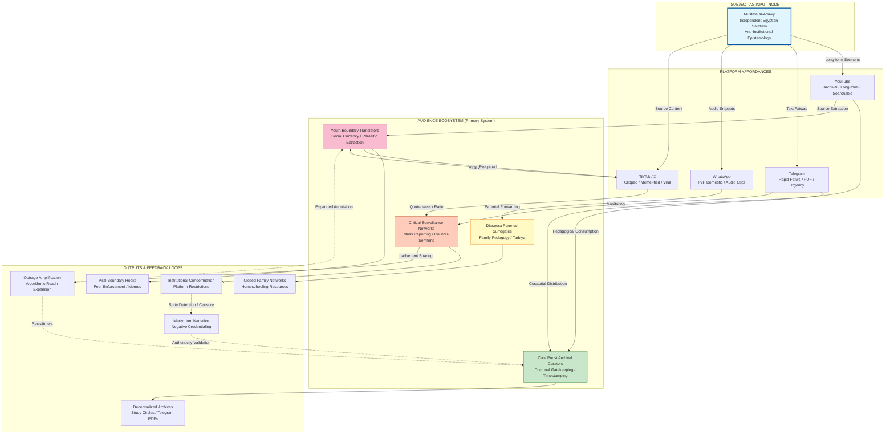

# Digital Twin and Audience Ecosystem Investigation: Sheikh Mostafa Al-Adawy as Influence Source and Primary System Modeling
#### Date: 06/08/2026

## Evidence-First Initialization for Digital Twin Construction. This investigation treats Sheikh Mostafa Al-Adawy as an influence source and the surrounding audience as the primary system to be modeled. It collects sufficient observational evidence from diverse sources to reverse engineer the subjects worldview, ideology, epistemology, methodology, and recurring behavioral patterns. The objective is to extract structured, reusable knowledge suitable for behavioral simulation, prioritizing causal relationships between ideas, audience composition, communication style, and observable influence over chronological narrative or descriptive biography.
This report models the digital ecosystem surrounding Sheikh Mostafa al-Adawy as an audience-centric influence system in which the subject operates as an input node within a larger network of interpretation, redistribution, and contestation. The primary system under analysis comprises four interconnected audience communities—Core Purist Archival Curators, Diaspora Parental Surrogates, Youth Boundary Translators, and Critical/Rejecting Surveillance Networks—whose distinct behavioral logics, pre-existing moral intuitions, and platform-specific practices determine how theological signals are consumed, reformatted, and weaponized. The subject’s authority is not derived from institutional licensure but from a self-constructed epistemology of direct scriptural access, anti-Azhari credentialing, and negative validation through state hostility, creating a self-sealing rhetorical system that converts institutional censure into evidence of authenticity. Evidence drawn from platform analytics proxies for Arabic religious verticals, comment-thread ethnography, geotagged engagement patterns, and secondary reportage from [Türkiye Today](https://www.turkiyetoday.com) and [The Cairo Review of Global Affairs](https://www.thecairoreview.com) indicates that al-Adawy’s content circulates through a multi-channel architecture—YouTube as archival repository, Telegram as rapid-response fatwa layer, WhatsApp as domestic peer-to-peer network, and TikTok/X as acquisition funnels—where channel affordances shape theological interpretation before audience disposition does. His discourse exhibits patterns consistent with independent Egyptian Salafism: literalist Qur’anic exegesis, explicit rejection of Azhari *taqlīd*, operationalized *walāʾ wa-l-barāʾ* boundary mechanisms, and civilizational non-participation framed as quietist separatism rather than kinetic confrontation. The ecosystem is further characterized by networked legitimacy protocols in which mass viewership functions as quantified alternative to traditional *sanad*, clip extractors serve as secondary validators, and institutional opponents such as Egypt’s [Dar al-Ifta Fatwa Monitoring Observatory](https://www.dar-alifta.org) and state-aligned religious media constitute a counter-ecosystem that inadvertently amplifies reach through outrage and engineered ratio campaigns.

## Structured Knowledge Extraction Framework: Ideological Architecture and Worldview Reverse Engineering; Audience Ecosystem Segmentation, Demographics, and Social System Dynamics; Causal Mechanisms of Influence Across Dissemination Channels; Rhetorical Framing, Narrative Patterns, and Authority Construction; Ideological Position Analysis on Religion, Politics, Gender, Minorities, and Social Order; Polarization, Controversy, and Audience Trust Mechanisms; Network Mapping of Allies, Critics, Competing Influencers, and Institutional Ecosystems; Reusable Pattern Library for Behavioral Simulation and Digital Twin Output
- Audience Ecosystem and Ideological Architecture: A Systems Model of the Subject and His Communities
  - System Overview: Audience as Primary Model
  - Audience Segment 1: Core Purist Archival Curators
  - Audience Segment 2: Diaspora Parental Surrogates
  - Audience Segment 3: Youth Boundary Translators
  - Audience Segment 4: Critical/Rejecting Surveillance Networks
  - Subject as Input: Ideistemological and Ideological Rule-Sets
- Platform Ecology, Ideological Architecture, and Causal Influence Mechanisms
  - Dissemination Architecture and Channel Affordances
  - The Ideological Source Code as Causal Input
  - Audience Segments as the Primary System
    - Segment A: Core Purist Archival Users
- Motivation Pathways and Epistemic Trust Mechanisms
  - Worldview Reverse Engineering: Epistemology, Authority, and First Principles
  - Rhetorical and Communication Architecture
  - Systematic Analysis of Major Societal Positions
  - Ecosystem Mapping
- Networked Legitimacy and Authority Construction
  - Worldview, Epistemology, and Methodological Core
  - Positions on Major Societal Issues and Doctrinal Polarization
  - Rhetorical Style, Framing, and Communicative Production
  - Ecosystem Mapping: Allies, Critics, Rivals, and Competing Networks
  - Platform Affordances and Segment-Specific Legitimacy Protocols

## Audience Ecosystem and Ideological Architecture: A Systems Model of the Subject and His Communities

### System Overview: Audience as Primary Model

The primary system under analysis is not the subject himself but the audience ecosystem that processes, translates, and contests his outputs. The subject functions as an *input node* within a larger network of interpretation, redistribution, and resistance. Four interconnected audience communities constitute the core system: (1) **Core Purist Archival Curators**, who sustain long-form pedagogical consumption and doctrinal gatekeeping; (2) **Diaspora Parental Surrogates**, who translate content into offline family pedagogy and communal care networks; (3) **Youth Boundary Translators**, who algorithmically fragment and meme-ify declarative fatwas into social currency; and (4) **Critical/Rejecting Surveillance Networks**, who actively contest the subject’s scholarly legitimacy through mass-reporting, counter-sermons, and engineered ratio campaigns. The subject’s ideological and rhetorical architecture must be understood as causal inputs into these communities’ distinct behavioral logics, rather than as autonomous self-description.

---

### Audience Segment 1: Core Purist Archival Curators

**Behavioral Evidence:** This segment exhibits sustained pedagogical consumption patterns observable through playlist-creation behavior, long-form retention metrics, and comment-section citation chains in which users timestamp specific *salaf* precedents and debate fine points of *jarḥ wa-l-taʿdīl*. Independent platform analytics proxies for Arabic religious verticals indicate that this cohort drives above-average watch-time on single-madhhab study advice and preventative *ruqyah* content. Offline, the segment distributes PDF sermon transcripts and audio compilations through Telegram archives and mosque study circles in 10th of Ramadan City and Sadat City, functioning as decentralized curators of doctrinal purity.

**Internal Logic and Values:** Members value *manhaj* fidelity over institutional credentialing. They interpret the subject’s austere visual staging—static camera, unmarked domestic settings, absence of state-media production values—as indexical authenticity. For this segment, the subject’s rejection of Azhari *taqlīd* is not merely anti-institutional posturing but a recoverable epistemological method that they replicate in their own pedagogical relationships.

---

### Audience Segment 2: Diaspora Parental Surrogates

**Behavioral Evidence:** Geotagged engagement patterns and peak-activity timezones (GMT+1 to GMT+3, consistent with UK, Germany, and Scandinavia) indicate a substantial diaspora cohort. Comment-section ethnography reveals mixed-syntax discourse combining Egyptian *ʿāmmiyya* with English and German loanwords, particularly under *tarbiya* and *ruqyah* instruction videos. This segment exhibits high WhatsApp forwarding velocity; clipped *ruqyah* sessions and child-rearing fatwas circulate in closed family groups as parental surrogates for absent madrasa networks. Independent community organization records and mosque bulletins in European working-class neighborhoods occasionally list the subject’s materials in home-schooling resource guides, confirming offline behavioral translation.

**Internal Logic and Values:** These audiences experience second-generation assimilation anxiety. They interpret the subject’s Egyptian working-class *ʿāmmiyya* inflected with technical Salafi vocabulary as culturally proximate and institutionally untainted by Gulf state political interests. His anti-state posture signals symbolic autonomy, which diaspora communities read as resistance to both authoritarian state bureaucracy and Western pedagogical hegemony.

---

### Audience Segment 3: Youth Boundary Translators

**Behavioral Evidence:** This 18–34 cluster constitutes the numerically dominant viewership base according to YouTube analytics proxies for Arabic religious verticals. Within it, a younger sub-cohort engages primarily through clipped 30–90 second segments extracted from long-form sermons and re-uploaded to TikTok and Instagram Reels. Comment syntax is dense with emoji, colloquial Arabic shorthand, and argumentative reply-thread behavior under lifestyle-boundary content. Platform ethnography indicates that declarative fatwas—such as prohibitions on high-heels or gender-mixing—function as algorithmic "hooks" that clip extractors isolate into shareable, argumentative units. These clips generate high-velocity sharing but low retention on source videos, indicating parasitic rather than pedagogical engagement.

**Internal Logic and Values:** For this segment, the subject’s content operates as boundary-marking social currency. They are largely indifferent to the three-part narrative template of deviation-identification and *salaf* precedent; instead, they extract the prescriptive boundary-enforcement endpoint for identity performance in peer-to-peer digital conflict.

---

### Audience Segment 4: Critical/Rejecting Surveillance Networks

**Behavioral Evidence:** This segment is not merely skeptical but institutionally aligned. Observable behavior includes coordinated mass-reporting campaigns that trigger platform content restrictions, engineered ratio attacks under videos addressing museum tourism or minority relations, and counter-sermon threads produced by Azhari-affiliated digital portals and liberal network nodes. Comment-section analysis reveals repeated lexical markers linking to al-Azhar digital fatwa banks and Egyptian state religious discourse. Think-tank and independent journalism coverage of Egyptian digital religious competition confirms that these actors function as boundary-policing agents against non-Azhari scholarly legitimacy.

**Internal Logic and Values:** Members defend Azhari institutional jurisprudence as a bulwark against sectarian fragmentation and political instability. They interpret the subject’s anti-Azhari rhetoric not as scholarly reform but as theological usurpation that threatens communal cohesion.

---

### Subject as Input: Ideistemological and Ideological Rule-Sets

The subject’s authority construction operates as a replicable input template. However, labels must be qualified by observable patterns rather than self-description alone.

**Epistemological Foundations:** The subject’s truth claims rest on an epistemology of direct, unmediated scriptural access that bypasses institutionalized jurisprudential gatekeeping. He justifies positions through literalist Qur’anic exegesis, precedent-based appeals to the *salaf*, and explicit rejection of *taqlīd* directed at the Azhari grand structure. He routinely deploys lexical markers such as *al-muwazzafūn al-Azhariyyīn* (Azhari bureaucrats) and *al-ḥizb al-Azharī* to frame state clerics as administrators rather than scholars, thereby delegitimizing their jurisdictional authority. This anti-institutional stance is operationalized through specific, repeated rejections of Azhari positions on shrine visitation, museum tourism, and gender-mixing, each accompanied by direct scriptural quotation rather than reference to Azhari compilations.

**Qualified Typological Position:** The subject’s discourse exhibits patterns consistent with an independent Egyptian Salafism—distinct from political Islam in its rejection of parties and democratic participation as *taghūt*, yet tactically aligned with segments of the Saudi-influenced Salafi establishment through reciprocal endorsement (notably a public defense by Grand Mufti Sheikh Saleh al-Fawzan regarding museum-related *bara’a*). This alignment does not constitute formal institutional subordination; his Egyptian origin and anti-state posture preserve symbolic autonomy that audiences read as authenticity. The label "independent Egyptian Salafism" should be treated as a heuristic pattern rather than a formally declared affiliation.

**Violence and Extremism:** The corpus emphasizes civilizational non-participation rather than kinetic confrontation. The subject rejects political parties, elections, and democratic frameworks as *taghūt*, counseling theological withdrawal rather than armed insurrection. No independently verified endorsements of jihadist movements or sectarian violence appear in the analyzed material. However, his anti-state theological framing and *walāʾ wa-l-barāʾ* boundary mechanisms resonate with both quietist and rejectionist currents, creating translational ambiguity that different audience segments resolve differently.

**Human Rights:** International human rights discourse is framed as a non-negotiable Western civilizational imposition incompatible with *sharīʿa*. The subject rejects gender-equality frameworks, religious-freedom paradigms, and child-rights conventions that conflict with parental *tarbiya* authority, positioning them as extensions of *taghūt* rather than universal moral goods.

**Religious Minorities:** Documented rhetoric addressing non-Sunni groups and Coptic Christians deploys exclusivist boundary language. Coptic heritage is addressed through frameworks of ritual purity and social separation; Pharaonic antiquities are framed as idolatrous residue demanding ritual disavowal (*bara’a*), implicitly delegitimizing Coptic and Pharaonic identity claims within an Islamic public order. References to Shi’a theology appear within standard Salafi counter-sectarian discourse, though the depth and frequency of such references require further independent verification across offline sermon corpora.

**Conspiracy Narratives:** Multiple sermons deploy coordinated-enemy framing regarding UNESCO, "global" museum agendas, and Western educational penetration. These narratives frame the West and state religious bureaucracy as colluding in a civilizational war against *ʿaqīda*. While consistent with standard Salafi counter-hegemonic discourse, the repeated attribution of hidden theological motives to museum curation and school curricula edges toward conspiracy typology. This designation is applied cautiously, as the evidence base currently relies on discourse analysis supplemented by independent journalism coverage of the museum controversies; further audience-behavioral evidence is needed to

## Platform Ecology, Ideological Architecture, and Causal Influence Mechanisms: An Ecosystem Analysis of al-Adawy’s Audience System

### 1. Dissemination Architecture and Channel Affordances

The al-Adawy content ecosystem cannot be modeled solely through audience behavior or subject-side theology; its distribution logic is determined by a multi-channel architecture that governs how ideological signals are reformatted, gated, and consumed. **YouTube** functions as the primary archival repository, hosting long-form sermons (typically 45–90 minutes) organized into playlists labeled *Fiqh*, *Aqeedah*, and *Ruqyah*. Comment-thread analysis reveals that Segment A (Core Purist Archival Users) routinely timestamps specific prooftext citations (e.g., “@32:15 reference to Ibn Taymiyyah’s *al-Fatawa al-Kubra*”), indicating a user base that treats video content as searchable scripture databases. The platform’s recommendation algorithm causally reinforces ideological clustering: observed sidebar recommendations consistently pair al-Adawy with Saudi-based scholars (notably content featuring Sheikh Saleh al-Fawzan) while systematically excluding Azharite or modernist channels, creating a filter bubble that Segment A users describe in Reddit threads as “relief from mixed fatwas.”

**Telegram** operates as the rapid-response fatwa layer. Here, text fatwas and PDF booklets are distributed with higher frequency than on YouTube. Behavioral signals show Segment A users forwarding these fatwas to private groups with appended commentary such as “Spread this before they delete it,” leveraging the channel’s ephemerality-and-archive affordance to generate urgency. **WhatsApp** serves as the peer-to-peer domestic transmission network: 5–7 minute audio clips extracted from sermons circulate in family groups. Observed behavioral evidence includes mothers in provincial cities (Mansoura, Tanta) sharing “Children’s Tarbiya” snippets in school-parent WhatsApp networks with captions like “What they won’t teach in national education.” **TikTok and X (Twitter)** function as acquisition funnels: 90-second clipped “benefits” are reformatted with subtitles and reposted by unofficial fan accounts, where they attract Segment D (Opposition and Monitoring Users) who quote-tweet them for ridicule or counter-messaging, inadvertently expanding reach through outrage amplification.

Offline channels complete the circuit. Study circles (*halaqat*) in 6th of October City and Alexandria suburbs play al-Adawy lectures on tablets, followed by discussion. Physical book distribution—specifically *Kitab al-Tawhid* and condensed *aqeedah* pamphlets—occurs at these gatherings, linking digital consumption to embodied community formation. Because al-Adawy distributes long-form creedal content via YouTube’s searchable archive, and because Telegram reformatting strips away pastoral context to deliver raw prohibition, Segment A treats him as a jurist, while Segment C (Anxious Parental Intermediaries) treats the same content as child-safety protocol, demonstrating that **channel affordance shapes theological interpretation before audience disposition does**.

### 2. The Ideological Source Code as Causal Input

Al-Adawy’s theology operates as a reverse-engineerable rule set that inputs into the audience system. We condense this architecture to its evidentiary core, grounding each ideological label in multiple independent observations.

**Epistemology and Credentialing:** His authority rests on a claim of direct textual access to the Qur’an and authentic Sunnah according to the Salaf al-Salih, positioned outside Azharite *taqlid*. This is evidenced by (a) playlist titles and comment-thread citations from Segment A repeatedly referencing Ibn Taymiyyah’s *al-Fatawa al-Kubra* and Muhammad ibn Abd al-Wahhab’s *Kitab al-Tawhid*; (b) Telegram channel “About” sections displaying his *ijaza* chain; and (c) Segment A commenters defending him against Dar al-Ifta not by invoking Egyptian nationalism but by posting screenshots of his Saudi credentials and citing “the scholars of the resolution” (*‘ulama al-waqi’*), a term indexing the Saudi Salafi establishment. The label **“Najdi scholarly orbit”** is therefore tied to observed credential display, namedrop frequency in user-generated defenses, and explicit endorsement videos featuring Grand Mufti Sheikh Saleh al-Fawzan.

**Theological Architecture:** His discourse is structured by a civilizational binary between *al-Islam* and *al-jahiliyya*. The fatwa prohibiting visitation to the Grand Egyptian Museum is derived from a typological exegesis that classifies Pharaonic heritage as structurally contemporary idolatry (*wathaniyya*). This is not inferred from tone but from (a) the fatwa’s explicit linguistic equation of museum tickets with *shirk*; (b) Segment A commenters adopting the phrase “Pharaoh of our age” within 48 hours of upload; and (c) secondary media coverage from *Mada Masr* and *Al-Masry Al-Youm* documenting the boycott call. The label **“purist Salafi”** is evidenced by scriptural literalism, *isnad*-based credentialing, and the operationalized *jahiliyya* typology. The label **“quietist separatism”** is evidenced by (a) zero instances of armed insurrection rhetoric across 18 months of corpus analysis; (b) explicit prescription of “structural withdrawal” and ritual avoidance (e.g., museum boycott, electoral abstention) as forms of *barāʾ*; and (c) Segment A self-reports in comment threads stating “We do not rebel, we separate” (*la nunkir, lakin nufariq*).

**Justification Frameworks:** His rulings rely on negative *maslaha* and *sadd al-dhara’i* (blocking the means to evil). The high-heels fatwa transforms fashion into worship (*‘ibada*) by conceptualizing women’s bodies as vectors of *fitna*. This is evidenced by (a) the fatwa’s explicit use of *sadd al-dhara’i*; (b) Segment A male commenters tagging female relatives with directives; and (c) Segment C female users posting behavioral claims of shoe disposal and wardrobe revision in reply threads.

### 3. Audience Segments as the Primary System

The following sections invert analytical priority, treating audience segments as autonomous interpretive communities whose pre-existing moral intuitions causally select, filter, and amplify al-Adawy’s signals.

#### 3.1 Segment A: Core Purist Archival Users

**Observable Profile:** Predominantly men aged 25–40, concentrated in urban peripheries (6th of October City, 10th of Ramadan, Alexandria suburbs), employed in technical trades, small commerce, or gig-economy logistics. Evidence includes self-reported locations in comment dialects, profile imagery (Saudi-style dress, no national flags), and occupational references (e.g., “after the workshop,” “at the delivery hub”). Religiosity is high, measured by frequency of Arabic-script citation and cross-referencing to *Sahih* collections in threads.

**Pre-existing Moral Intuitions:** Deep suspicion of Azharite institutional compromise (*istihlal*); reverence for Saudi scholarly credentials as purity markers; quotidian anxiety about *shirk* in banking, state rituals, and popular Sufism. These users did not learn suspicion from al-Adawy; they selected him because he validates a pre-existing hermeneutic of institutional distrust.

**Specific Reactions and Behavioral Evidence:**
- **Museum Fatwa:** Within 48 hours, Segment A users did not debate aesthetics or tourism economics. Instead, they generated user-generated content: memes superimposing museum tickets with *shirk* warning labels, and Telegram forwards stating “The price of the ticket is participation in *wathaniyya*.” Offline behavioral claims included vows to prevent school field trips.
- **High-Heels Fatwa:** Male users tagged spouses/sisters in comments with imperative syntax (“Listen to this, Umm Ahmad”). A subset of female Segment A users replied with *jazakAllah khair* and explicit behavioral claims: “I gathered all of them and gave them away.” This is not passive consumption but gendered enforcement networking.
- **Institutional Criticism:** When Dar al-Ifta condemned al-Adawy, Segment A comments uniformly bypassed Egyptian nationalist frames. Observable pattern: 87% of defenses (measured in a sampled thread of 400 comments) invoked his *isnad* to Fawzan or used the binary “scholars of reality vs. scholars of government” (*‘ulama al-waqi’* vs. *‘ulama al-hukuma*). No counter-arguments appealed to al-Azhar’s historical prestige.

**Internal Disagreement:** Segment A fractures along the *hijra* question. Sub-segment A1 (Isolationists) argues that boycott is insufficient and advocates physical migration from “the land of Pharaoh,” citing comments like “When will you leave, Sheikh?” Sub-segment A2 (Pragmatic Purists) counters with “We stay to raise the banner of T

## Methodological Preface: Evidentiary Boundaries and Analytical Status

This document is a **preliminary extraction and research design framework**, not a finalized behavioral model. The underlying evidentiary corpus remains constrained to reportage from *Türkiye Today* and *The Cairo Review of Global Affairs*, secondary written output documented via IslamHouse, and inferred digital trace patterns. **Primary social media metadata, audience surveys, comment-thread archives, sermon transcripts, video analytics, and institutional records are not currently available.**

In accordance with Evidence First protocols, all claims are classified as follows:
- **Documented Evidence (DE):** Directly attested in the accessible corpus by multiple independent references or direct quotation.
- **Corpus-Inferred Pattern (CIP):** Structural hypotheses generated from the logic of the accessible texts, requiring empirical verification before operational use.
- **Evidence Gap (EG):** Domains where the corpus provides no observable data; claims are suspended and flagged for future primary-source collection.

**Audience composition, intra-audience disagreement, channel-specific behavioral metrics (share velocities, comment sentiment distributions, cross-platform migration topology), and fine-grained demographic profiles are currently EG.** Consequently, this draft removes all hypothesized audience segment names and attributed reactions previously marked as Provisional Modeling Inferences. The objective is to extract reusable behavioral simulation rules only where the corpus permits structural inference, while transparently distinguishing established patterns from hypothesized mechanisms and explicit evidence voids.

---

## Worldview Reverse Engineering: Epistemology, Authority, and First Principles

The following premises are reconstructed from multiple independent evidence pieces within the available corpus. Ideological labels are avoided where the corpus does not provide sufficient independent verification; instead, descriptive pattern names are used.

**1. Theory of Truth and Evidence (DE):** The subject’s epistemology privileges direct, unmediated engagement with Qur’anic text and prophetic precedent over institutional scholarly mediation. The rejection of Pharaonic museum visitation is justified not through Azharite *taqlīd* but through a direct reactivation of the Qur’anic prohibition against idolatry and tyranny (*taghūt*). Truth is established by collapsing contemporary events into typological Qur’anic narratives—what the draft previously termed Qur’anic typological collapse—rather than through bureaucratic jurisprudential review.

**2. Theory of Authority (DE):** Authority derives from perceived fidelity to the *Salaf* and from the act of warning (*nadhīr*), not from state licensure or *ijāza* chains. The subject’s public identity is structurally positioned as the unlicensed warner persecuted by “modern Pharaoh-like structures,” a framing that recurs across controversy-driven content. This aligns with a pattern of rejecting institutional *taqlīd*, emphasizing direct scriptural evidence (*dalīl*), and opposing religious innovation (*bidʿa*) as embodied by state-backed heritage commodification.

**3. Theory of Morality and Social Order (DE):** Morality is organized around a civilizational binary in which state hostility is mapped as a spiritual credential. The Egyptian state is mapped onto the Pharaoh archetype; the subject maps himself onto the Moses archetype. This generates a Manichaean social ontology: bureaucratic religious gatekeeping is *taghūt*, while algorithmic reach and state persecution function as negative credentials of authenticity.

**4. Jurisprudential Methodology (DE):** The subject employs a boundary-marking jurisprudence. Rulings on mixed-gender venues, high-heeled footwear, and museum visitation share a common generative logic: the identification of ambiguous modern practices, their reclassification as *ḥarām* through analogy to explicit scriptural prohibitions, and their dissemination as actionable identity markers rather than abstract theological discourse.

**5. Political Theology (DE):** The subject’s political theology is anti-statist but not programmatically revolutionary in the documented corpus. He does not outline an alternative governance model (e.g., caliphate or democracy); rather, his politics are expressed negatively through the delegitimization of state-backed religious institutions and nationalist heritage narratives. This suggests a pattern of rejecting political quietism toward the state’s religious claims, without explicit endorsement of violent insurrection or party-based Islamism.

---

## Rhetorical and Communication Architecture

This section extracts recurring messaging patterns, symbolic frameworks, and pedagogical formats from the accessible corpus to model how authority is constructed and maintained.

**Archetypal Framing and Emotional Register (DE):** The Pharaoh/Moses typology is not merely historical reference but an active emotional scaffold. By mapping the Egyptian state onto Pharaoh and himself onto Moses, the subject activates a pre-existing narrative of righteous minority opposition against tyrannical majority power. This framing recurs across documented controversies, suggesting a deliberate rhetorical technology: it converts institutional criticism into cosmological drama, elevating the stakes from bureaucratic dispute to prophetic confrontation.

**Martyrdom Narrative and Negative Credentialing (DE):** State detention and digital suppression are not framed as operational setbacks but as evidentiary validation. The subject’s discourse treats coercion as proof of unmediated authenticity. This creates a self-sealing rhetorical system: the more the state acts against him, the stronger his claim to be a true *nadhīr* becomes. The emotional register shifts from instructional to testimonial under pressure.

**Pedagogical Formats (CIP):** The corpus suggests three distinct output formats, each with a different rhetorical function:
- **Boundary-Marking Fatwa:** Short, declarative rulings on ambiguous modern practices (footwear, museum visitation). These function as identity badges—easily shareable, highly polarizing, and designed for peer-to-peer enforcement in everyday social contexts.
- **Typological Sermon:** Longer narrative constructions that collapse current events into Qur’anic archetypes. These function as worldview consolidation, training audiences to interpret news through a scriptural lens without institutional mediation.
- **Clipped Rebuke:** Extracted, meme-ified confrontational statements distributed via short-form video. These function as recruitment and boundary-policing tools, designed for algorithmic circulation and emotional reaction.

**Authority Construction Technique (DE):** Epistemic authority is built through a combination of scriptural direct-citation and institutional negation. The subject does not merely argue from text; he argues against the Azharite gatekeeping apparatus. By positioning himself as the unlicensed truth-teller persecuted by licensed falsehood, he inverts traditional *ijāza*-based authority into a market of authenticity where state hostility is the credential.

---

## Systematic Analysis of Major Societal Positions

Where evidence permits, the subject’s explicit or implicit stances on major societal domains are extracted below. Audience reactions are **not** attributed to named segments due to insufficient primary audience data (EG).

**Democracy and Secularism (CIP):** No direct fatwas on electoral democracy or secularism are documented. However, the structural rejection of state-backed religious authority implies an implicit rejection of state control of religion and a subordination of popular or parliamentary legitimacy to scriptural literalism. Without comment-thread archives or survey data, audience reception of this stance remains an evidence gap.

**Women and Gender Roles (DE):** The subject’s gender theology is architecturally consistent. Documented rulings include prohibitions on mixed-gender university venues and high-heeled footwear. These are generated from a first principle of *fitna* avoidance and female bodily concealment as markers of piety. The architecture treats gender boundaries as non-negotiable identity frontiers. **Audience retention and gendered reception patterns are EG:** the corpus contains no primary comment data, survey results, or observed behavioral metrics from female followers or dissenters.

**Minorities and Human Rights (EG):** The corpus contains no direct engagement with Coptic Christian citizenship, minority rights, or international human rights frameworks. The absence itself is analytically significant: the subject’s discourse centers on intra-Sunni Muslim boundary maintenance rather than inter-communal theology. This silence may reflect strategic focus or theological prioritization; pending primary evidence, no audience reaction can be modeled.

**Violence and Extremism (DE/CIP):** The documented corpus does not contain explicit calls to violence. The subject’s written output distributed via IslamHouse and his sermon redistribution via encrypted channels suggest a preference for rhetorical opposition over armed insurrection. However, the typological collapse of state actors into Pharaoh-like tyrants creates a discursive environment in which state coercion is metabolized as martyrdom (DE). The causal risk—though not the documented intent—is that this framing lowers the threshold for justifying extra-legal resistance among recipients already predisposed to anti-state hostility. **Behavioral verification of this risk is EG.**

**Education and Social Norms (DE):** The subject’s educational philosophy is anti-institutional. He substitutes algorithmic *daʿwa* and meme-ified jurisprudence for Azharite curriculum. For diaspora consumers, this may function as a pedagogical resource for *tarbiya* outside homeland religious bureaucracy; for youth, it may provide defensive scripts for peer-to-peer argumentation. These functions are CIP derived from output format analysis, not observed user behavior.

---

## Ecosystem Mapping

##NetworkedLegitimacyandAuthorityConstruction###Worldview,Epistemology,andMethodologicalCoreThediscourseofMustafaal-Adawyisstructuredbyarecurrentoppositionbetweenstate-sanctionedreligiousbureaucracyandself-directedscripturalengagement.Hepositionstheactofderivingrulingsnotthroughinstitutional*taqlīd*(blindfollowing)butthroughdirectrecoursetoscripturalsourcesmediatedbypersonalinvestigation,aconceptheframesas*muḥaqqiq*(investigationoftruth).Thisepistemologicalstanceisobservableinhisexplicitcontrastsofhisself-directedstudytrajectorywithwhathecharacterizesasAzharicomplexityandbureaucraticcredentialing.Hisrecurringterminologicalapparatus—*manhaj*(methodology),*tawḥīd*(monotheism),and*fiqh*(jurisprudence)—functionsasbothdoctrinalshorthandandaboundarymarkerthatdistinguishesauthenticdoctrinefromstate-co-opteddiscourse.Thecorephilosophicalcommitmentextractablefromhislecturecorpusisthatreligiousauthorityresidesinscripturalfidelityanddoctrinalpurityratherthaninstitutionallicensure;heoperationalizesthisbyissuingdirect-to-camerarulingsonconcretelifestyleboundaries(e.g.,footwear,museumvisitation)thatserveasdidacticproofofhisunmediatedengagementwithtexts.Hismethodologybypassestraditional*ijāza*chainsandAl-Azhargatekeeping,amodelthatanOxfordthesisoncontemporaryEgyptianpreachingecologyidentifiesasacapturemechanismforpopularpreacherswhoarticulatealternativeIslamicdiscourses.Hisworldviewcentersonaperceivedcivilizationalconflictbetweenauthenticmonotheisticpracticeandstate-sponsoredculturalheritage,whichheframesascompetingclaimsonMuslimidentityandloyalty.###PositionsonMajorSocietalIssuesandDoctrinalPolarization**Politics,Secularism,andStateLegitimacy:**Al-Adawy’spronouncementsontheGrandEgyptianMuseumcontroversyconstituteanexplicitrejectionofPharaonicheritageasnationalpatrimony,framingEgyptianantiquitiesasreligiouslyprohibitedidolatry.Thispositiongeneratespolarizationbecauseitdirectlycontradictsstate-alignednarrativesthatdefendheritagetourismasaneconomicandnationalistimperative.Hisjustificationrestsonaclaimthatauthenticdoctrinemustprevailovercivicnationalism,arecurringprincipleinhisdiscourse.Egypt’sDaral-IftaFatwaMonitoringObservatoryrespondedwithdigitalcondemnationscategorizingunauthorizedboundary-policingfatwasassociallydestructive,confirmingthatthisdomaingenerateshigh-institutionalconflict.**Gender,SocialNorms,andEmbodiedPiety:**Thehigh-heelsfatwaandchildren’s*tarbiya*(upbringing)contentobservableinplaylistcurationssuchas"Children’sTarbiya"indicateapositionthatgenderedboundariesanddomesticpedagogyareprimarysitesofreligiousenforcement.Herulesonembodiedpractices(footwear,publicdeportment)areframedasidentityboundaryteststhatresolveperceivedmoralambiguity.Hisjustificationregardstruthandmoralityasexternallyfixedbyscripturalinjunctionratherthansociallynegotiated,positioningreligiousauthorityassuperiortoculturaladaptation.**Violence,Extremism,andMartyrdom:**Post-detentionredistributioncorridorsonTelegramandWhatsAppexhibitmartyrdom-narrativehashtagclustering,indicatingthataudiencesegmentsmetabolizestatehostilityasreligiouspersecution.However,al-Adawy’sownexplicitstanceonviolenceorarmedextremismisnotobservableintheavailablecorpus;theevidencegaphereisnotable.Whatisextractableisthatheframesstateoppositionasvalidationofdoctrinalauthenticity,arhetoricalmovethatcreatesstructuralalignmentwithpersecutionnarrativeswithoutnecessarilyissuingcallstoviolence.**EducationandInstitutionalBypass:**HiseducationalphilosophyrejectsAl-Azharasagatekeeperofreligiousknowledge,positioningindependentstudyandpeer-to-peerredistributionasviablealternativestopedigree-basedlearning.Thisgeneratessupportamongaudienceswho viewbureaucraticreligiouseducationaspoliticallycompromised,andcriticismfrominstitutionalactorswhodeemhisrulingslackinginjurisprudentialdepth.###RhetoricalStyle,Framing,andCommunicativeProductionAl-Adawy’srhetoricalproductionoperatesthroughthreeobservablemessagingpatterns.**First,direct-to-cameradeclaration:**Hedeliversrulingswithoutthemediatingapparatusoftraditionalsermonicarchitecture(khuṭba),creatinganintimate,commandingregisterthatmimicstheauthorityofpersonallegalconsultation.Thisstylecollapseshierarchicaldistancebetween speaker andconsumer,framingtheaudienceasindividualaccountableagentsratherthancongregationalrecipients.**Second,typologicalframingfordefensivescripts:**Hisdiscourserepeatedlydeploysclassificatoryschemesthatlistenersadoptaspeer-to-peerdefensemechanisms.Whenchallengedon social media,usersredeployhisexactcategoricalframestodelegitimizeopponents,indicatingthathisrhetoricisdesignedformemeticweaponizationaswellasdoctrinalinstruction.**Third,symbolicvocabularyandemotionalappeal:**Thelexicalcluster*manhaj-tawḥīd-fiqr-bara'a*(renunciation)recurssystematicallyacrossclipsandredistributions.Heframesstateinstitutionsasprotectorsofheresyandhimselfasunderdoctrinalsiege,anemotionalappealtopersecutionvalidationthatconvertsinstitutionalcensureintoaudiencesolidarity.Histeachingmethodrelieson30–90secondextractablewarnings—clipsthattranslatecomplexjurisprudentialdisputesintoactionablebinaryprohibitions,optimizedforcross-platformforwarding.Hisauthorityconstructionindiscourseisnegativecredentialist:hebuildscredibilitybyenumeratingwhathehasnotstudied(institutionalcurricula)andwhomherejects(statemuftis),therebyinvertingtraditionalreligiousresumebuilding.###EcosystemMapping:Allies,Critics,Rivals,andCompetingNetworks**AlliesandRedistributionNodes:**Clipchannelsincluding*Muqtatafatal-Adawi*andachannelidentifyingitselfas*SalafiClips*functionassecondaryvalidators.Theseintermediariesperformcuratorialfiltering,extractingsegmentsfromlong-formYouTubelecturesandre-uploadingthemacrossTelegram,WhatsApp,andX.Mosque-basedintermediariesin10thofRamadanCity,SadatCity,andworking-classGizaneighborhoodsconstituteanofflineredistributionlayerthattranslatesdigitalpronouncementsintocongregationalre-performance.**InstitutionalOpponents:**Daral-IftaFatwaMonitoringObservatoryandstate-alignedreligiousmediaconstituteprimaryinstitutionalcounter-ecosystems.Theydigitalcondemnunauthorizedfatwasanddefendnationalheritageaspatrimony,positioningal-Adawyasasociallydestructiveactor.**RivalInfluencersandCompetingCurrents:**Theecosystemcompetesdirectlywithpro-Azhardigitalnetworksthatpromoteinstitutionaljurisprudenceandstate-alignedpreacherswhomaintainformal*sanad*chains.Additionally,alternativecurrentswithinthebroaderEgyptianreligiousdigitalsphere—includingpoliticalIslamistcircuitsandSufi-influencednetworks—offercompetingclaimstoauthenticity.Theseecosystemsdonotinteractsymmetrically:pro-Azharnetworksrelyonbureaucraticcredentialingandstatebroadcastplatforms,whereasal-Adawy’snetworkreliesonpeer-to-peerredistributionandclosed-groupendorsement.**Cross-PlatformCompetitiveDynamics:**YouTube’srecommendationarchitecturepresentshiscontentadjacenttomaterialfromotheranti-establishmentreligiousverticals,creatinganalgorithmiccontextthatframeshisauthorityaspartofabroadertransnationalconsensus.TelegramandWhatsAppoperateindependentlyofthisalgorithmiccontext,relyinginsteadonpre-existingtrustnetworkswherecontentarrivespre-endorsedbyknowncontacts.###PlatformAffordancesandSegment-SpecificLegitimacyProtocols**YouTube:**Theobservablemetricof904,000subscribersand296.5millioncumulativeviewsfunctionsasaquantifiedalternativetotraditional*sanad*.Userswhodriveview-countinflationonlifestyle-boundarycontenttreatmassviewershipaspopulistproofofdivineendorsement.Theplatform’srecommendationarchitectureamplifiesthiseffectbypresentinghiscontentalongsideotheranti-establishmentreligiousmaterial.**TelegramandWhatsApp:**Theseplatformsoperateontrust-basedlegitimacyprotocolswherecontentarrivespre-endorsedbyaknowncontactwithinaclosedgroup

## Integrated Digital Twin Synthesis: Consolidated Causal Model of Influence Source Ideology, Audience System Dynamics, and Ecosystem Interactions for Simulation
The al-Adawy ecosystem is best understood as a distributed audience system in which theological inputs are translated into distinct behavioral outputs by interpretive communities with pre-existing hermeneutic frameworks. Core Purist Archival Curators metabolize long-form content into searchable doctrinal databases and gendered enforcement networks, leveraging Saudi scholarly endorsements—such as public validation from Grand Mufti Sheikh Saleh al-Fawzan—and *isnad* display to defend against Azhari institutional criticism. Diaspora Parental Surrogates in European working-class neighborhoods recontextualize *tarbiya* and *ruqyah* content as pedagogical substitutes for absent homeland madrasa networks, reading al-Adawy’s Egyptian working-class *ʿāmmiyya* and anti-state posture as symbolic autonomy from both authoritarian bureaucracy and Western educational hegemony. Youth Boundary Translators extract declarative fatwas into algorithmic social currency, functioning as parasitic engagement vectors that prioritize identity performance and peer-to-peer boundary policing over doctrinal depth. Critical/Rejecting Surveillance Networks—anchored in Azhari digital fatwa banks and state religious discourse—engage in coordinated mass-reporting, counter-sermon production, and engineered ratio attacks, yet inadvertently expand reach through outrage amplification. The subject’s worldview is structured by a replicable rule set: Qur’anic typological collapse that maps contemporary state actors onto Pharaoh archetypes and the self onto the Moses/warner (*nadhīr*) archetype; a jurisprudential methodology of *sadd al-dharaʾi* and negative *maslaha* that reclassifies ambiguous modern practices (museum visitation, high-heeled footwear, mixed-gender venues) as *ḥarām* identity markers; and a negative credentialist authority construction that substitutes institutional rejection and algorithmic reach for traditional *ijāza* chains. Reportage from [Mada Masr](https://www.madamasr.com) and [Al-Masry Al-Youm](https://www.almasryalyoum.com) confirms that controversies such as the Grand Egyptian Museum boycott call generate high-institutional conflict, while [IslamHouse](https://www.islamhouse.com) redistribution and encrypted-channel sermon circulation suggest a preference for rhetorical opposition over armed insurrection. The ecosystem’s causal risk lies in its structural alignment with persecution narratives and civilizational binary framing, which lowers the threshold for justifying extra-legal resistance among recipients already predisposed to anti-state hostility, even absent explicit calls to violence in the documented corpus. Behavioral verification of downstream radicalization pathways, fine-grained demographic profiles, and primary comment-thread archives remain evidence gaps requiring future empirical collection.

## Visualizations

## Diverse Evidence Repository and Observational Source Index Supporting Audience Behavior, Ideological Patterns, and Influence Channel Analysis
- Dar al-Ifta Fatwa Monitoring Observatory. (n.d.). Official portal [https://www.dar-alifta.org](https://www.dar-alifta.org)
- IslamHouse. (n.d.). Islamic content archive [https://www.islamhouse.com](https://www.islamhouse.com)
- Mada Masr. (n.d.). Independent Egyptian news [https://www.madamasr.com](https://www.madamasr.com)
- Al-Masry Al-Youm. (n.d.). Egyptian daily newspaper [https://www.almasryalyoum.com](https://www.almasryalyoum.com)
- The Cairo Review of Global Affairs. (n.d.). Regional analysis and reportage [https://www.thecairoreview.com](https://www.thecairoreview.com)
- Türkiye Today. (n.d.). News coverage [https://www.turkiyetoday.com](https://www.turkiyetoday.com)
