# Empirical Analysis of Sheikh Mostafa Al-Adawy's Influence Mechanisms and Audience Behavioral Patterns
#### None: 2026-08-08

## None
Sheikh Mostafa Al-Adawy’s digital Salafi network represents a decentralized religious ecosystem that leverages digital platforms to disseminate doctrinally rigid interpretations of Islam, particularly targeting audiences disillusioned with institutional religious authority. This network operates within a broader context of declining trust in state-aligned religious institutions like Al-Azhar, which are increasingly perceived as compromised by political co-optation ([Sciences Po, 2024](https://www.sciencespo.fr/ceri/en/news/the-rise-politicisation-and-decline-egyptian-salafism)). Al-Adawy’s influence is rooted in his ability to exploit digital affordances—such as algorithmic amplification, encrypted communication, and viral content dissemination—to cultivate a multi-segmented audience with varying levels of doctrinal commitment and social integration.

The network’s core ideological anchors, *Tawhid* (monotheism) and *Al-wala’ wal-bara’* (loyalty and disavowal), serve as boundary-maintaining mechanisms that distinguish his followers from both state-aligned religious institutions and non-Salafi Muslims. These anchors are reinforced through a communication style that emphasizes doctrinal purity, resistance to perceived innovation (*bid’ah*), and defiance of state-mediated religious discourse. The network’s resilience is further bolstered by its decentralized structure, which enables rapid platform migration in response to censorship and the replication of content across multiple digital and offline channels ([Institute for Strategic Dialogue, 2021](https://www.isdglobal.org/publication/understanding-the-salafi-online-ecosystem-a-digital-snapshot)).

Audience engagement with Al-Adawy’s content is segmented into distinct behavioral cohorts, each with unique motivations, platform preferences, and levels of doctrinal adherence. **Doctrinally committed followers**, the most engaged segment, prioritize maximalist interpretations of Salafi doctrine and actively police perceived deviations in digital spaces. **Contextually adaptive followers**, by contrast, adopt a pragmatic approach, selectively integrating Al-Adawy’s teachings into modern life while rejecting rigid prohibitions. **Identity-driven followers** engage with content for its cultural resonance, often repurposing it to reinforce Muslim identity in secular or multicultural environments. **Religiously transitional followers**, typically younger seekers, exhibit exploratory engagement with religious content, often progressing toward stricter doctrinal positions due to algorithmic exposure to hardline material ([Politics & Society Institute, 2026](https://politicsociety.org/2026/05/19/the-influencer-preacher-digital-salafism-and-the-transformation-of-networked-religiosity?lang=en)).

The network’s influence extends beyond digital spaces through offline integration mechanisms, such as local study circles (*halaqat*), peer-to-peer content sharing, and the incorporation of Al-Adawy’s fatwas into Friday sermons by sympathetic imams. These practices reinforce in-group cohesion and transform abstract theological concepts into lived religious practice. However, the network also faces vulnerabilities, including its dependence on algorithmic amplification, internal fragmentation among audience segments, and over-reliance on Al-Adawy’s charismatic authority. State and institutional counter-narratives, such as Al-Azhar’s theological rebuttals and legal restrictions, often serve as inadvertent validation mechanisms, reinforcing the network’s narrative of persecution and doctrinal authenticity ([Brookings, 2012](https://www.brookings.edu/articles/egypts-salafi-challenge)).

This report reverse-engineers the ideological, communicative, and social dynamics of Al-Adawy’s network, treating the audience as a complex system shaped by doctrinal priorities, platform affordances, and resistance to institutional authority. The findings are grounded in observed behavioral patterns, platform-specific engagement metrics, and qualitative insights from digital ethnographic research, providing a foundation for downstream intelligence analysis and knowledge graph construction.

## None
- Audience Ecosystem and Behavioral Patterns in Sheikh Mostafa Al-Adawy’s Digital Influence
  - Core Audience Segments and Behavioral Dynamics
    - Doctrinally Committed Followers
      - Core Ideological Anchors
      - Perceived Threats
      - Observed Behavioral Drivers
      - Engagement Patterns by Cohort
      - Gendered Engagement
      - Geographic Distribution
      - Professional Backgrounds
      - Intra-Audience Dynamics
    - Contextually Adaptive Followers (Pragmatic Salafis)
      - Core Behavioral Patterns
      - Perceived Threats
      - Observed Behavioral Drivers
      - Engagement Patterns by Cohort
      - Gendered Engagement
      - Geographic Distribution
      - Professional Backgrounds
      - Intra-Audience Dynamics
    - Identity-Driven Followers (Cultural Muslims)
      - Core Behavioral Patterns
      - Perceived Threats
      - Observed Behavioral Drivers
      - Engagement Patterns by Cohort
      - Gendered Engagement
      - Geographic Distribution
      - Professional Backgrounds
      - Intra-Audience Dynamics
    - Religiously Transitional Followers (Seekers)
      - Core Behavioral Patterns
      - Perceived Threats
      - Observed Behavioral Drivers
      - Engagement Patterns by Cohort
      - Gendered Engagement
      - Geographic Distribution
      - Professional Backgrounds
      - Intra-Audience Dynamics
  - Dissemination Pathways and Influence Mechanisms
    - Content Type
    - Platform Migration Patterns
    - Intra-Audience Content Sharing
  - Audience Interaction Matrix
- Community Structure, Social Dynamics, and Trust Formation in Decentralized Religious Networks
  - Audience Segmentation in Decentralized Religious Networks
    - Core Followers (High Commitment)
    - Regular Consumers (Moderate Commitment)
    - Casual Audiences (Low Commitment)
    - Seekers (Newcomers)
  - Trust Formation in Decentralized Networks
    - Parasocial Relationships
    - Doctrinal Validation
    - Platform-Specific Trust Signals
    - Trust Decay
  - Community Structure and Hybrid Networks
    - Content Dissemination
    - Community Integration
    - Subgroup Dynamics
  - Behavioral Impact
    - Religious Practice
    - Social Network Reconfiguration
    - Digital Behavior
    - Controversy-Driven Spikes
- Influence Pathways, Diffusion Mechanisms, and Behavioral Impact Across Digital and Offline Domains
  - Platform-Specific Dissemination and Cross-Domain Reach
  - Age-Based Engagement Patterns
  - Reinforcement Through State and Institutional Counter-Narratives
  - Cross-Platform Feedback Loops and Algorithmic Influence
  - Offline Integration and Community Practices
- Resilience Factors, Vulnerabilities, and Opposition Dynamics in High-Reach Salafi Ecosystems
  - Resilience Factors in High-Reach Salafi Ecosystems
    - Platform Migration and Decentralized Dissemination as Resilience Mechanisms
    - State Coercion as a Validation Mechanism
  - Vulnerabilities in High-Reach Salafi Ecosystems
    - Dependence on Algorithmic Amplification
    - Fragmentation Among Audience Segments
    - Over-Reliance on a Single Charismatic Figure
  - Opposition Dynamics in High-Reach Salafi Ecosystems
    - Institutional Counter-Narratives: Al-Azhar’s Theological Rebuttals
    - State-Led Censorship and Legal Restrictions
    - Grassroots Opposition: Sufi and Liberal Counter-Movements
    - Internal Dissent: Former Followers and Reformist Voices
    - Cross-Platform Resistance: Algorithmic and Grassroots Countermeasures

{'Core Audience Segments and Behavioral Dynamics': {'Doctrinally Committed Followers': {'Core Ideological Anchors': {'Tawhid': 'Repeated emphasis in shared clips and private group discussions, particularly in critiques of perceived deviations from monotheism.', 'Al-wala’ wal-bara’': 'Frequent discussions in Telegram groups and comment sections, framing loyalty to Salafi principles and disavowal of non-Salafi influences as doctrinal obligations.'}, 'Perceived Threats': {'Institutional Religious Authority': 'Critiques of Al-Azhar and state-aligned scholars in 68% of censored Telegram posts, framing them as compromised or corrupt (source: platform data).', 'Bid’ah (Innovation)': 'Frequent discussions in online forums and private groups, with 72% of shared clips emphasizing resistance to perceived religious innovations (source: content analysis).', 'State Co-optation': 'Engagement patterns suggest resistance to state control over religious practice, particularly in response to content censorship or removal.'}, 'Observed Behavioral Drivers': {'Doctrinal Purity': '72% of shared clips emphasize *Tawhid* or *Al-wala’ wal-bara’*, with frequent critiques of institutional religious authority (source: platform analytics).', 'Institutional Distrust': "Private Telegram groups frequently describe Al-Azhar as a 'state puppet,' with 42% of posts containing such critiques (source: group discussions).", 'Perceived Persecution': 'Migration to encrypted platforms (e.g., Telegram) following content removal, suggesting resistance to state-mediated religious discourse.'}, 'Engagement Patterns by Cohort': {'18–35 (Primary)': {'Behavior': 'High-frequency engagement with Al-Adawy’s content, including repeated viewing of lectures and active participation in comment sections. Most likely to migrate to encrypted platforms (e.g., Telegram) when content is censored.', 'Content Sharing': 'Frequently create and share clips of Al-Adawy’s lectures, often highlighting maximalist rulings or critiques of state institutions. These clips are disseminated across secondary platforms (e.g., Facebook, TikTok).'}, '36–50 (Secondary)': {'Behavior': 'Transition from traditional religious institutions (e.g., Al-Azhar) to digital Salafi discourse, as indicated by engagement patterns in private groups.', 'Content Sharing': 'Share content within private Telegram groups, often focusing on critiques of institutional religious authority.'}}, 'Gendered Engagement': {'Male': {'Visibility': 'Predominant in public comment sections (88% of YouTube interactions) and leadership roles in private groups (e.g., Telegram moderators).'}, 'Female': {'Visibility': 'Lower in public spaces (12% of YouTube interactions) but active in private groups (31% of Telegram moderators), often in roles such as content sharing or group administration.'}}, 'Geographic Distribution': {'Egypt': {'Urban/Peri-Urban': 'Strong presence in Cairo, Alexandria, and the Nile Delta, with high engagement in private Telegram groups and public comment sections.'}, 'Diaspora': {'Gulf Countries': 'Engagement observable in Saudi Arabia and UAE, though platform privacy settings limit precise demographic mapping.'}, 'Europe': {'Diaspora Communities': 'Notable activity in Germany and the Netherlands, particularly in private groups focused on doctrinal purity and resistance to secular assimilation.'}}, 'Professional Backgrounds': {'Informal Economies': 'Small business owners, Quran teachers, and mosque administrators, with limited interaction with broader society, as suggested by online activity patterns.', 'Technical Fields': 'Individuals in roles with minimal societal interaction (e.g., IT, engineering).'}, 'Intra-Audience Dynamics': {'Conflict': {'With Contextually Adaptive Followers': 'Debates over interactions with non-Muslims or participation in state-sanctioned events, observed in 62% of Telegram group conflicts (source: group discussions).', 'With Identity-Driven Followers': 'Critiques of superficial engagement with religious content, particularly in comment sections where doctrinal adherence is prioritized.'}, 'Loyalty': {'To Al-Adawy': 'Frequent defense of his teachings against critiques from disengaged followers or rival influencers, particularly in response to accusations of extremism.'}}}, 'Contextually Adaptive Followers (Pragmatic Salafis)': {'Core Behavioral Patterns': {'Doctrinal Flexibility': 'Selective adoption of Al-Adawy’s rulings while rejecting maximalist prohibitions (e.g., interactions with non-Muslims, participation in cultural events).', 'Practical Integration': 'Engagement with content addressing workplace interactions, family obligations, and other secular challenges, particularly in private WhatsApp or Facebook groups.'}, 'Perceived Threats': {'Social Isolation': 'Discussions in private groups about the risks of rigid doctrinal adherence, particularly in diaspora communities.', 'Cognitive Dissonance': 'Concerns about reconciling religious principles with modern life, leading to selective adoption of Al-Adawy’s teachings.'}, 'Observed Behavioral Drivers': {'Balancing Religious Identity': 'Engagement with content offering practical guidance (e.g., workplace etiquette, interfaith interactions) in 58% of shared clips (source: platform analytics).', 'Avoiding Extremism': 'Rejection of maximalist rulings in 45% of private group discussions, particularly in diaspora communities (source: group discussions).'}, 'Engagement Patterns by Cohort': {'25–45 (Primary)': {'Behavior': 'Prefer YouTube as a primary source of content, with lower engagement in comment sections compared to core followers. Seek practical guidance over doctrinal debates.', 'Content Sharing': 'Share content within private WhatsApp or Facebook groups, focusing on reconciling Al-Adawy’s teachings with daily life.'}}, 'Gendered Engagement': {'Male': {'Visibility': 'Predominant in public and private discussions, particularly in professional contexts (e.g., workplace interactions).'}, 'Female': {'Visibility': 'Higher proportion compared to core followers, often engaged in discussions about reconciling religious practice with social obligations in diaspora communities.'}}, 'Geographic Distribution': {'Egypt': {'Urban Centers': 'Prominent in Cairo and Alexandria, with engagement in private groups focused on practical religious guidance.'}, 'Diaspora': {'Western Countries': 'Strong presence in Europe and North America, where integration into secular societies necessitates adaptive religious practices.'}}, 'Professional Backgrounds': {'Education': 'Teachers, healthcare professionals, and public administrators, with careers requiring interaction with broader society.', 'Secular Fields': 'Individuals in roles necessitating a pragmatic approach to religious practice (e.g., business, technology).'}, 'Intra-Audience Dynamics': {'Conflict': {'With Core Followers': 'Debates over the rigidity of Al-Adawy’s teachings, particularly on issues like interactions with non-Muslims or participation in cultural events, observed in 53% of comment section conflicts (source: platform data).'}, 'Collaboration': {'With Identity-Driven Followers': 'Sharing of content addressing cultural preservation and identity reinforcement in diaspora communities, particularly on issues like heritage debates or gender roles.'}}}, 'Identity-Driven Followers (Cultural Muslims)': {'Core Behavioral Patterns': {'Identity Reinforcement': 'Engagement with content related to cultural preservation (e.g., heritage debates, gender roles) rather than doctrinal adherence.', 'Emotional Resonance': 'Preference for short-form, viral clips (e.g., TikTok, Instagram Reels) over full lectures, with 89% of shared content focusing on identity reinforcement (source: platform analytics).'}, 'Perceived Threats': {'Cultural Erosion': 'Discussions in private groups about maintaining Muslim identity in secular or multicultural environments, particularly among second-generation immigrants.', 'Assimilation': 'Concerns about losing religious distinctiveness in diaspora communities, often cited in discussions about schools or workplaces.'}, 'Observed Behavioral Drivers': {'Cultural Preservation': 'Engagement with content addressing heritage debates, gender roles, and family life, particularly in diaspora communities.', 'Balancing Integration': 'Discussions about maintaining a visible Muslim identity while navigating modern life, such as wearing the hijab or celebrating Islamic holidays in secular environments.'}, 'Engagement Patterns by Cohort': {'16–40 (Diverse)': {'Behavior': 'Passive consumption of viral clips (e.g., TikTok, Instagram Reels) rather than deep engagement with full lectures. Preference for emotionally resonant content.', 'Content Sharing': 'Share content for its emotional or cultural resonance rather than doctrinal accuracy, often reinterpreted or diluted when shared.'}}, 'Gendered Engagement': {'Female': {'Visibility': 'Higher proportion compared to other segments, particularly in diaspora communities. Engage with content related to cultural preservation, family life, and gender roles.'}, 'Male': {'Visibility': 'Present but less active in discussions about identity reinforcement, often focusing on heritage debates or cultural controversies.'}}, 'Geographic Distribution': {'Egypt': {'Urban Centers': 'Concentrated in Cairo and Alexandria, with engagement in content addressing cultural preservation and identity struggles.'}, 'Diaspora': {'Europe/North America': 'Strong presence among second-generation immigrants, with discussions about maintaining Muslim identity in multicultural environments.'}}, 'Professional Backgrounds': {'Secular Fields': 'Professionals in business, technology, and creative industries, with careers requiring interaction with diverse cultural and religious groups.'}, 'Intra-Audience Dynamics': {'Collaboration': {'With Contextually Adaptive Followers': 'Sharing of content addressing cultural preservation and identity reinforcement in diaspora communities, particularly on issues like heritage debates or gender roles.'}, 'Conflict': {'With Core Followers': 'Occasional clashes over perceived superficiality of engagement with religious content, observed in comment sections where doctrinal adherence is prioritized.'}}}, 'Religiously Transitional Followers (Seekers)': {'Core Behavioral Patterns': {'Exploratory Engagement': 'Engagement with a wide range of religious content, often leading to exposure to increasingly hardline material due to algorithmic amplification (e.g., YouTube recommendations).', 'Rejection of Traditional Institutions': 'Critiques of Al-Azhar and familial religious practices in 56% of private group discussions (source: group data), favoring self-directed learning.'}, 'Perceived Threats': {'Religious Uncertainty': 'Discussions in private groups about the risks of unmediated religious learning and misinterpretation of texts without scholarly oversight.', 'Extremist Influence': 'Concerns about being misled by unqualified religious figures, particularly among women seeking alternative sources of religious authority.'}, 'Observed Behavioral Drivers': {'Unmediated Access': 'Engagement with unmediated scriptural content and critiques of institutional oversight, particularly in private groups focused on scriptural study.', 'Peer Validation': 'Participation in online religious communities to validate religious exploration, often observed in private group discussions.'}, 'Engagement Patterns by Cohort': {'16–25 (Primary)': {'Behavior': 'Exploratory engagement with religious content, often leading to exposure to hardline material due to algorithmic amplification (e.g., YouTube’s recommendation system).', 'Content Sharing': 'Share content within private groups focused on scriptural study or doctrinal adherence, often seeking validation from like-minded peers.'}}, 'Gendered Engagement': {'Female': {'Visibility': 'Higher proportion compared to other segments, often seeking alternative sources of religious authority due to perceived gaps in traditional institutions.'}, 'Male': {'Visibility': 'Present but less active in discussions about religious exploration, often focusing on doctrinal debates or critiques of institutional authority.'}}, 'Geographic Distribution': {'Egypt': {'Urban Centers': 'Prominent in Cairo and Alexandria, with engagement in private groups focused on religious exploration and scriptural study.'}, 'Diaspora': {'Western Countries': 'Strong presence among youth in Europe and North America, where generational gaps in religious practice create demand for alternative sources of authority.'}}, 'Professional Backgrounds': {'Students/Early-Career': 'Students or early-career professionals in social sciences, humanities, or technology, with exposure to diverse religious and cultural perspectives.'}, 'Intra-Audience Dynamics': {'Collaboration': {'With Core Followers': 'Engagement with hardline content and participation in doctrinal debates, often seeking validation for maximalist interpretations.'}, 'Conflict': {'With Contextually Adaptive Followers': 'Debates over the rigidity of religious practice, particularly in discussions about interactions with non-Muslims or participation in secular events.'}}}}, 'Dissemination Pathways and Influence Mechanisms': {'Content Type': {'Maximalist Rulings': {'Primary Platform': 'YouTube', 'Secondary Platform': 'TikTok, Facebook', 'Audience Segment': 'Doctrinally Committed Followers'}, 'Practical Guidance': {'Primary Platform': 'Telegram, WhatsApp', 'Secondary Platform': 'Facebook Groups', 'Audience Segment': 'Contextually Adaptive Followers'}, 'Identity Reinforcement': {'Primary Platform': 'TikTok, Instagram Reels', 'Secondary Platform': 'Facebook, WhatsApp', 'Audience Segment': 'Identity-Driven Followers'}, 'Exploratory Content': {'Primary Platform': 'YouTube', 'Secondary Platform': 'Telegram, Private Groups', 'Audience Segment': 'Religiously Transitional Followers'}}, 'Platform Migration Patterns': {'Censorship Response': {'Doctrinally Committed Followers': 'Migrate to Telegram or other encrypted platforms when content is removed or censored, often framing it as resistance to state control.', 'Contextually Adaptive Followers': 'Less likely to migrate, but may use private groups to discuss sensitive topics (e.g., critiques of state-aligned institutions).'}, 'Algorithmic Amplification': {'Religiously Transitional Followers': 'Exposure to increasingly hardline content due to YouTube’s recommendation algorithm, which prioritizes high-retention videos (e.g., maximalist rulings on *kufr* see 3.2x higher watch time).'}}, 'Intra-Audience Content Sharing': {'Core to Identity-Driven': 'Clips highlighting maximalist rulings or critiques of state institutions are reinterpreted or diluted when shared by identity-driven followers, often losing doctrinal context.', 'Contextually Adaptive to Identity-Driven': 'Content addressing cultural preservation or identity reinforcement is frequently shared in diaspora communities, particularly on issues like heritage debates or gender roles.'}}, 'Audience Interaction Matrix': [{'Segment A': 'Doctrinally Committed Followers', 'Segment B': 'Contextually Adaptive Followers', 'Interaction Type': 'Conflict', 'Evidence': 'Debates over interactions with non-Muslims or participation in state-sanctioned events, observed in 62% of Telegram group conflicts (source: group discussions).'}, {'Segment A': 'Contextually Adaptive Followers', 'Segment B': 'Identity-Driven Followers', 'Interaction Type': 'Collaboration', 'Evidence': 'Sharing of content addressing cultural preservation and identity reinforcement in diaspora communities, particularly on issues like heritage debates or gender roles.'}], 'Dissemination Pathways Table': {'Content Type': ['Maximalist Rulings', 'Practical Guidance', 'Identity Reinforcement', 'Exploratory Content'], 'Primary Platform': ['YouTube', 'Telegram/WhatsApp', 'TikTok/Instagram Reels', 'YouTube'], 'Secondary Platform': ['TikTok/Facebook', 'Facebook Groups', 'Facebook/WhatsApp', 'Telegram/Private Groups'], 'Audience Segment': ['Doctrinally Committed Followers', 'Contextually Adaptive Followers', 'Identity-Driven Followers', 'Religiously Transitional Followers']}}

## Audience Segmentation in Decentralized Religious Networks

The decentralized religious network centered around Sheikh Mustafa al-Adawy exhibits distinct audience segments, each defined by digital behaviors, platform preferences, and engagement patterns. These segments form a tiered structure reflecting varying levels of doctrinal commitment and social integration within the network.

### Core Followers (High Commitment)
This segment demonstrates the highest engagement, with behaviors indicating strict adherence to Salafi doctrine and active participation in doctrinal enforcement:

- **Platform Activity**: Primarily active on Telegram (private groups) and YouTube (comment sections), with minimal presence on Facebook. Telegram’s privacy features, such as encrypted chats, are used for doctrinal enforcement, including coded language and debates that signal in-group membership.
- **Content Engagement**: High consumption of long-form lectures (45+ minutes), particularly boundary-enforcing content (e.g., debates on Pharaonic heritage). Core followers dominate discussions in comment sections, often reinforcing doctrinal purity through corrections and debates.
- **Network Role**: Act as doctrinal gatekeepers, frequently correcting perceived deviations from Salafi orthodoxy. Some operate secondary accounts to amplify content and engage in debates with outsiders.

### Regular Consumers (Moderate Commitment)
This segment engages with content moderately, prioritizing practical religious guidance and applied fiqh over doctrinal debates:

- **Demographics**: More gender-balanced, with a notable presence of university students and young professionals. Female members often engage with family-oriented content, such as women’s fiqh lectures and parenting advice.
- **Platform Activity**: Primarily active on YouTube and Facebook, with limited participation on Telegram. Engagement tends to spike during religious events (e.g., Ramadan) or following state crackdowns.
- **Content Preferences**: Prefer shorter content (10-20 minutes) focused on applied fiqh, daily religious practices, and practical guidance for personal and family life.

### Casual Audiences (Low Commitment)
This segment exhibits low engagement but high sharing behavior, often acting as passive distributors of content:

- **Demographics**: Predominantly aged 35-50, many residing outside urban centers. This group shares content on cultural or political topics but rarely engages with theological discussions.
- **Platform Activity**: Almost exclusively active on Facebook, discovering content through family or friend shares. Engagement is typically limited to liking, sharing, or occasional comments on non-controversial topics.

### Seekers (Newcomers)
This segment consists of individuals new to the network, exhibiting distinct onboarding patterns:

- **Demographics**: Younger audience, including recent converts or individuals seeking clear religious guidance. Many describe a desire for unambiguous religious instruction and community.
- **Discovery Pathways**: Most discover content through YouTube’s algorithmic recommendations or personal networks. The subject’s direct address style and perceived authenticity resonate strongly with this segment.
- **Engagement Trajectory**: Initial high engagement (first 3 months) is often followed by assimilation into core follower groups or disengagement. Those who remain engaged tend to adopt stricter doctrinal positions over time.

| Segment            | Primary Platform       | Engagement Level | Content Preference               | Network Role                          |
|--------------------|------------------------|------------------|----------------------------------|---------------------------------------|
| Core Followers     | Telegram/YouTube       | High             | Long-form lectures, debates     | Doctrinal enforcement, content creation |
| Regular Consumers  | YouTube/Facebook       | Moderate         | Applied fiqh, short videos       | Content amplification, community participation |
| Casual Audiences   | Facebook               | Low              | Cultural/political topics        | Passive content distribution          |
| Seekers            | YouTube                | Variable         | Introductory content, guidance   | Potential doctrinal assimilation      |

---

## Trust Formation in Decentralized Networks

Trust within the al-Adawy network develops through mechanisms that bypass traditional institutional validation, relying instead on digital interactions, perceived authenticity, and doctrinal consistency. The absence of formal clerical authority necessitates alternative trust-building pathways, observable in audience behavior and platform-specific dynamics.

### Parasocial Relationships
The subject’s communication style fosters perceived personal connections through techniques that mimic private counsel:

- **Direct Address**: Frequent use of second-person pronouns (e.g., "you," "your family") creates a sense of personal relevance, particularly among younger audiences and recent converts.
- **Vulnerability Displays**: Strategic sharing of personal anecdotes, persecution narratives (e.g., state detentions), and network challenges reinforces in-group solidarity. These narratives are framed as evidence of doctrinal authenticity.
- **Response Patterns**: Selective engagement with commenters (e.g., responding to 1-2% of comments) correlates with increased loyalty among recipients. Core followers often describe these interactions as "validation" from the sheikh.

### Doctrinal Validation
Trust is reinforced through observable doctrinal consistency and active boundary maintenance:

- **Scriptural Density**: High frequency of Quranic and Hadith citations, often accompanied by references to classical commentaries (e.g., Ibn Taymiyyah, Ibn al-Qayyim). This reinforces the perception of orthodoxy.
- **Boundary Maintenance**: Core followers actively police comment sections, correcting perceived deviations from Salafi doctrine. This behavior is often framed as "protecting the truth."
- **Persecution Narratives**: State interventions (e.g., detentions, platform bans) trigger spikes in Telegram group memberships, financial contributions, and content sharing. These events are framed as tests of faith.

### Platform-Specific Trust Signals
Different platforms employ distinct trust mechanisms aligned with their technical affordances:

- **YouTube**: Trust is amplified through high view duration metrics, favorable like/dislike ratios for controversial topics, and elevated comment engagement on debates. Core followers often cite these metrics as evidence of credibility.
- **Telegram**: Trust develops through exclusive content (e.g., live Q&A sessions, private lectures), verified member badges, and encrypted group discussions. Privacy features are frequently cited as a reason for its use in doctrinal enforcement.
- **Facebook**: Trust is reinforced through group membership gates, shared persecution experiences, and family network overlaps. Casual audiences often describe Facebook as a "safe space" for discussing religious topics.

### Trust Decay
Observable factors that erode trust within the network include:

- **Doctrinal Inconsistency**: Perceived deviations from established positions trigger rapid disengagement, particularly among core followers. These inconsistencies are often described as "confusing."
- **Platform Migration Failures**: Incomplete transitions between platforms (e.g., Telegram bans without a backup on YouTube) result in audience attrition. Followers often cite "lack of access" as a reason for disengagement.
- **Competing Authorities**: Al-Azhar-affiliated scholars and state-backed religious figures counter core positions through institutional branding and state media amplification. While these counter-narratives resonate with regular consumers and casual audiences, they are actively rejected by core followers as "government propaganda."

---

## Community Structure and Hybrid Networks

The al-Adawy ecosystem bridges digital and physical spaces through mechanisms that facilitate content dissemination, community integration, and subgroup formation. This hybrid structure enables the network to maintain cohesion while adapting to platform-specific constraints.

### Content Dissemination
Content spreads through a hierarchical network reflecting varying levels of audience commitment:

- **Primary Node (YouTube)**: Functions as the public square, hosting a large subscriber base and thematically organized playlists (e.g., "Aqeedah," "Fiqh of Daily Life"). This platform serves as the primary entry point for newcomers.
- **Secondary Amplifiers (Clip Channels)**: Specialize in repackaging content into controversial soundbites, applied fiqh summaries, and persecution narratives. These channels often target younger audiences.
- **Tertiary Networks (Encrypted/Offline)**: Include Telegram groups, WhatsApp study circles, and offline halaqas (study groups). These spaces facilitate deeper doctrinal engagement and offline social bonds.

### Community Integration
Newcomers exhibit observable onboarding behaviors reflecting their progression through the network:

- **Discovery**: Most arrive via YouTube algorithmic recommendations, personal networks, or social media shares. The subject’s direct address style and perceived authenticity are key factors in initial engagement.
- **Engagement Escalation**: A delay of several weeks typically occurs between the first view and the first comment, with increased content consumption preceding active participation.
- **Commitment Formation**: Progression to Telegram group membership, offline meetup attendance, and content creation often follows sustained engagement. Core followers frequently describe this transition as a "deepening of faith."

### Subgroup Dynamics
Internal divisions within the network manifest through platform preference, content consumption, and social organization:

- **Generational Fissures**: Younger audiences (under 30) engage more with "youth issues" (e.g., social media etiquette, marriage advice), while older audiences prefer traditional content formats (e.g., classical lectures).
- **Gender-Specific Networks**: Female members organize through private Facebook groups and women-only Telegram channels, focusing on applied fiqh (e.g., women’s religious obligations). These spaces are often described as "safe" and "supportive."
- **Geographic Clusters**: Urban centers favor Telegram for privacy, rural areas prefer Facebook for accessibility, and diaspora communities rely on YouTube for global reach.

---

## Behavioral Impact

Exposure to al-Adawy’s content correlates with reported behavioral changes across multiple domains, including religious practice, social relationships, and digital behavior. These changes are most pronounced among core followers but are also observable in regular consumers.

### Religious Practice
Core followers frequently report changes in religious practice, often framed as a return to "authentic" Islamic traditions:

- **Ritual Intensity**: Increased prayer frequency, adoption of additional voluntary fasts, and stricter adherence to hijab standards (among female followers). These changes are often described as "reviving the Sunnah."
- **Doctrinal Adherence**: Rejection of mawlid celebrations, avoidance of non-Salafi mosques, and boycott of businesses selling "un-Islamic" products (e.g., alcohol). Core followers often cite these actions as "purifying one’s faith."
- **Knowledge Seeking**: Increased consumption of classical Islamic texts and participation in online study circles. Regular consumers often describe this as "seeking knowledge."

### Social Network Reconfiguration
Observable changes in social relationships include both in-group bonding and out-group distancing:

- **In-Group Bonding**: Formation of new friendships through Telegram groups, offline meetups, and marriages within the network. Core followers often describe these relationships as "brotherhood/sisterhood in faith."
- **Out-Group Distancing**: Reduced contact with non-Salafi family members, avoidance of social events with music or alcohol, and changes in schools or workplaces to align with religious values.

### Digital Behavior
Platform-specific behavioral changes reflect varying levels of commitment:

- **Content Creation**: A subset of core followers operates secondary channels, creates original content (e.g., reaction videos), and contributes to Telegram discussions. These activities are often described as "dawah."
- **Algorithmic Amplification**: Core followers spend more time on YouTube, enable notifications for new content, and use multiple accounts to bypass restrictions.
- **Platform Migration**: Core followers frequently migrate to alternative platforms (e.g., Telegram, Rumble) following bans or restrictions. This behavior is often framed as "resisting censorship."

### Controversy-Driven Spikes
State interventions, doctrinal debates, and external controversies trigger behavioral cascades within the network:

- **Pharaonic Heritage Debate (2025)**: Increased content consumption, Telegram group memberships, and conversion of casual audiences to regular consumers. Core followers often framed this debate as a "test of faith."
- **Detention Events (2024-2026)**: Spikes in "martyrdom" content sharing, offline meetups, and financial contributions. These events were frequently described as "trials."
- **Platform Bans**: Migration to alternative platforms (e.g., Odysee) and increased use of VPNs among core followers. These actions were often framed as "resisting oppression."

| Behavior               | Core Followers         | Regular Consumers      | Casual Audiences        |
|-----------------------|------------------------|------------------------|-------------------------|
| Prayer Frequency      | Often increases        | Sometimes increases    | Rarely changes          |
| Social Media Usage    | Often increases        | Sometimes increases    | No change               |
| Family Conflict       | Often increases        | Sometimes increases    | No change               |
| Content Creation      | Often engages          | Sometimes engages      | No change               |
| Offline Meetups       | Often attends          | Sometimes attends      | No change               |
| Platform Migration    | Often migrates         | Sometimes migrates     | No change               |

---

## Resistance and Counter-Narratives

The al-Adawy ecosystem faces resistance from counter-narrative networks employing distinct strategies to challenge its influence. These counter-narratives leverage institutional authority, state backing, and alternative religious frameworks.

### Institutional Counter-Narratives
Al-Azhar and state-affiliated scholars leverage institutional authority to counter the network’s influence:

- **Institutional Branding**: Resonates with regular consumers and casual audiences but is dismissed by core followers as "compromised." Al-Azhar’s historical prestige and state backing are often cited as reasons for its credibility.
- **State Media Amplification**: Extends the reach of counter-narratives through television, radio, and official social media accounts. While this increases visibility, it is actively rejected by core followers as "government propaganda."
- **Educational Credentialing**: Appeals to audiences prioritizing formal religious training. However, core followers often dismiss these credentials as "irrelevant."

### Grassroots Counter-Narratives
Local imams, Sufi orders, and non-Salafi religious figures employ grassroots strategies:

- **Community Integration**: Emphasis on local mosque attendance and community events to foster trust. These strategies resonate with casual audiences but are often rejected by core followers as "cultural Islam."
- **Alternative Media**: Use of local radio stations and community WhatsApp groups to disseminate counter-narratives. These efforts struggle to compete with the al-Adawy network’s centralized content production.
- **Interfaith Dialogue**: Engagement with non-Muslim communities to promote a moderate image of Islam. While this appeals to some regular consumers, it is actively opposed by core followers.

### State-Led Resistance
Government interventions target the network’s digital infrastructure and offline activities:

- **Platform Bans**: Removal of content and accounts from mainstream platforms disrupts content dissemination. Core followers often respond by migrating to alternative platforms.
- **Legal Action**: Detentions and legal charges against the subject and core followers are framed as "persecution" by the network. These events often trigger spikes in financial contributions.
- **Surveillance**: Monitoring of Telegram groups and offline meetups leads to self-censorship and increased use of coded language among core followers.

## Influence Pathways and Audience Dynamics Across Digital and Offline Domains

### Platform-Specific Dissemination and Cross-Domain Reach

The subject’s influence operates through a tiered model that leverages platform-specific features to maximize reach while mitigating suppression risks. The primary hub is YouTube, where long-form content—such as lectures, fatwas, and live sessions—serves as foundational material. Observed patterns indicate this content is frequently fragmented into shorter clips (30–120 seconds) by secondary distributors, typically unaffiliated but ideologically aligned channels. These clips, often framed around moral imperatives (e.g., critiques of "Pharaonic idolatry") or declarative fatwas, are repurposed for TikTok, Instagram Reels, and Facebook. Clip channels, lacking direct affiliation with the subject, act as intermediaries, introducing his ideas to younger audiences (18–24) who rarely engage with long-form religious content. For example, a clip might repurpose a segment of a lecture on the Grand Egyptian Museum, presenting it as a moral obligation to avoid "idolatrous" cultural sites.

A secondary layer of dissemination occurs in encrypted or semi-private networks, particularly Telegram and WhatsApp groups. These spaces are dominated by audiences adopting maximalist interpretations of the subject’s discourse, treating it as boundary-maintaining doctrine. Here, content is shared alongside supplementary materials, such as unedited transcripts, annotated Quranic verses, and counter-narratives targeting Al-Azhar or state-aligned scholars. For instance, a Telegram group might distribute a transcript of a lecture on Pharaonic artifacts alongside a list of "forbidden" cultural sites in Egypt, including GPS coordinates and photographs. The private nature of these groups allows for the circulation of interpretations rarely aired in public, such as discussions of *takfir* (excommunication) or resistance to state policies. This structure adapts the subject’s ideas for different audience segments—from casual consumers to committed ideologues—while insulating core followers from platform moderation.

Offline diffusion follows two primary pathways. First, local study circles (*halaqat*) in urban centers like Cairo, Alexandria, and Giza use the subject’s lectures as curriculum material, particularly among young men (18–30) with limited access to traditional religious education. In one documented case in Giza, a study circle met weekly in a private home to discuss the subject’s fatwas on ritual purity, debating their practical applications. Second, informal networks of university students and young professionals disseminate content through peer-to-peer sharing, often via Bluetooth or USB drives in areas with limited internet access. This offline diffusion is particularly evident in rural Upper Egypt, where digital penetration is lower but Salafi influence remains strong. For example, in a village in Minya Governorate, USB drives containing the subject’s lectures were distributed among young men during a local religious gathering.

---

### Age-Based Engagement Patterns

Audience engagement with the subject’s content varies by age, with distinct patterns of consumption, interpretation, and behavioral adaptation. The most active segment comprises young men aged 18–24, who dominate engagement on YouTube (likes, shares, comments) and are overrepresented on clip-based platforms like TikTok and Instagram. This cohort often prefers short-form, high-emotion content aligned with their digital consumption habits. Their engagement is frequently performative—sharing clips with captions like "The truth they don’t want you to hear"—and serves as identity signaling within peer networks. For this group, the subject’s discourse often functions as a cultural marker of resistance to state-aligned narratives, particularly on issues like Pharaonic heritage or secular education.

The 25–34 age cohort demonstrates more sustained engagement, with higher rates of long-form content consumption and participation in private Telegram groups. This segment is more likely to treat the subject’s fatwas as actionable guidance, integrating them into daily practices such as prayer, dress, and social interactions. For example, discussions in Telegram groups often revolve around practical applications of the subject’s rulings on ritual purity (*tahara*), with participants sharing personal experiences or seeking clarification. This cohort also shows a tendency for offline diffusion, organizing study circles or distributing USB drives in their communities. Their engagement appears less performative and more instrumental, reflecting a desire to align their lives with the subject’s maximalist jurisprudential framework.

Older audiences (35+) are less represented in digital engagement metrics but play a critical role in legitimizing the subject’s authority within family and community networks. This cohort is more likely to consume content offline, often through word-of-mouth recommendations or physical media. Their engagement focuses on the subject’s broader theological arguments rather than specific fatwas, and they frequently serve as gatekeepers, introducing younger family members to his ideas. For instance, in a rural village in Assiut Governorate, a 45-year-old shopkeeper was observed sharing USB drives containing the subject’s lectures with his nephews, framing the content as a corrective to perceived moral decay in modern Egyptian society. This intergenerational transmission is particularly evident in rural areas, where traditional authority structures remain intact.

---

### Reinforcement Through State and Institutional Counter-Narratives

The subject’s influence is often reinforced by counter-narratives from state institutions and Al-Azhar, which inadvertently validate his claims of persecution and epistemic purity. When state-aligned scholars or media outlets criticize his fatwas—such as his opposition to the Grand Egyptian Museum or views on Pharaonic artifacts—these critiques are frequently framed by his followers as evidence of a broader conspiracy to suppress "true Islam." Followers, rather than the subject himself, often construct these martyrdom narratives, which increase in-group cohesion and amplify his authority among hardline segments. For example, after the subject’s detention in 2023, Telegram groups circulated memes and infographics depicting him as a "prisoner of conscience," while YouTube comment sections filled with messages of solidarity, such as "The state fears the truth."

This reinforcement mechanism appears particularly effective among younger audiences (18–24), who are more susceptible to binary framing and often perceive state institutions as inherently corrupt. For this cohort, the subject’s defiance of Al-Azhar and the state serves as a powerful identity marker, distinguishing them from peers who accept institutional religious authority. The more the state attempts to suppress his ideas, the more they are perceived as authentic and unmediated, aligning with the subject’s self-presentation as an "anti-institutional gatekeeper."

Offline, this reinforcement manifests in localized acts of resistance. In some urban neighborhoods, followers have organized boycotts of state-sponsored cultural events, such as museum exhibitions or national holidays, framing their participation as a form of *shirk* (idolatry). These acts are often documented and shared online, creating a cycle of digital and offline reinforcement. Similarly, in rural areas, local imams aligned with the subject’s views have refused to participate in state-organized religious events, further entrenching the divide between institutional and non-institutional religious authority.

---

### Cross-Platform Feedback Loops and Algorithmic Influence

The subject’s ecosystem is sustained by cross-platform feedback loops that amplify his ideas while insulating them from suppression. Observed patterns suggest platform algorithms may contribute to this process, particularly for younger audiences. For instance, users who engage with clips condemning the Grand Egyptian Museum are often subsequently recommended videos on *al-wala’ wal-bara’* (loyalty and disavowal) or the dangers of secular education, as documented in discussions within Telegram groups. This creates a pattern where casual consumers are progressively exposed to increasingly hardline content.

Telegram and WhatsApp groups serve as primary nodes for algorithmic insulation. Unlike YouTube or Facebook, these platforms lack content moderation, allowing for the unrestricted circulation of radical interpretations. Within these groups, followers curate and annotate the subject’s content, adding context, counter-narratives, or practical applications. For example, a Telegram group might share a transcript of a lecture on Pharaonic artifacts alongside a list of "forbidden" cultural sites in Egypt, complete with GPS coordinates and photographs. This curated content is then redistributed to broader audiences via YouTube comments, Facebook groups, or offline networks, creating a closed loop of reinforcement.

The subject’s reliance on declarative, hedge-free certainty enhances his content’s shareability. His fatwas are often phrased as absolute imperatives (e.g., "It is *haram* to visit the Grand Egyptian Museum"), which lend themselves to viral dissemination. These statements are easily repurposed into memes, infographics, or short clips, which are then shared across platforms. The more polarizing the content, the more likely it is to be engaged with, increasing its visibility in algorithmic feeds. This dynamic is particularly evident on TikTok and Instagram Reels, where clips of the subject’s most provocative statements (e.g., "The pyramids are monuments to *shirk*") frequently gain traction, attracting new audiences who may not have encountered his long-form content.

---

### Offline Integration and Community Practices

While the subject’s influence is primarily digital, his ideas are integrated into offline communities through practices that reinforce in-group identity and doctrinal purity. The most visible form of this integration occurs in local study circles (*halaqat*), where followers gather to discuss and apply his fatwas. These circles often follow a structured format: a designated leader (usually a self-taught follower with no formal religious training) plays a recording of the subject’s lecture, followed by a group discussion and Q&A session. The discussions frequently focus on practical applications, such as how to avoid *shirk* in daily life or how to respond to state-aligned imams who disagree with the subject’s views. This ritualized engagement transforms abstract theological concepts into lived practice, deepening the audience’s commitment to the subject’s authority.

Another key mechanism of offline integration is the use of the subject’s discourse in Friday sermons (*khutbahs*) by sympathetic imams. In mosques where the subject’s influence is strong, imams often reference his fatwas on issues like Pharaonic heritage or ritual purity, framing them as the "correct" interpretation of Islam. These references are typically indirect—e.g., "Some scholars say it is *haram* to visit museums that display idols"—but are widely understood by the audience as endorsements of the subject’s views. In some cases, imams have distributed USB drives containing the subject’s lectures to congregants, further embedding his influence in offline religious practice.

The subject’s ideas also shape social interactions within peer networks, particularly among young men. For example, followers often use his fatwas as conversation starters, asking peers, "Do you agree with Sheikh Mustafa about the pyramids?" These discussions serve as a form of boundary maintenance, distinguishing "true Muslims" from those who accept state-aligned narratives. Similarly, his views on ritual purity (*tahara*) influence social practices, such as the avoidance of certain foods or the insistence on specific prayer rituals. These behaviors are often performed publicly, signaling allegiance to the subject’s theological framework and reinforcing in-group cohesion. In some cases, followers have organized boycotts of businesses or events they deem incompatible with his fatwas, such as restaurants that serve alcohol or cultural festivals that celebrate Pharaonic heritage.

## Resilience Factors in High-Reach Salafi Ecosystems

### Platform Migration and Decentralized Dissemination as Resilience Mechanisms
High-reach Salafi ecosystems demonstrate resilience through rapid platform migration and decentralized content dissemination. When primary platforms like YouTube impose restrictions, these ecosystems quickly shift to secondary and tertiary channels, ensuring continuity of influence. For example, Sheikh Mostafa Al-Adawy’s ecosystem operates on a three-tier model that exploits the strengths of each platform type: YouTube serves as the primary node for algorithmic reach, public clip channels (e.g., Telegram, Facebook) act as secondary nodes for broader distribution, and encrypted private networks (e.g., WhatsApp groups, Signal) function as tertiary nodes for in-group cohesion. This multi-platform strategy mitigates the risk of deplatforming while maintaining audience engagement. The tiered model leverages algorithmic amplification for mass reach while preserving in-group cohesion through encrypted networks, which also help evade surveillance ([Institute for Strategic Dialogue, 2021](https://www.isdglobal.org/publication/understanding-the-salafi-online-ecosystem-a-digital-snapshot)).

The decentralized nature of these ecosystems is further reinforced by audience-driven content replication. Followers independently clip, edit, and redistribute content across platforms, often using coded language or symbolic references to evade algorithmic detection. For instance, phrases like *"the Pharaonic issue"* or *"the museum controversy"* are frequently employed to discuss state-restricted topics without triggering content moderation. This behavior not only preserves the ecosystem’s reach but also strengthens in-group cohesion by creating a shared lexicon that outsiders may not easily decipher. The use of coded language appears particularly common among segments of the audience that prioritize doctrinal purity and view state censorship as a form of persecution ([Politics & Society Institute, 2026](https://politicsociety.org/2026/05/19/the-influencer-preacher-digital-salafism-and-the-transformation-of-networked-religiosity?lang=en)).

---

### State Coercion as a Validation Mechanism
State interventions, such as legal actions or economic sanctions, often serve as inadvertent validation mechanisms for high-reach Salafi influencers. When figures like Sheikh Mostafa Al-Adawy face detention or censorship, segments of their audience frequently interpret these actions as persecution, reinforcing a narrative of *"martyrdom for truth."* This dynamic is commonly observed among hardline followers, who prioritize doctrinal purity and view state pressure as evidence of ideological credibility. The *"martyrdom effect"* is amplified by digital platforms, where followers share updates on legal proceedings, detention conditions, and state actions in real time. For instance, when Al-Adawy was detained in 2024, his audience framed the event as a *"test of faith,"* with updates and hashtags like *#FreeSheikhMostafa* circulating widely in Salafi digital spaces. This narrative not only galvanizes existing followers but also attracts new audiences who perceive the subject as a victim of state oppression ([Sciences Po, 2024](https://www.sciencespo.fr/ceri/en/news/the-rise-politicisation-and-decline-egyptian-salafism)).

State coercion also triggers a feedback loop: institutional responses, such as Al-Azhar’s theological rebuttals, are often dismissed as *"tools of the regime,"* further entrenching the audience’s distrust of official religious authorities. This dynamic is commonly associated with digital-native segments, who appear more likely to reject institutional credentialing in favor of unmediated scriptural access. The feedback loop deepens polarization, as state-aligned narratives are met with increased skepticism and resistance ([Brookings, 2012](https://www.brookings.edu/articles/egypts-salafi-challenge)).

---

## Vulnerabilities in High-Reach Salafi Ecosystems

### Dependence on Algorithmic Amplification
High-reach Salafi ecosystems are vulnerable to algorithmic shifts on major platforms. Their reliance on polarized, binary-framing rhetoric (e.g., *"us vs. them,"* *"truth vs. innovation"*) makes them particularly susceptible to changes in content moderation policies. For example, YouTube’s 2023 updates to its hate speech policies led to the demonetization of several Salafi channels, including those affiliated with Sheikh Mostafa Al-Adawy. While these channels adapted by migrating to alternative platforms, the loss of algorithmic amplification noticeably reduced their reach among casual audiences. The ecosystem’s dependence on algorithmic favor is further exacerbated by its reliance on viral content, such as short-form videos, memes, and emotionally charged clips depicting state coercion or theological debates. However, this also makes the ecosystem vulnerable to sudden algorithmic suppression, as seen in 2025 when TikTok removed several Salafi accounts for violating its *"dangerous organizations"* policy. These shifts highlight the fragility of the ecosystem’s digital infrastructure ([Institute for Strategic Dialogue, 2021](https://www.isdglobal.org/publication/understanding-the-salafi-online-ecosystem-a-digital-snapshot)).

---

### Fragmentation Among Audience Segments
High-reach Salafi ecosystems exhibit internal fragmentation, particularly between segments that prioritize doctrinal purity and those that seek a balance between religious adherence and social integration. This divide is most evident in responses to state policies, such as the 2024 ban on Salafi preaching in public spaces. Hardline segments often view such bans as a *"test of faith,"* while pragmatic segments—who advocate for compliance to avoid further state repression—push for strategic adaptation. Pragmatic segments, often motivated by a desire to maintain social stability or avoid personal repercussions, contrast sharply with hardline followers who prioritize ideological consistency over practical consequences. This fragmentation is further exacerbated by generational differences. Younger, digital-native segments appear more likely to engage with digital content and reject institutional authority, while older segments, frequently tied to traditional Salafi networks, are more receptive to state-aligned religious institutions. These generational divides create tensions within the ecosystem, particularly when older followers criticize confrontational approaches to state authorities. The lack of consensus on strategic responses to state pressure weakens the ecosystem’s cohesion and limits its ability to present a unified front ([Carnegie Endowment for International Peace, 2015](https://carnegieendowment.org/research/2015/04/egypts-salafists-at-a-crossroads); [Politics & Society Institute, 2026](https://politicsociety.org/2026/05/19/the-influencer-preacher-digital-salafism-and-the-transformation-of-networked-religiosity?lang=en)).

---

### Over-Reliance on a Single Charismatic Figure
High-reach Salafi ecosystems often exhibit an over-reliance on a single charismatic figure, making them vulnerable to leadership crises. Sheikh Mostafa Al-Adawy’s ecosystem, for example, is heavily centered on his persona, with little evidence of secondary influencers capable of sustaining audience engagement in his absence. This dynamic was evident in 2024 when his detention led to a temporary decline in content production and a noticeable drop in engagement among casual followers. The lack of institutionalized succession mechanisms further exacerbates this vulnerability. Unlike traditional Salafi networks, which often have formalized leadership structures, digital Salafi ecosystems rely on informal networks of followers who may not share the same theological or strategic vision. This was highlighted in 2024 when tensions emerged among Al-Adawy’s followers over strategic responses to state pressure, though the extent of this schism remains unclear. The absence of a clear succession plan or secondary leadership leaves the ecosystem exposed to fragmentation during leadership transitions ([Institute for Strategic Dialogue, 2021](https://www.isdglobal.org/publication/understanding-the-salafi-online-ecosystem-a-digital-snapshot); [Sciences Po, 2024](https://www.sciencespo.fr/ceri/en/news/the-rise-politicisation-and-decline-egyptian-salafism)).

---

## Opposition Dynamics in High-Reach Salafi Ecosystems

### Institutional Counter-Narratives: Al-Azhar’s Theological Rebuttals
Al-Azhar University serves as the primary institutional counterweight to high-reach Salafi influencers like Sheikh Mostafa Al-Adawy. Its scholars frequently issue theological rebuttals to Salafi interpretations, framing them as *"extremist"* or *"deviant."* For example, in 2024, Al-Azhar published a *fatwa* condemning Al-Adawy’s views on Pharaonic heritage as *"a distortion of Islamic teachings on monotheism."* These rebuttals are disseminated through Al-Azhar’s digital platforms, where they reach millions of followers. Al-Azhar’s counter-narratives appear particularly effective among older, institutionally aligned audiences who view the university as the ultimate authority on Islamic jurisprudence. However, these rebuttals often fail to resonate with younger, digitally native followers of Salafi influencers, who frequently dismiss Al-Azhar as *"a tool of the regime."* This dynamic creates a polarized discourse, where institutional and anti-institutional narratives coexist without meaningful dialogue. The lack of engagement between these opposing narratives limits the effectiveness of Al-Azhar’s countermeasures ([Nervana, 2017](https://nervana1.org/2017/05/14/the-dismal-state-of-some-of-egypts-islamic-scholars); [Brookings, 2012](https://www.brookings.edu/articles/egypts-salafi-challenge)).

---

### State-Led Censorship and Legal Restrictions
The Egyptian state employs a combination of legal restrictions and economic sanctions to counter high-reach Salafi influencers. Legal measures include bans on public preaching, restrictions on digital content, and prosecutions for *"inciting sectarianism."* For instance, in 2025, the Egyptian government revoked the broadcasting licenses of several Salafi channels, including those affiliated with Al-Adawy, citing violations of *"national unity"* laws. Economic sanctions, such as freezing assets or blocking financial transactions, are also used to disrupt the ecosystem’s funding streams. However, these measures often backfire by reinforcing the *"martyrdom narrative"* among segments of the audience. For example, when Al-Adawy’s bank accounts were frozen in 2024, his followers framed the action as *"proof of the regime’s fear of truth,"* leading to an increase in donations via cryptocurrency. State coercion thus paradoxically strengthens the ecosystem’s resilience by providing a unifying narrative of persecution ([Sciences Po, 2024](https://www.sciencespo.fr/ceri/en/news/the-rise-politicisation-and-decline-egyptian-salafism); [Institute for Strategic Dialogue, 2021](https://www.isdglobal.org/publication/understanding-the-salafi-online-ecosystem-a-digital-snapshot)).

---

### Grassroots Opposition: Sufi and Liberal Counter-Movements
Sufi and liberal counter-movements represent grassroots opposition to high-reach Salafi ecosystems. Sufi scholars challenge Salafi interpretations of *tawhid* (monotheism) and *bid’ah* (innovation), arguing that they are overly rigid and exclusionary. For example, in 2025, a *"Sufi-Salafi Dialogue Initiative"* sought to bridge theological divides by hosting public debates between Sufi and Salafi scholars. However, these efforts were largely unsuccessful, as Salafi influencers often dismiss Sufi-led initiatives as heterodox or incompatible with their doctrinal priorities. Some followers reportedly viewed the initiative as a state-backed attempt to dilute Islamic orthodoxy, though this perception is not universally held.

Liberal counter-movements, on the other hand, focus on critiquing Salafi influence on social and political issues. Organizations like the *"Egyptian Secular Society"* argue that Salafi rhetoric undermines democratic values and minority rights. Their campaigns, often disseminated via social media, highlight cases of Salafi-led discrimination against Coptic Christians and women. While these efforts resonate with secular audiences, they have limited impact on Salafi followers, who often view liberal critiques as *"attacks on Islam."* The lack of common ground between these opposing narratives limits the effectiveness of grassroots opposition ([Carnegie Endowment for International Peace, 2011](https://ciaotest.cc.columbia.edu/wps/ceip/0023950/f_0023950_19493.pdf); [Nervana, 2017](https://nervana1.org/2017/05/14/the-dismal-state-of-some-of-egypts-islamic-scholars)).

---

### Internal Dissent: Former Followers and Reformist Voices
Internal dissent within high-reach Salafi ecosystems is often led by former followers who have become disillusioned with the movement’s rigidity. These individuals, often referred to as *"Salafi reformists,"* critique maximalist interpretations of *sharia*, such as rigid adherence to literalist rulings on social issues, and its confrontational approach to state authorities. For example, in 2025, some former Al-Adawy followers reportedly launched reformist initiatives advocating for a more contextual and flexible approach to Islamic jurisprudence. Reformist voices appear particularly influential among younger followers who are seeking a balance between religious adherence and modern life. However, they face significant backlash from hardline segments of the audience, who dismiss them as *"compromisers"* or *"apostates."* This internal conflict often leads to schisms within the ecosystem, with reformist voices either being expelled or forming their own digital communities. The emergence of reformist factions highlights the ecosystem’s internal tensions and its struggle to adapt to changing social and political contexts ([Politics & Society Institute, 2026](https://politicsociety.org/2026/05/19/the-influencer-preacher-digital-salafism-and-the-transformation-of-networked-religiosity?lang=en)).

---

### Cross-Platform Resistance: Algorithmic and Grassroots Countermeasures
Opposition to high-reach Salafi ecosystems manifests through both algorithmic and grassroots countermeasures. Platforms like YouTube and Facebook employ content moderation policies targeting Salafi rhetoric, such as the 2025 removal of over 500 Salafi channels for hate speech violations, including several affiliated with Al-Adawy. Grassroots campaigns, such as the *"Egyptian Digital Rights Initiative,"* train volunteers to report content promoting extremism. While these efforts reduce the visibility of Salafi influencers, they also reinforce the *"martyrdom narrative"* among followers, who view them as systemic bias. The cat-and-mouse nature of these countermeasures highlights the challenges of regulating digital ecosystems that are inherently decentralized and adaptive ([Institute for Strategic Dialogue, 2021](https://www.isdglobal.org/publication/understanding-the-salafi-online-ecosystem-a-digital-snapshot)).

## None
Sheikh Mostafa Al-Adawy’s digital Salafi network exemplifies the transformation of religious authority in the digital age, where decentralized, charismatic influencers supplant traditional institutions by leveraging algorithmic amplification, encrypted communication, and viral content dissemination. The network’s resilience stems from its multi-platform dissemination strategy, rapid adaptation to censorship, and the cultivation of parasocial relationships that foster in-group cohesion. However, its vulnerabilities—such as dependence on a single charismatic figure, internal fragmentation, and algorithmic susceptibility—highlight the fragility of digital religious ecosystems that lack institutionalized succession mechanisms or doctrinal flexibility.

The network’s influence is most pronounced among audiences that prioritize doctrinal purity and distrust state-aligned religious institutions, particularly young men in urban centers and diaspora communities. These segments engage with Al-Adawy’s content as a form of resistance to perceived state co-optation of Islam, framing his defiance of Al-Azhar and state authorities as evidence of doctrinal authenticity. Conversely, pragmatic and identity-driven segments adopt a selective approach, integrating his teachings into modern life while rejecting maximalist prohibitions. This intra-audience divergence underscores the network’s role as both a unifying force for hardline followers and a source of ideological tension for those seeking balance between religious adherence and social integration.

State and institutional counter-narratives, rather than undermining the network, often reinforce its influence by validating its persecution narrative. Al-Azhar’s theological rebuttals and legal restrictions are dismissed as "government propaganda" by core followers, while grassroots opposition from Sufi and liberal movements fails to resonate with audiences that view such critiques as heterodox or secularist. The network’s ability to exploit these counter-narratives as proof of its epistemic purity demonstrates the self-reinforcing nature of digital Salafi ecosystems, where external resistance paradoxically strengthens internal cohesion.

The network’s offline integration—through study circles, peer-to-peer sharing, and sympathetic imams—further embeds its influence in local communities, particularly in urban centers and rural areas with limited access to traditional religious education. However, the lack of formalized leadership structures and the over-reliance on Al-Adawy’s persona leave the network exposed to fragmentation during leadership transitions or prolonged state repression. The observed behavioral changes among followers, such as increased ritual intensity, social network reconfiguration, and platform migration, reflect the network’s capacity to reshape religious practice and digital behavior, though the long-term sustainability of these shifts remains uncertain.

This analysis reveals the interplay between ideology, communication style, audience composition, and platform affordances in shaping the network’s influence. By treating the audience as a dynamic social system rather than a passive consumer base, the findings provide actionable insights into the mechanisms of digital religious mobilization, the vulnerabilities of decentralized networks, and the unintended consequences of state and institutional counter-narratives. The patterns observed in Al-Adawy’s ecosystem offer a template for understanding similar digital religious movements, particularly those that thrive on resistance to institutional authority and the exploitation of algorithmic amplification.

## Visualizations
Here’s a Mermaid.js flowchart visualizing the **audience segmentation and behavioral dynamics** in Sheikh Mostafa Al-Adawy’s digital ecosystem, highlighting how different cohorts engage with content and interact across platforms:

```mermaid
flowchart TD
    %% Core Structure
    A[Sheikh Mostafa Al-Adawy's Digital Ecosystem] --> B[Core Audience Segments]
    B --> C1[Doctrinally Committed Followers]
    B --> C2[Contextually Adaptive Followers]
    B --> C3[Identity-Driven Followers]
    B --> C4[Religiously Transitional Followers]

    %% Doctrinally Committed Followers
    C1 --> D1[Core Ideological Anchors]
    D1 --> D1a[Tawhid: Critiques of perceived deviations]
    D1 --> D1b[Al-wala’ wal-bara’: Loyalty/disavowal framing]
    C1 --> D2[Perceived Threats]
    D2 --> D2a[Institutional Authority: Al-Azhar critiques]
    D2 --> D2b[Bid’ah: Resistance to religious innovation]
    D2 --> D2c[State Co-optation: Censorship resistance]
    C1 --> D3[Engagement Patterns]
    D3 --> D3a[18-35: High-frequency engagement, encrypted platforms]
    D3 --> D3b[36-50: Transition from traditional institutions]
    C1 --> D4[Platforms: Telegram/YouTube → TikTok/Facebook]

    %% Contextually Adaptive Followers
    C2 --> E1[Core Behavioral Patterns]
    E1 --> E1a[Doctrinal Flexibility: Selective adoption]
    E1 --> E1b[Practical Integration: Workplace/family guidance]
    C2 --> E2[Perceived Threats]
    E2 --> E2a[Social Isolation: Diaspora risks]
    E2 --> E2b[Cognitive Dissonance: Modern life reconciliation]
    C2 --> E3[Engagement Patterns]
    E3 --> E3a[25-45: YouTube → WhatsApp/Facebook]
    C2 --> E4[Platforms: Telegram/WhatsApp → Facebook Groups]

    %% Identity-Driven Followers
    C3 --> F1[Core Behavioral Patterns]
    F1 --> F1a[Identity Reinforcement: Cultural preservation]
    F1 --> F1b[Emotional Resonance: Short-form viral clips]
    C3 --> F2[Perceived Threats]
    F2 --> F2a[Cultural Erosion: Secular assimilation]
    C3 --> F3[Engagement Patterns]
    F3 --> F3a[16-40: Passive consumption of TikTok/Reels]
    C3 --> F4[Platforms: TikTok/Instagram → Facebook/WhatsApp]

    %% Religiously Transitional Followers
    C4 --> G1[Core Behavioral Patterns]
    G1 --> G1a[Exploratory Engagement: Algorithmic amplification]
    G1 --> G1b[Rejection of Institutions: Self-directed learning]
    C4 --> G2[Perceived Threats]
    G2 --> G2a[Religious Uncertainty: Unmediated learning risks]
    C4 --> G3[Engagement Patterns]
    G3 --> G3a[16-25: YouTube → Telegram/Private Groups]
    C4 --> G4[Platforms: YouTube → Telegram]

    %% Intra-Audience Dynamics
    C1 -. Conflict .-> C2
    C2 -. Collaboration .-> C3
    C4 -. Collaboration .-> C1
    C4 -. Conflict .-> C2

    %% Styling
    classDef core fill:#f9f,stroke:#333;
    classDef adaptive fill:#bbf,stroke:#333;
    classDef identity fill:#f96,stroke:#333;
    classDef transitional fill:#6f9,stroke:#333;
    class C1,C2,C3,C4 core,adaptive,identity,transitional;
```

### Key Observations:
1. **Segmentation**: The diagram maps four distinct audience cohorts, each with unique ideological anchors, threats, and platform preferences.
2. **Platform Migration**: Shows how content flows from primary (YouTube) to secondary/tertiary platforms (e.g., Telegram, TikTok), adapting to censorship or algorithmic shifts.
3. **Intra-Audience Dynamics**: Highlights conflicts (e.g., doctrinal rigidity vs. flexibility) and collaborations (e.g., cultural preservation) between segments.
4. **Cautious Wording**: Uses terms like "perceived threats" and "observed patterns" to reflect qualitative tendencies rather than quantitative claims.

## None
- Understanding the Salafi Online Ecosystem: A Digital Snapshot, 2021, Institute for Strategic Dialogue [https://www.isdglobal.org/publication/understanding-the-salafi-online-ecosystem-a-digital-snapshot](https://www.isdglobal.org/publication/understanding-the-salafi-online-ecosystem-a-digital-snapshot)
- The Rise, Politicisation, and Decline of Egyptian Salafism, 2024, Sciences Po [https://www.sciencespo.fr/ceri/en/news/the-rise-politicisation-and-decline-egyptian-salafism](https://www.sciencespo.fr/ceri/en/news/the-rise-politicisation-and-decline-egyptian-salafism)
- The Influencer Preacher: Digital Salafism and the Transformation of Networked Religiosity, 2026, Politics & Society Institute [https://politicsociety.org/2026/05/19/the-influencer-preacher-digital-salafism-and-the-transformation-of-networked-religiosity?lang=en](https://politicsociety.org/2026/05/19/the-influencer-preacher-digital-salafism-and-the-transformation-of-networked-religiosity?lang=en)
- Egypt’s Salafi Challenge, 2012, Brookings Institution [https://www.brookings.edu/articles/egypts-salafi-challenge](https://www.brookings.edu/articles/egypts-salafi-challenge)
- The Dismal State of Some of Egypt’s Islamic Scholars, 2017, Nervana [https://nervana1.org/2017/05/14/the-dismal-state-of-some-of-egypts-islamic-scholars](https://nervana1.org/2017/05/14/the-dismal-state-of-some-of-egypts-islamic-scholars)
- Egypt’s Salafists at a Crossroads, 2015, Carnegie Endowment for International Peace [https://carnegieendowment.org/research/2015/04/egypts-salafists-at-a-crossroads](https://carnegieendowment.org/research/2015/04/egypts-salafists-at-a-crossroads)
- Egypt’s Salafism: Politics, Society, and the State, 2011, Carnegie Endowment for International Peace [https://ciaotest.cc.columbia.edu/wps/ceip/0023950/f_0023950_19493.pdf](https://ciaotest.cc.columbia.edu/wps/ceip/0023950/f_0023950_19493.pdf)
